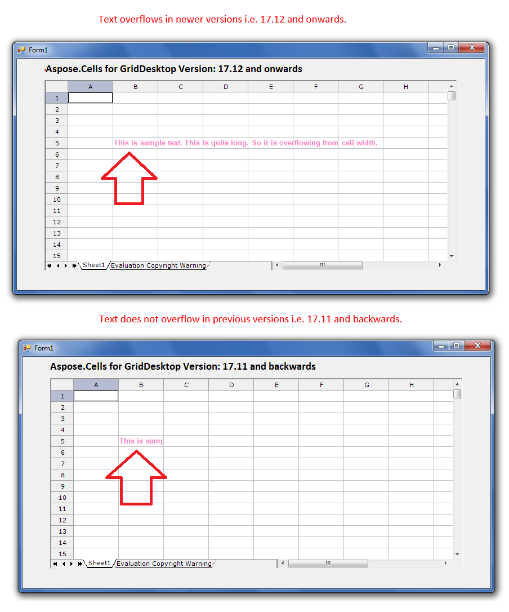

## **Possible Usage Scenarios**
Microsoft Excel overflows the text when the next adjacent cells are empty and the text is too long to fit inside the cell. Aspose.Cells for GridDesktop also supports this feature. However, this feature was not supported in earlier versions of GridDesktop e.g. 17.11, 17.10 etc. The newer versions starting from 17.12 and onward supports this feature.
## **Text overflows from GridDesktop cell if it is too long**
The following screenshot shows that the text overflows from GridDesktop cell when it is too long to fit inside the cell width. The screenshot shows the behavior of newer and older version of GridDesktop relating to the text overflow. As you can see in screenshot, the feature is supported from 17.12 onward.
## **Screenshot**

