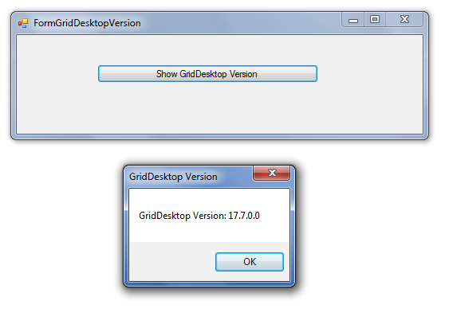

## **Possible Usage Scenarios**
Sometimes, it is important to find the GridDesktop version at runtime. For example, you may want to ensure that you are using the correct version, or you may be debugging your application and need to know which version of GridDesktop is currently in use. GridDesktop provides the Aspose.Cells.GridDesktop.GridDesktop.GetVersion() method, which returns the GridDesktop version at runtime. 

## **Find GridDesktop Version at Runtime**
The following sample code finds the GridDesktop version at runtime. The screenshot shows the result of the execution of this sample code for reference.

## **Sample Code**

