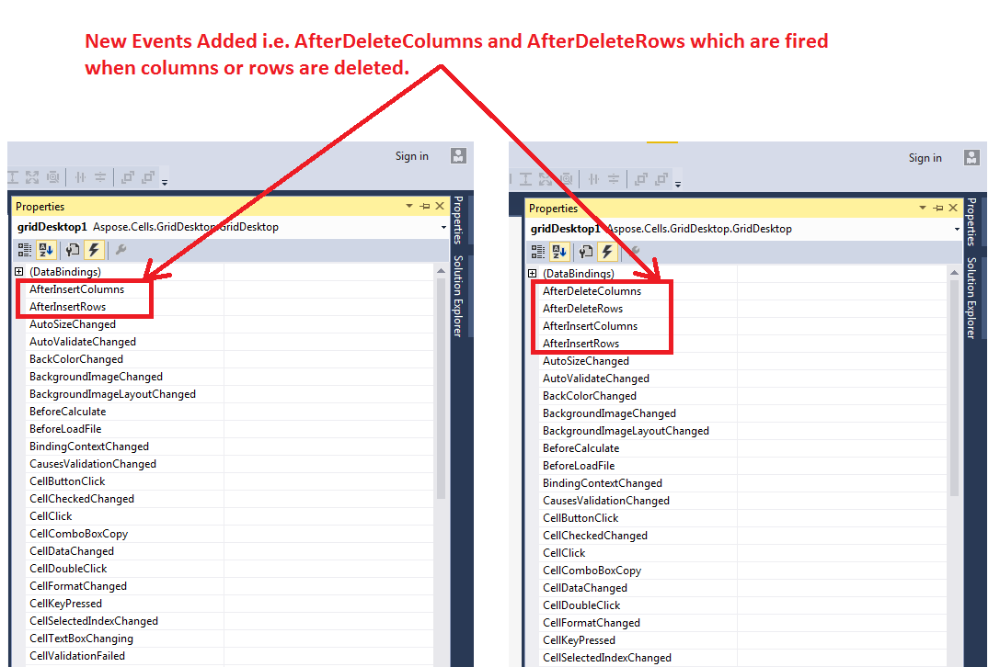

## **Possible Usage Scenarios**
Aspose.Cells for GridDesktop has added two new events i.e. AfterDeleteColumns and AfterDeleteRows as shown in the following screenshot. These events are fired when you delete columns and rows respectively.

## **Handling Events after Deleting Columns and Rows in GridDesktop**
The following sample code explains how to make use of AfterDeleteColumns and AfterDeleteRows events. Whenever you delete some columns or rows, the given function will be called and show a message box that displays the index of the deleted column or row.
## **Sample Code**


 private void gridDesktop1_AfterDeleteColumnsAndRows(object sender, Aspose.Cells.GridDesktop.WorksheetEventArgs args)

{

    if(args.SheetEvents == Aspose.Cells.GridDesktop.WorksheetEvents.ColumnDeleted)

    {

        MessageBox.Show("Deleted Column Index: " + args.Index);

    }

    if (args.SheetEvents == Aspose.Cells.GridDesktop.WorksheetEvents.RowDeleted)

    {

        MessageBox.Show("Deleted Row Index: " + args.Index);

    }

}


