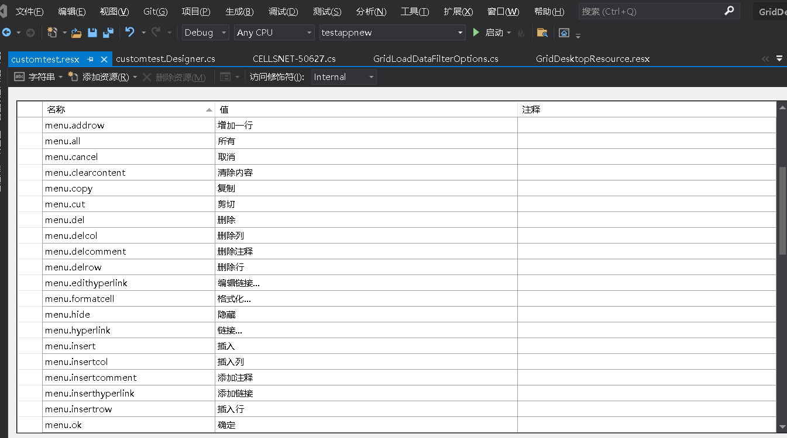
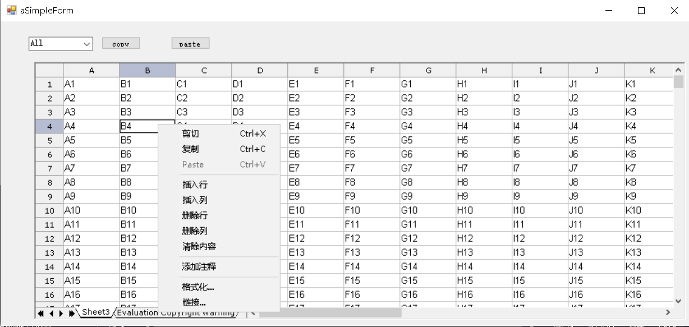

{} 

If we need to do localization for all the menus/message tips etc. in GridDesktop,We can define the resource file ,and use GridDesktop.SetCustomResourceManager to load this resource.

{} 
## **example**

first add a new resource file: customtest.resx








```csharp
//suppose your application with name space: myapp
   ResourceManager rm = new ResourceManager("myapp.customtest", Assembly.GetExecutingAssembly());
   gridDesktop1.SetCustomResourceManager(rm);
```

After executing the above code,   menu items shows:


 