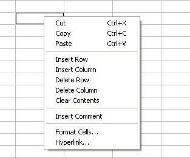
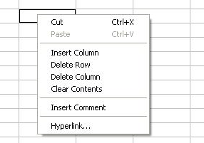
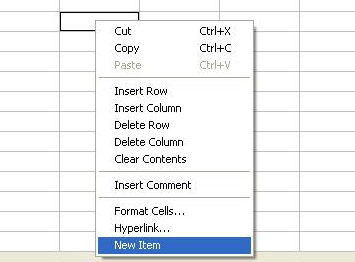

{} 

Aspose.Cells.GridDesktop has a context menu which has all the commonly used commands. The control allows you to hide/show menu items. Moreover, it is possible to add new menu items with event handlers to the menu.

{} 
## **Introduction**
The ContextMenuManager class is used to manage the context menu items. The GridDesktop.ContextMenuManager attribute gets the instance of ContextMenuManager object. For example, the ContextMenuManager.MenuItemAvailable_Copy attribute gets or sets a value indicating whether the context menu item **Copy** is available or not. Similarly, we have all the corresponding attributes for different context menu items.

**IMPORTANT:** By default, all the context menu items are visible in the list.
## **Managing the Context Menu**
### **Hiding Context Menu Items**
To perform this task, we first take a look the default context menu the GridDesktop has.

**GridDeskop's default menu** 

Now, hide some menu items using the code below:



After executing the above code, some menu items will not be visible for the users:

**Some menu items are hidden** 

### **Adding New Menu Items**
Add a new context menu item to the list using the following code snippet.



We also specify an event handler for the new command/option.



After executing the above code, a new menu item can be seen in the context menu. A message will also appear when cell is clicked.

**A new menu item is added to the list** 

