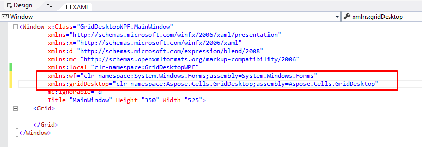
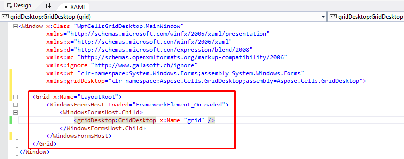

{} 

This article demonstrates how to use the Windows Presentation Foundation (WPF) Designer for Visual Studio to host a Windows Forms control such as Aspose.Cells.GridDesktop in a WPF application.  
We will be using Visual Studio 2015 to demonstrate the process; however, you can use any version, including Visual Studio 2008 or later.

{} 

This tutorial will walk you through the process of adding the Aspose.Cells.GridDesktop control to a WPF application. You need any version of the Visual Studio IDE that supports WPF development in order to try this on your side.

## **Create a WPF application using Visual Studio**
First, create a WPF application using the Visual Studio IDE. Click on **File** >> **New** >> **Project** menu, and select **WPF Application** from Templates, name the project, and click **OK**. You can target your project to any .NET Framework higher than 2.0; however, you cannot use client‑profile .NET Frameworks.

## **Add references to required namespaces**
Add the references to the following assemblies by right‑clicking the References in the Solution Explorer window and selecting the Add Reference menu.

- WindowsFormsIntegration assembly (WindowsFormsIntegration.dll).
- Windows Forms assembly (System.Windows.Forms.dll).
- Aspose.Cells.GridDesktop assembly (Aspose.Cells.GridDesktop.dll).

This action adds the required assemblies to the application, that is, copies the assemblies to the Bin folder of the application.

## **Add references to XAML**
Next, go to the XAML file and add the following namespaces and assembly references within the Windows tag.



 xmlns:wf="clr-namespace:System.Windows.Forms;assembly=System.Windows.Forms"

xmlns:gridDesktop="clr-namespace:Aspose.Cells.GridDesktop;assembly=Aspose.Cells.GridDesktop">



**The final Windows tag will look similar to that shown below.**

## **Add Aspose.Cells.GridDesktop control to XAML**
Simply add the code below inside the Grid tag in XAML. The **WindowsFormsHost** tag is used to host a Windows Forms control, and the **gridDesktop:GridDesktop** tag represents the Aspose.Cells.GridDesktop control. You can also name the control so that it can be referenced easily in the code.



 <WindowsFormsHost Loaded="FrameworkElement_OnLoaded">

    <WindowsFormsHost.Child>

        <gridDesktop:GridDesktop x:Name="grid" />

    </WindowsFormsHost.Child>

</WindowsFormsHost>



**The final XAML will look as follows.** 

## **Use Aspose.Cells.GridDesktop**
We can now access and use the Aspose.Cells.GridDesktop control in the .cs file as we would any other Windows Forms application. In order to keep the demonstration simple, we are just loading a sample spreadsheet in the Aspose.Cells.GridDesktop control and saving it back. Moreover, we have used the FrameworkElement_OnLoaded event to trigger the following statements.



## **Build & Run**
Now, build and run the application using **F5** or the **Start** button in the Visual Studio UI.
