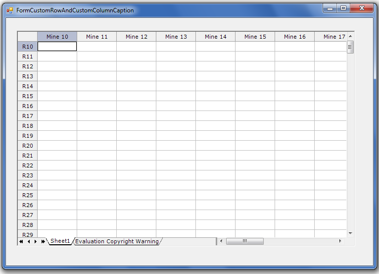

## **Possible Usage Scenarios**
You can customize row and column captions of a GridDesktop worksheet. Normally, rows start from 1 and columns start from A. You can change this behavior and use your own captions for rows and columns of a GridDesktop worksheet. To change the captions of rows and columns, please implement the **ICustomRowCaption** and **ICustomColumnCaption** interfaces.

## **Custom Row and Custom Column Caption of GridDesktop Worksheet**
The following sample code implements **ICustomRowCaption** and **ICustomColumnCaption** interfaces and changes the captions of rows and columns. The screenshot shows the result of executing this sample code for reference.

## **Sample Code**

