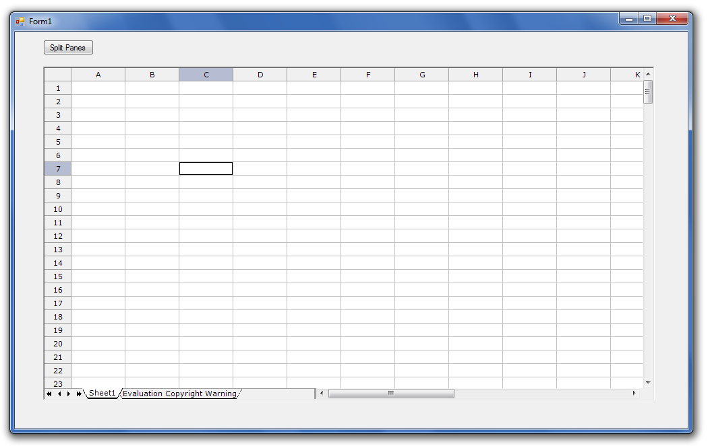

## **Possible Usage Scenarios**
Microsoft Excel allows you to split panes using the View > Split menu command. Aspose.Cells also provides this feature. Please use GridDesktop.DoSplit() and GridDesktop.UnDoSplit() methods to split and unsplit panes in a GridDesktop worksheet.

## **Split Panes in GridDesktop Worksheet**
The following screenshots show the GridDesktop before split panes and after split panes.

### **GridDesktop Before Split Panes**

### **GridDesktop After Split Panes**

