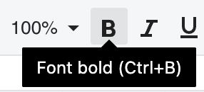

{}
The **Bold** button toggles the `font.bold` attribute of the currently selected cell(s). It is accessible via the toolbar, menubar, context‑menu, status bar and the **Ctrl + B** keyboard shortcut. All UI elements stay synchronized automatically.
{}

## Overview
Bold formatting makes the text in a cell appear thicker. In GridJs the bold state is represented by the `font.bold` property of a cell’s style. Users can toggle this property through several entry points; developers can also control it programmatically via the public JavaScript API.

## UI Operations

### Toolbar
1. Hover over the **B** icon on the toolbar. A tooltip **Bold** appears.  



2. Click the **B** icon (or press **Ctrl + B**) to toggle bold on the selected cell(s).  

  

3. The button shows a pressed state while bold is active and returns to normal when it is not.
4. Selecting a different cell or range automatically updates the button’s appearance to match the cell’s `font.bold` value.  


### Menubar
1. Open **Format** → **Text** → **Font Bold** (or use **Ctrl + B**).  

2. The same toggle logic runs as the toolbar button, updating the cell style and the toolbar’s bold button state.  


## JavaScript API
font colour changes can be achieved by setting the `font-bold` attribute on a cell or range using the `setRangeAttr` method of the `data` object. After updating the attribute, call the `render` method to apply the changes visually.

```js
// Assume xs is your x_spreadsheet instance
xs = x_spreadsheet('#gridjs-demo-uid', option);
const range = {"sri":2,"sci":2,"eri":2,"eci":2}; // Define the cell range (row/col indices)
// Set the font color of a specific cell or range
xs.sheet.data.setRangeAttr(range, 'font-bold', true);
// Render the changes to update the UI
xs.sheet.table.render();
```


### Relevant functions

| Function | Description | Parameters | Returns |
|----------|-------------|------------|---------|
| `xs.sheet.data.setRangeAttr(range, attr, value)` | Modifies an attribute of the currently selected range. For font bold, set `attr` to `'font-bold'` and `value` to `true` or `false`. | `range` – **object** (contains `sri`, `sci`, `eri`, `eci` for start/end row/column).<br>`attr` – **string** (`'font-bold'` only).<br>`value` – **boolean** (`true` or `false`). | `undefined` (grid refreshes automatically). |
| `xs.sheet.table.render()` | Re-renders the table UI to reflect any data or style changes. | None. | `undefined`. |


