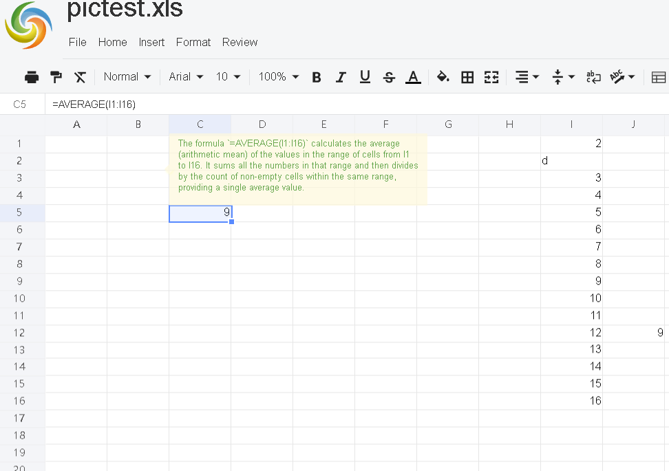

 
# To display formula explanation when hovering over a specific cell that contains a formula ,the steps are
## Set load options.
for example:
```javascript
 const option = {
     ...
     //set showFormulaExplain to true
    showFormulaExplain:true,
 };
  xs = x_spreadsheet('#gridjs-demo', option)
```
## Set action URL for showFormulaExplain.
for example:
```javascript
    const formulaExplainUrl = "/GridJs2/FormulaExplain";
    xs.setFormulaExplainUrl(formulaExplainUrl);
```
When the user moves the mouse over a cell that contains a formula, the action of display formula explanation will be triggered automatically by the spreadsheet application 

## Implement show  formula explanation action API in Controller in serverside.
for example:
```C#
  [HttpPost]
 public async Task<IActionResult> FormulaExplainAsync()
 {
     String formulaText = HttpContext.Request.Form["v"];
     String locale = HttpContext.Request.Form["locale"];
     if (string.IsNullOrEmpty(formulaText))
     {
         return Ok(new
         {
             Success = false,
             v = ""
         });
     }
     //here the formulaText is the formula ,etc "=SUM(B1:B10)"
     string correctedContent = await GetFormulaExplainAsync(formulaText, locale);

     return Ok(new
     {
         Success = true,
         v = correctedContent
     });
 }
 //you need to implement it youself
 private async Task<string> GetFormulaExplainAsync(string formulaText,string locale)
 {   String result=null;
     //your logic to get the detail explanation for the formulaText
     return result;
 }
```



 
