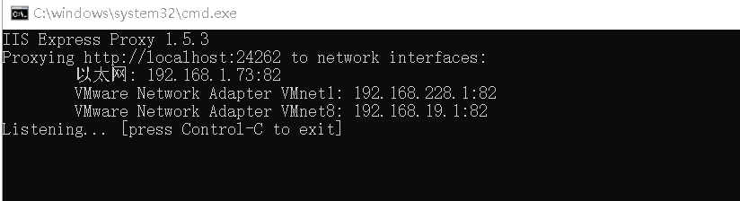

## Use GridJs on a mobile device

You can use GridJs smoothly on the mobile device. 

GridJs can adapt to the mobile screen.

Run the [demo of GridJs ](https://github.com/aspose-cells/Aspose.Cells.Grid-for-.NET/tree/master/Examples_GridJs "demo of GridJs ")

The default port of the demo project is 24262. 

You need to access the page via IP on the mobile terminal http://localhost:24262/GridJs2/List. 

You can use a small tool such as iisexpress-proxy.

Install with the following command:

*npm install -g iisexpress-proxy*

Run the command to complete the port mapping:

*iisexpress-proxy 24262 to 82*

Then we can open the demo web page in the mobile browser.

Navigate to the page http://yourip:82/GridJs2/List and select a file to open.

Then you can perform edit operations as on a PC device.
