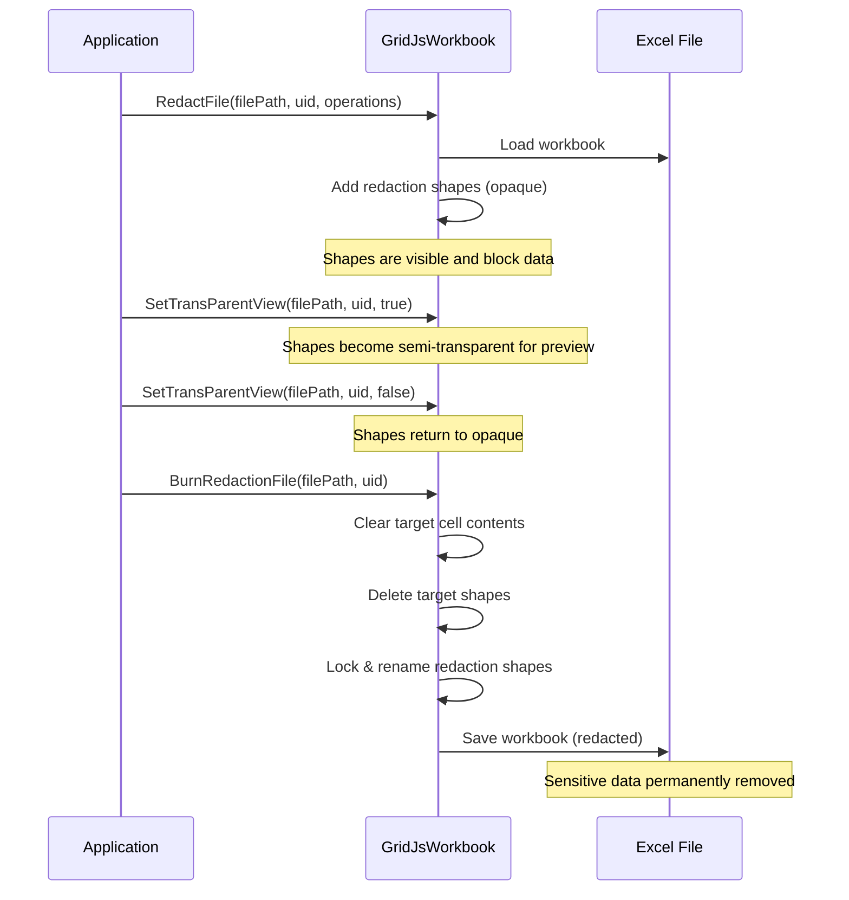

# Introduction

The **Redaction** feature lets you hide sensitive information in a spreadsheet by drawing obscuring overlays on **cell ranges** or **shape/image objects**.  
All client‑side operations are asynchronous, and a set of server‑side APIs is provided to permanently apply (burn) the redactions.

This guide shows:

* How to create, update, delete and batch‑synchronize redactions from JavaScript.  
* How to listen to redaction‑related events.  
* How to finalize redactions on the server using Aspose.Cells (`GridJsWorkbook`).  

---

## Client‑Side API Overview


---

### Enable the feature  

When initializing the spreadsheet component, set **enableRedactionShape** to `true` in the load options.

```javascript
// ./wwwroot/js/gridjs-init.js
const option = {
    // other options you may already use
    updateMode: 'server',
    updateUrl: '/GridJs2/UpdateCell',
    mode: 'edit',
    locale: 'en',                  // default UI language
    enableRedactionShape: true     // <<< enables the feature
    redactionDefaultColor: 'green',// optional ,for redaction default color
    redactionReasons:              // optional ,for redaction reasons  
    ['Personal Information',
    'Confidential',
    'Legal Privilege',
    'Trade Secret',],
};

let xs = x_spreadsheet('#gridjs-demo-div', option);
```


All GridJs redaction APIs are `async` and must be awaited.

| API | Purpose |
|-----|---------|
| `insertRedactionForShape(reason, color, targetId, sheetName?)` | Add a redaction overlay on a shape or image. |
| `insertRedactionForRange(reason, color, range, sheetName?)` | Add a redaction overlay on a cell range. |
| `removeRedaction(id, sheetName?)` | Delete a redaction by its internal ID. |
| `syncRedactionOprClient(historyOprArray, isSyncToServer)` | Batch‑synchronize add / update / delete operations. |
| `burnAllRedactions()` | Permanently clear the underlying content and lock the redaction shapes. |

---

## API Reference

### 1. `insertRedactionForShape(reason, color, targetId, sheetName?)`

Adds a redaction overlay on a specified shape or image object.

**Parameters:**

| Parameter | Type | Required | Description |
|-----------|------|----------|-------------|
| `reason` | `string` | Yes | The redaction reason/label text, displayed on the redaction area |
| `color` | `string` | Yes | Background color of the redaction, supports CSS color values like `'#000000'`, `'gray'`, `'#FF0000'` |
| `targetId` | `string` | Yes | The ID of the target shape or image (IDs are unique across shapes and images) |
| `sheetName` | `string` | No | The sheet name; defaults to the current active sheet if not provided |


**Examples:**

```javascript
//iterate over shapes and images and print out its id
 xs.sheet.data.shapes.forEach((d)=>{console.log(d.id);})
 xs.sheet.data.images.forEach((d)=>{console.log(d.id);})
// Add a black redaction on the shape with ID "1" ,sheet name not provided,the defaults is for current active sheet 
await xs.insertRedactionForShape('Confidential', '#000000', '1');

// Add a gray redaction on the image with ID "2", specifying the sheet
await xs.insertRedactionForShape('Privacy Data', 'gray', '2', 'Sheet2');
```

**Notes:**
- The target object must exist in `shapes` or `images`
- The target object must not be an existing redaction (`isRedaction` is true)
- The target object must not already have a redaction attached (`redactionShape` property exists)
- Lazy loading is triggered automatically if the sheet is not yet loaded
- 

---

### 2. `insertRedactionForRange(reason, color, range, sheetName?)`

Adds a redaction overlay on a specified cell range. the redaction shape can be resized ,and it will alwasys snap to cell range boundaries and never cover partial cells

**Parameters:**

| Parameter | Type | Required | Description |
|-----------|------|----------|-------------|
| `reason` | `string` | Yes | The redaction reason/label text, displayed on the redaction area |
| `color` | `string` | Yes | Background color of the redaction, supports CSS color values like `'#000000'`, `'gray'` |
| `range` | `Object` | Yes | Cell range object, format: `{ sri, sci, eri, eci }` |
| `sheetName` | `string` | No | The sheet name; defaults to the current active sheet if not provided |

**`range` object:**

| Property | Type | Description |
|----------|------|-------------|
| `sri` | `number` | Start Row Index (0-based) |
| `sci` | `number` | Start Column Index (0-based) |
| `eri` | `number` | End Row Index (inclusive) |
| `eci` | `number` | End Column Index (inclusive) |


**Examples:**

```javascript
// Add a redaction on cell range B2:D5 (row 1, col 1 to row 4, col 3), sheet name not provided,the defaults is for current active sheet 
await xs.insertRedactionForRange('Confidential', '#000000', {
  sri: 1, sci: 1, eri: 4, eci: 3
});

// Add a redaction on a single cell A1, specifying the sheet
await xs.insertRedactionForRange('PII', '#333333', {
  sri: 0, sci: 0, eri: 0, eci: 0
}, 'Sheet1');
```

**Notes:**
- Row and column indices are 0-based
- `eri` and `eci` are inclusive boundaries
- Lazy loading is triggered automatically if the sheet is not yet loaded

---

### 3. `removeRedaction(id, sheetName?)`

Removes a redaction by its ID.

**Parameters:**

| Parameter | Type | Required | Description |
|-----------|------|----------|-------------|
| `id` | `string` | Yes | The ID of the redaction object to remove |
| `sheetName` | `string` | No | The sheet name; defaults to the current active sheet if not provided |


**Examples:**

```javascript
// Remove the redaction with ID "42",sheet name not provided,the defaults is for current active sheet 
await xs.removeRedaction('42');

// Remove a redaction from a specific sheet
await xs.removeRedaction('42', 'Sheet2');
```

**Notes:**
- The target ID must correspond to an object with `isRedaction` set to `true`
- Removal cleans up the  redaction shape and associated fabric canvas object  
- Lazy loading is triggered automatically if the sheet is not yet loaded

---

### 4. `syncRedactionOprClient(historyOprArray, isSyncToServer)`

Batch synchronizes redaction operations to the client, used for replaying add/delete/update operations from history records.
The payload rquest triggered from add/remove/update redaction via UI is the basic record.

**Parameters:**

| Parameter | Type | Required | Description |
|-----------|------|----------|-------------|
| `historyOprArray` | `Array<Object>` | Yes | Array of redaction operation history records |
| `isSyncToServer` | `boolean` | Yes | Whether to sync changes to the server |

**History record format:**

| Property | Type | Description |
|----------|------|-------------|
| `name` | `string` | Sheet name |
| `op` | `string` | Operation type, always `'syncRedactionSingle'` |
| `subopr` | `string` | Sub-operation type: `'add'`, `'del'`, or `'update'` |
| `shape` | `Object` | Redaction shape data (see `shape` object below) |
| `id` | `string` | Server-side ID of the redaction object |
| `originId` | `string` | Original ID of the redaction (differs from server ID on insert) |

**`shape` object:**

| Property | Type | Description |
|----------|------|-------------|
| `id` | `string` | Redaction ID |
| `srcid` | `string` | Source ID (strid) |
| `left` | `number` | X coordinate position |
| `top` | `number` | Y coordinate position |
| `width` | `number` | Width |
| `height` | `number` | Height |
| `angle` | `number` | Rotation angle |
| `originAngle` | `number` | Original angle |
| `zorder` | `number` | Z-order |
| `type` | `string` | Shape type, e.g., `'Rectangle'` |
| `bgColor` | `string` | Background color |
| `isRedaction` | `boolean` | Whether this is a redaction object |
| `redactionReason` | `string` | Redaction reason text |
| `name` | `string` | Redaction name, format: `aspose.redaction-{id}-{target}` |
| `fontSetting` | `Object` | Font settings (includes wrap, lines, etc.) |
| `op` | `string` | Operation identifier |
| `isNewAdded` | `boolean` | Whether this is a newly added object |


**Examples:**

```javascript
// Sync multiple redaction operations  
const oprs=[
{"name":"Sheet2","op":"syncRedactionSingle","subopr":"add","shape":{"id":9,"left":144,"top":304,"width":95,"height":69,"angle":0,"zorder":7,"type":"Rectangle","bgColor":"green","isRedaction":true,"redactionReason":"PII - Personal Information","name":"aspose.redaction-1776848316091208-4","isNewAdded":true,"fontSetting":{"size":12.75,"color":"#FFFFFF","name":"sans-serif","bold":false,"italic":false}}},


{"name":"Sheet2","op":"syncRedactionSingle","subopr":"add","shape":{"id":10,"left":432,"top":228,"width":144,"height":57,"angle":0,"zorder":8,"type":"Rectangle","bgColor":"green","isRedaction":true,"redactionReason":"PII - Personal Information","name":"aspose.redaction-1776848320435434-12.6.14.7","isNewAdded":true,"fontSetting":{"size":15,"color":"#FFFFFF","name":"sans-serif","bold":false,"italic":false}}},


{"name":"Sheet2","op":"syncRedactionSingle","subopr":"add","shape":{"id":11,"left":310,"top":273,"width":50,"height":37,"angle":0,"zorder":10,"type":"Rectangle","bgColor":"green","isRedaction":true,"redactionReason":"PII - Personal Information","name":"aspose.redaction-1776848322931889-5","isNewAdded":true,"fontSetting":{"size":7.5,"color":"#FFFFFF","name":"sans-serif","bold":false,"italic":false}}},

{"name":"Sheet2","op":"syncRedactionSingle","subopr":"update","shape":{"id":9,"left":144.0000000000001,"top":304,"width":130,"height":95,"angle":0,"zorder":12,"type":"Rectangle","bgColor":"green","isRedaction":true,"redactionReason":"PII - Personal Information","name":"aspose.redaction-9-4","fontSetting":{"size":15,"color":"#FFFFFF","name":"sans-serif","bold":false,"italic":false}}},


{"name":"Sheet2","op":"syncRedactionSingle","subopr":"update","shape":{"id":10,"left":432,"top":190,"width":144,"height":95,"angle":0,"zorder":13,"type":"Rectangle","bgColor":"green","isRedaction":true,"redactionReason":"PII - Personal Information","name":"aspose.redaction-10-10.6.14.7","fontSetting":{"size":15,"color":"#FFFFFF","name":"sans-serif","bold":false,"italic":false}}},


{"name":"Sheet2","op":"syncRedactionSingle","subopr":"update","shape":{"id":10,"left":576,"top":190,"width":144,"height":95,"angle":0,"zorder":14,"type":"Rectangle","bgColor":"green","isRedaction":true,"redactionReason":"PII - Personal Information","name":"aspose.redaction-10-10.8.14.9","fontSetting":{"size":15,"color":"#FFFFFF","name":"sans-serif","bold":false,"italic":false}}},

{"name":"Sheet2","op":"syncRedactionSingle","subopr":"del","shape":{"id":11,"left":310,"top":273,"width":50,"height":37,"angle":0,"zorder":16,"type":"Rectangle","bgColor":"green","isRedaction":true,"redactionReason":"PII - Personal Information","name":"aspose.redaction-11-5","op":"del","fontSetting":{"size":7.5,"color":"#FFFFFF","name":"sans-serif","bold":false,"italic":false}}},

{"name":"Sheet2","op":"syncRedactionSingle","subopr":"add","shape":{"id":11,"left":433,"top":362,"width":480,"height":288,"angle":0,"zorder":18,"type":"Rectangle","bgColor":"green","isRedaction":true,"redactionReason":"PII - Personal Information","name":"aspose.redaction-1776848364555179-3","isNewAdded":true,"fontSetting":{"size":15,"color":"#FFFFFF","name":"sans-serif","bold":false,"italic":false}}},

{"name":"Sheet2","op":"syncRedactionSingle","subopr":"update","shape":{"id":11,"left":433,"top":362,"width":480,"height":306,"angle":0,"zorder":19,"type":"Rectangle","bgColor":"green","isRedaction":true,"redactionReason":"PII - Personal Information","name":"aspose.redaction-11-3","fontSetting":{"size":15,"color":"#FFFFFF","name":"sans-serif","bold":false,"italic":false}}},


{"name":"Sheet3","op":"syncRedactionSingle","subopr":"add","shape":{"id":3,"left":200,"top":97,"width":71,"height":36,"angle":0,"zorder":2,"type":"Rectangle","bgColor":"green","isRedaction":true,"redactionReason":"PII - Personal Information","name":"aspose.redaction-3-2","isNewAdded":true,"fontSetting":{"size":7.5,"color":"#FFFFFF","name":"sans-serif","bold":false,"italic":false}}},

{"name":"Sheet3","op":"syncRedactionSingle","subopr":"add","shape":{"id":4,"left":432,"top":114,"width":144,"height":38,"angle":0,"zorder":3,"type":"Rectangle","bgColor":"green","isRedaction":true,"redactionReason":"PII - Personal Information","name":"aspose.redaction-4-6.6.7.7","isNewAdded":true,"fontSetting":{"size":10.5,"color":"#FFFFFF","name":"sans-serif","bold":false,"italic":false}}},

{"name":"Sheet3","op":"syncRedactionSingle","subopr":"update","shape":{"id":4,"left":432,"top":114,"width":144,"height":76,"angle":0,"zorder":3,"type":"Rectangle","bgColor":"green","isRedaction":true,"redactionReason":"PII - Personal Information","name":"aspose.redaction-4-6.6.9.7","fontSetting":{"size":15,"color":"#FFFFFF","name":"sans-serif","bold":false,"italic":false}}},
{"name":"Sheet1","op":"syncRedactionSingle","subopr":"add","shape":{"id":1,"left":216,"top":129,"width":137,"height":34,"angle":0,"zorder":1,"type":"Rectangle","bgColor":"green","isRedaction":true,"redactionReason":"Legal Privilege","name":"aspose.redaction-1-6.3.6.3","isNewAdded":true,"fontSetting":{"size":13.5,"color":"#FFFFFF","name":"sans-serif","bold":false,"italic":false}}},
{"name":"Sheet1","op":"syncRedactionSingle","subopr":"update","shape":{"id":1,"left":353,"top":258,"width":120,"height":38,"angle":0,"zorder":1,"type":"Rectangle","bgColor":"green","isRedaction":true,"redactionReason":"Legal Privilege","name":"aspose.redaction-1-10.4.11.5","fontSetting":{"size":11.25,"color":"#FFFFFF","name":"sans-serif","bold":false,"italic":false}}},
]

// Sync and also push changes to server
await xs.syncRedactionOprClient(oprs, true);
```

**Notes:**
- Records where `op` is not `'syncRedactionSingle'` are skipped
- Records referencing non-existent sheets are skipped
- Lazy loading is triggered automatically for unloaded sheets
- When `isSyncToServer` is `true`, all modified sheet data is batch-synced to the server


---

### 5. `burnAllRedactions()`

Clear cell range content and target shape covered  by redaction shapes,and lock the redaction shapes.


**Examples:**

```javascript
//iterate over shapes and images and print out its id
 xs.burnAllRedactions()

```
{}

---

## Redaction‑Related Events

Listen to events via `xs.on(eventName, callback)`.

| Event | When it Fires | Callback Arguments |
|-------|---------------|--------------------|
| `redaction-inserted` | After a redaction is added (API or UI) | `sheetName`, `redactionData` |
| `redaction-deleted` | After a redaction is removed | `sheetName`, `redactionShape` |
| `redaction-updated` | After a redaction is moved, resized, or otherwise modified | `sheetName`, `shape` |
| `redaction-burned` | After `burnAllRedactions()` finishes | *none* |
| `redactionReason-inserted` | When a new reason is added via the UI dropdown | `reason` |
| `redactionReason-cleared` | When all reasons are cleared via the UI dropdown | *none* |


### `redaction-inserted`

Triggered when a new Redaction is added. Usually occurs after `insertRedactionForShape`, `insertRedactionForRange`, or add redaction via UI opertation triggers an `add` operation.

**Callback arguments:**

| Argument | Type | Description |
|----------|------|-------------|
| `sheetName` | `string` | The sheet name where the change occurred |
| `redactionData` | `Object` | The newly added Redaction data object, containing properties like `id`, `left`, `top`, `width`, `height`, `bgColor`, `redactionReason`, `fabobj`, etc. |

**Example:**

```javascript
//notice here originId is the client request id ,and the id is the server side response id
xs.on('redaction-inserted', (sheetName, redactionData) => {
  console.log(`Redaction added to ${sheetName}, server side response id: ${redactionData.id} ,origin request id: ${redactionData.originId}`);
});
```

---

### `redaction-deleted`

Triggered when a Redaction is deleted. Usually occurs after `removeRedaction` or delete redaction via UI opertation triggers a `del` operation.

**Callback arguments:**

| Argument | Type | Description |
|----------|------|-------------|
| `sheetName` | `string` | The sheet name where the change occurred |
| `redactionShape` | `Object` | The deleted Redaction data object |

**Example:**

```javascript
xs.sheet.on('redaction-deleted', (sheetName, redactionShape) => {
  console.log(`Redaction removed from ${sheetName}, id: ${redactionShape.id}`);
});
```

---

### `redaction-updated`

Triggered when a Redaction's properties are updated. Usually after moving, scaling for redaction shape via UI opertation triggers an `update` operation.

**Callback arguments:**

| Argument | Type | Description |
|----------|------|-------------|
| `sheetName` | `string` | The sheet name where the change occurred |
| `shape` | `Object` | The updated Redaction data object |

**Example:**

```javascript
xs.sheet.on('redaction-updated', (sheetName, shape) => {
  console.log(`Redaction updated on ${sheetName}, id: ${shape.id}`);
});
```

---

### `redaction-burned`

Triggered after `burnAllRedactions()` completes. Indicates that all redactions have been permanently applied and associated  content in cell ranges or target images/shapes were cleared.

**Callback arguments:** None

**Example:**

```javascript
xs.sheet.on('redaction-burned', () => {
  console.log('All redactions have been permanently burned');
});
```

---

### `redactionReason-inserted`

Triggered when a new Redaction Reason is added via the redaction reasons dropdown via UI operation.

**Callback arguments:**

| Argument | Type | Description |
|----------|------|-------------|
| `reason` | `string` | The newly added reason text |

**Example:**

```javascript
xs.sheet.on('redactionReason-inserted', (reason) => {
  console.log(`New redaction reason added: ${reason}`);
});
```

---

### `redactionReason-cleared`

Triggered when all redaction reasons are cleared via the redaction reasons dropdown via UI operation.

**Callback arguments:** None

**Example:**

```javascript
xs.sheet.on('redactionReason-cleared', () => {
  console.log('All redaction reasons have been cleared');
});
```

---

## General Usage – Enumerating Existing Redactions

```javascript
/**
 * Visits every sheet and counts visible redaction shapes.
 * @param {Object} xsInstance The GridJs instance.
 * @returns {Promise<number>} Number of active redactions.
 */
async function countRedactions(xsInstance) {
  if (!xsInstance || !xsInstance.datas) return 0;

  let total = 0;
  for (const sheetData of xsInstance.datas) {
    // Ensure the sheet is loaded before accessing its shapes
    await xs.loadSheetDataLazily(sheetData);
    if (!sheetData.shapes) continue;

    for (const shape of sheetData.shapes) {
      // Skip deleted records (shape.op === 'del')
      if (shape.isRedaction && (!shape.op || shape.op !== 'del')) {
        console.log('Found redaction:', shape);
        if (shape.targetId) {
          console.log(' → Applied to shape/image ID:', shape.targetId);
        } else {
          console.log(' → Applied to cell range:', shape.targetCellRange);
        }
        total++;
      }
    }
  }
  return total;
}
```

 
---

## Row/Column Index Reference

| Index | Column | Example `range` object |
|-------|--------|------------------------|
| 0 | A | `{ sri: 0, sci: 0, eri: 0, eci: 0 }` → A1 |
| 1 | B | `{ sri: 1, sci: 1, eri: 3, eci: 2 }` → B2:D3 |
| 2 | C | … |
| 3 | D | … |
| … | … | … |

---

## Server‑Side API (C#) – Aspose.Cells `GridJsWorkbook`

The server side processes the redaction shapes generated by the client .

### 1. `RedactFile`

Applies a collection of redaction operations to an Excel workbook.

```csharp
using Aspose.Cells.GridJs;

// ...

public void ApplyRedaction()
{
    // Initialise the GridJs workbook helper
    var workbook = new GridJsWorkbook();

    // Path to the source Excel file
    string excelFilePath = "./Data/Confidential.xlsx";

    // Unique identifier for the workbook (used for caching)
    string uid = "doc-2024-04-27.xlsx";

    // JSON strings that describe each redaction operation.
    // Typically these are produced by xs.syncRedactionOprClient(..., false)
    string[] redactionOperations = new string[]
    {
        // Example: redaction over a cell range
        "{\"op\":\"syncRedactionSingle\",\"name\":\"Sheet1\",\"subopr\": \"add\",\"shape\":{\"id\":1,\"left\":100,\"top\":200,\"width\":120,\"height\":30,\"type\":\"Rectangle\",\"bgColor\":\"#FF0000\",\"isRedaction\":true,\"redactionReason\":\"PII\",\"name\":\"aspose.redaction-1-0.0.4.2\"}}",

        // Example: redaction over a shape with target ID 7
        "{\"op\":\"syncRedactionSingle\",\"name\":\"Sheet2\",\"subopr\": \"add\",\"shape\":{\"id\":2,\"left\":300,\"top\":150,\"width\":80,\"height\":80,\"type\":\"Rectangle\",\"bgColor\":\"#000000\",\"isRedaction\":true,\"redactionReason\":\"Confidential\",\"name\":\"aspose.redaction-2-7\"}}"
    };

    // Apply the redactions – any failure throws an exception that contains the offending JSON
    workbook.RedactFile(excelFilePath, uid, redactionOperations);
}
```

#### Exceptions

| Exception | When it is thrown |
|-----------|-------------------|
| `GridCellException` | A low‑level Cells exception occurs while processing a redaction operation. |
| `Exception` | Any other error (e.g., invalid JSON, missing sheet). The message includes the JSON that caused the failure. |

---

### 2. `SetTransParentView`

Makes all redaction shapes semi‑transparent (preview mode) or fully opaque.

```csharp
using Aspose.Cells.GridJs;

// ...

public void ToggleTransparency(bool makeTransparent)
{
    var workbook = new GridJsWorkbook();

    string excelFilePath = "./Data/Confidential.xlsx";
    string uid = "doc-2024-04-27.xlsx";

    // true  → 0.89 opacity (semi‑transparent)  
    // false → 0.0  opacity (fully opaque)
    workbook.SetTransParentView(excelFilePath, uid, makeTransparent);
}
```

---

### 3. `BurnRedactionFile`

Finalizes the redaction workflow – underlying data is erased, target shapes are removed, and redaction shapes are locked.

```csharp
using Aspose.Cells.GridJs;

// ...

public void BurnRedactions()
{
    var workbook = new GridJsWorkbook();

    string excelFilePath = "./Data/Confidential.xlsx";
    string uid = "doc-2024-04-27.xlsx";

    // WARNING: This operation is irreversible!
    workbook.BurnRedactionFile(excelFilePath, uid);
}
```

---

## Typical Redaction Workflow (C#)



### Step‑by‑Step C# Sample

```csharp
using Aspose.Cells.GridJs;

public class RedactionDemo
{
    public void Main(string[] args)
    {
        var workbook = new GridJsWorkbook();

        string filePath = "./Data/Confidential.xlsx";
        string uid = "demo-2024-04-27.xlsx";

        //example 1  Apply redactions (add shapes)
        string[] ops = new string[]
        {
            // Redact SSN column (cells B2:B100)
            "{\"op\":\"syncRedactionSingle\",\"name\":\"Sheet1\",\"subopr\": \"add\",\"shape\":{\"id\":10,\"left\":120,\"top\":200,\"width\":30,\"height\":4000,\"type\":\"Rectangle\",\"bgColor\":\"#000000\",\"isRedaction\":true,\"redactionReason\":\"SSN\",\"name\":\"aspose.redaction-10-1.1.99.1\"}}",

            // Redact a confidential image (target shape ID = 25)
            "{\"op\":\"syncRedactionSingle\",\"name\":\"Sheet1\",\"subopr\": \"add\",\"shape\":{\"id\":11,\"left\":500,\"top\":300,\"width\":150,\"height\":100,\"type\":\"Rectangle\",\"bgColor\":\"#444444\",\"isRedaction\":true,\"redactionReason\":\"Confidential Image\",\"name\":\"aspose.redaction-11-25\"}}"
        };
        workbook.RedactFile(filePath, uid, ops);
        workbook.SaveToXlsx("redact_output.xlsx");
        string ret = workbook.ExportToJson("redact.xls");
        Console.WriteLine(ret);
		
        //example 2  preview – make shapes semi‑transparent
		workbook = new GridJsWorkbook();
        workbook.SetTransParentView("redact_output.xlsx", uid, true);
		workbook.SaveToXlsx("redact2.xlsx");
        string ret = workbook.ExportToJson("redact.xls");
        Console.WriteLine(ret);
		
        // ... user inspects the preview ...
        workbook = new GridJsWorkbook();
        workbook.SetTransParentView("redact_output.xlsx", uid, false);
		workbook.SaveToXlsx("redact3.xlsx");
        string ret = workbook.ExportToJson("redact.xls");
        Console.WriteLine(ret);
		
        //example 3 Burn – permanently remove covered data and shape/image
        workbook = new GridJsWorkbook();
        workbook.BurnRedactionFile("redact_output.xlsx", uid);
		workbook.SaveToXlsx("redact_burned.xlsx");
        string ret = workbook.ExportToJson("redact.xls");
        Console.WriteLine(ret);
    }
}
```

{}
After burning, the workbook’s sheets are protected at the **object** level – redaction shapes cannot be moved or deleted without first removing the protection.  
{}

---

## Summary

* **Client side** – Use `insertRedactionForShape`, `insertRedactionForRange`, `removeRedaction`, `syncRedactionOprClient`, and `burnAllRedactions` to manage redactions interactively.  
* **Events** – Subscribe to redaction events (`redaction‑inserted`, `redaction‑deleted`, `redaction‑updated`, `redaction‑burned`) to keep UI state in sync.  
* **Server side** – Call `RedactFile`, optionally `SetTransParentView` for preview, and finalize with `BurnRedactionFile`.  

Following this guide ensures that sensitive spreadsheet data is safely obscured during collaboration and permanently removed when the document is finalized.