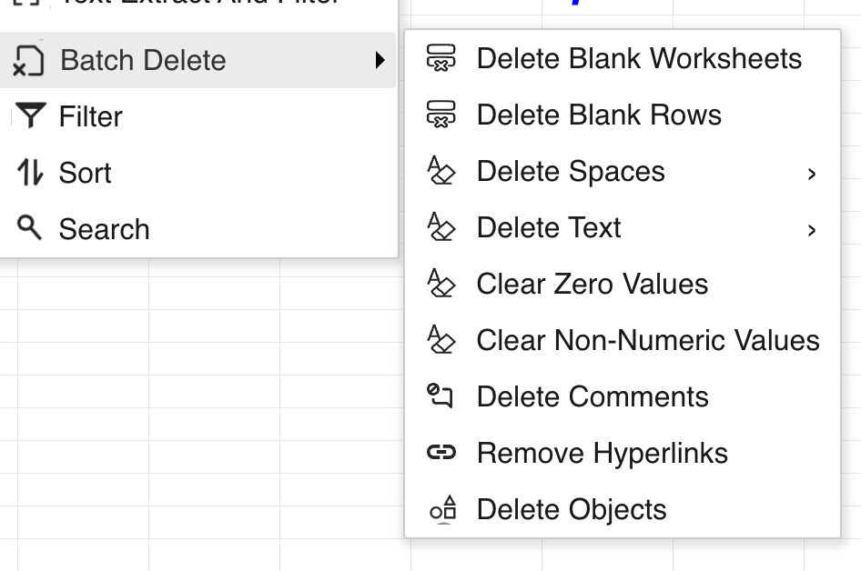
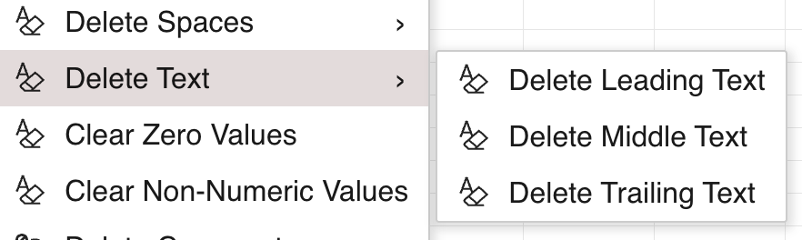
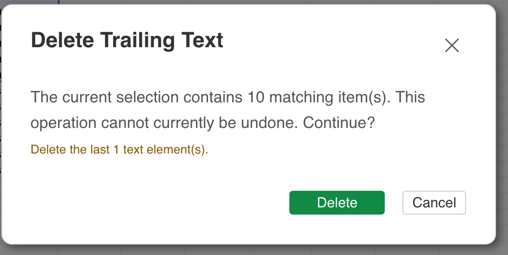

## Introduction

GridJs provides a **Batch Delete** command in the toolbar and the **Edit** menu. It can preview and delete matching worksheet content and objects in one operation.

Batch Delete is available only when GridJs uses server update mode. Except for **Delete Blank Worksheets**, each command processes the current cell selection. GridJs previews the operation on the server, reports the number of matching items, and asks for confirmation before executing the deletion.

## How to use

1. Open a workbook in GridJs server update mode.

2. For a selection-based operation, select the cells that you want to process.

   The selected range must contain fewer than 1,000,000 cells and must not be locked. **Delete Blank Worksheets** examines the workbook instead of the current selection and is blocked when the workbook is protected.

3. Open **Batch Delete** from the toolbar or the **Edit** menu.

4. Choose an operation.

   | Operation | Available choice |
   | --- | --- |
   | Blank worksheets | **Delete Blank Worksheets** |
   | Blank rows | **Delete Blank Rows** |
   | Spaces | **Delete Leading Spaces**, **Delete All Spaces**, or **Delete Trailing Spaces** |
   | Text | **Delete Leading Text**, **Delete Middle Text**, or **Delete Trailing Text** |
   | Values | **Clear Zero Values** or **Clear Non-numeric Values** |
   | Cell metadata | **Delete Comments** or **Remove Hyperlinks** |
   | Worksheet objects | **Delete Objects** |

5. If you choose a text operation, enter its position settings.

   - **Delete Leading Text** accepts the number of characters to delete from the beginning.
   - **Delete Trailing Text** accepts the number of characters to delete from the end.
   - **Delete Middle Text** accepts an inclusive start and end position and can calculate the positions from the start or the end.

   The inputs must be positive integers. For a middle range, the start position cannot be greater than the end position.

6. Review the preview and confirm the deletion.

   GridJs does not open the confirmation dialog when the preview finds no matches. When matches are found, the dialog displays their count. It can also list removable blank worksheet names, referenced blank worksheets that were skipped, formula cells that will be skipped, and the selected text-position settings.

   **Delete Blank Rows** removes entire matching rows, including cells outside the selected columns. The confirmation messages state that batch delete operations cannot currently be undone.

7. Click **Delete** to execute the operation.

   GridJs submits the confirmed preview to the server and applies the returned worksheet, row, cell, comment, hyperlink, or object changes to the current workbook view. If the preview or execution fails, GridJs displays an error message instead.

## JavaScript API

The inspected code does not expose a dedicated public `Spreadsheet` method for Batch Delete. The feature is driven by the toolbar or menubar command and requires these existing GridJs settings:

| Setting | Required behavior |
| --- | --- |
| `updateMode` | Must be `server`. |
| `updateUrl` | Receives both the preview and execute requests. |

### Internal request flow

| Function or component | Verified behavior |
| --- | --- |
| `DropdownBatchDelete` in `component/dropdown_batch_delete.js` | Defines the root actions and the Spaces and Text submenus. |
| `handleBatchDelete(action, textOptions)` in `component/sheet.js` | Validates the mode and selection, requests a preview, opens the confirmation dialog, and submits the confirmed execution. |
| `ModalBatchDeleteText.show(action, onSubmit)` in `component/modal_batch_delete_text.js` | Collects and validates the position settings for leading, middle, and trailing text deletion. |
| `data.requestBatchDelete(operationdata)` in `index.js` | Sends `op: "batchdelete"` data to `updateUrl`; preview requests return immediately, while execute requests wait for the matching server result. |
| `applyBatchDeleteClientResult(spreadsheet, result)` in `index.js` | Applies returned deletions to worksheets, rows, cells, comments, hyperlinks, and objects. |

The internal request uses `phase: "preview"` first. After confirmation, GridJs sends `phase: "execute"` with the same request ID and the preview token returned by the server.

## Common Questions

Q: Why is Batch Delete unavailable in local update mode?
A: `handleBatchDelete(...)` and `requestBatchDelete(...)` both require `updateMode` to be `server`.

Q: Does Delete Blank Worksheets use the selected range?
A: No. It is the only batch delete action that is not selection-scoped.

Q: Why does Delete Blank Rows warn about cells outside the selection?
A: The action deletes each matching row as an entire worksheet row, not only the selected columns.

Q: What happens when the preview finds no matching items?
A: GridJs displays a no-matches message and does not open the confirmation dialog.
