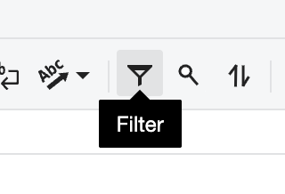
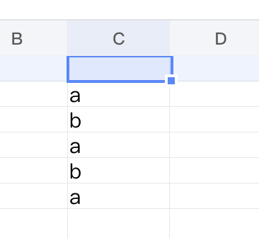
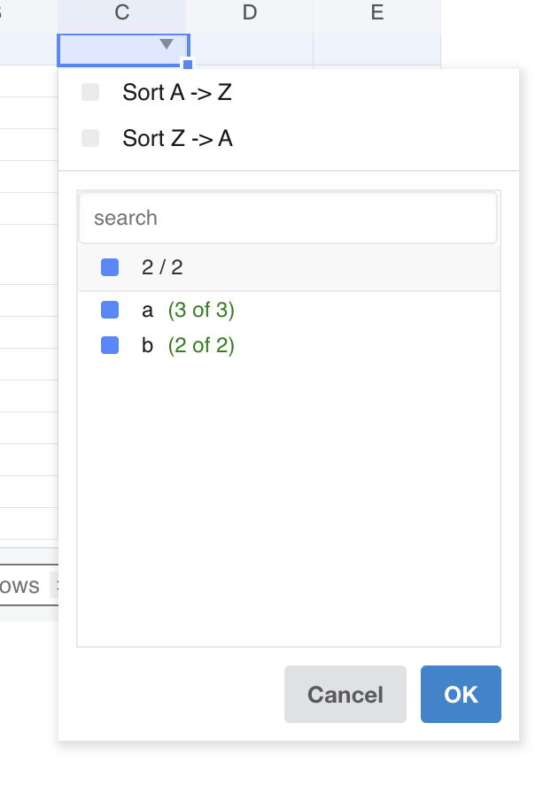

## Introduction

GridJs includes a toolbar autofilter toggle and a header filter popup for worksheet ranges.

When autofilter is active, clicking the filter arrow area in a header cell opens a popup where you can search values, check or uncheck values, and confirm with **OK**. Applying the filter updates visible rows through `exceptRowSet` and refreshes the sheet.

## How to use

1. Select the header range you want to filter.

   The toolbar autofilter button works on the current selected range (`selector.range`).

2. Click the **Autofilter** toolbar button.

   GridJs handles the `autofilter` toolbar action in `sheet.js`, then calls `data.autofilter()` in `data_proxy.js`.

3. Click the filter arrow area in a header cell.

   In `overlayerMousedown`, when the click is inside the header arrow region, GridJs calls `autoFilter.items(...)` and opens `SortFilter`.

4. Use **Sort A to Z** or **Sort Z to A** at the top of the popup.

   These actions are handled by `itemClick('asc' | 'desc')` and passed with filter apply on **OK**.

5. Use the search box to filter visible candidate items.

   `searchFilter()` filters item rows by key text and updates the header counter to `checked / visible`.

6. Use the header checkbox row to check or uncheck values in bulk.

   Without search text, `filterClick('all')` toggles all values. With search text, `filterClickAllWithSearch()` only toggles currently visible matched values.

7. Use individual item rows to include or exclude specific values.

   Each row shows `(cnt of total)`. Empty values are rendered with `t('filter.empty')`. Clicking a row toggles checked state and updates `filterValues`, `unfilterValues`, and `unfilterRecheck`.

8. Click **OK** to apply the current sort and filter state.

   `SortFilter.btnClick('ok')` passes selected values to `okActToApplyFilter`, and `sheet.js` calls `data.setAutoFilter(...)`.

9.  Click **Cancel** or click outside to close the popup without applying new changes.

   `hide()` restores temporarily unhidden rows when **OK** was not clicked.

10. Review the filtered result.

   `resetAutoFilter` recomputes filtered rows (`filteredRows`) and updates `exceptRowSet`, which controls hidden rows in the rendered sheet.

11. Click **Autofilter** again to clear filtering for the active worksheet autofilter.

   When autofilter is already active, `data.autofilter()` clears filter state and resets `exceptRowSet`.

## JavaScript API

The inspected code applies filtering through internal GridJs data and sheet methods.

### Relevant functions
| Function / Location | Description | Parameters | Returns |
|----------|-------------|------------|---------|
| `autofilter()` (`component/sheet.js`) | Handles toolbar `autofilter` action and calls the data-layer autofilter toggle. | None | `void` |
| `canAutofilter()` (`core/data_proxy.js`) | Returns whether worksheet autofilter can be enabled (`!autoFilter.active()`). | None | `boolean` |
| `autofilter()` (`core/data_proxy.js`) | Toggles worksheet autofilter on selected range; clears filter state when already active. | None | `void` |
| `SortFilter.set(...)` (`component/sort_filter.js`) | Initializes popup state from current filter items and sort state. | `ci`, `items`, `filter`, `sort`, `autoFilter`, `data` | `void` |
| `SortFilter.itemClick(...)` (`component/sort_filter.js`) | Sets sort direction (`asc` or `desc`) in the popup. | `it` | `void` |
| `SortFilter.searchFilter()` (`component/sort_filter.js`) | Filters visible item rows by search text and updates header counts. | None | `void` |
| `SortFilter.filterClick(...)` (`component/sort_filter.js`) | Handles select-all and individual include/exclude toggles. | `index`, `it` | `void` |
| `SortFilter.toggleFilterMeOnly()` (`component/sort_filter.js`) | Toggles collaborative “visible to me only” mode. | None | `void` |
| `SortFilter.btnClick('ok')` (`component/sort_filter.js`) | Collects selected values and triggers `okActToApplyFilter`. | `it` | `void` |
| `SortFilter.hide()` (`component/sort_filter.js`) | Closes popup and restores temp state when user did not confirm with **OK**. | None | `void` |
| `sortFilterChange(...)` (`component/sheet.js`) | Applies filter change by calling `data.setAutoFilter(...)`, then resets sheet view. | `ci`, `order`, `operator`, `value`, `unfilterValueSet`, `unfilterRecheck`, `showFilterResultForMeOnly`, `isCheckAll`, `isChanged`, `isFiltered` | `void` |
| `setAutoFilter(...)` (`core/data_proxy.js`) | Stores filter and sort settings, recalculates filtered rows, and optionally syncs collaborative filter ops to server. | `ci`, `order`, `operator`, `values`, `unfilterValueSet`, `unfilterRecheck`, `showFilterResultForMeOnly`, `isCheckAll`, `isChanged`, `isFiltered` | `void` |
| `resetAutoFilter(ci)` (`core/data_proxy.js`) | Recomputes filtered rows and updates `exceptRowSet`; applies sort operation when sort is set. | `ci` | `void` |
| `items(ci, getCell)` (`core/auto_filter.js`) | Builds popup value list with visible count (`cnt`) and total count (`total`) for each key. | `ci`, `getCell` | `Object` |

## Common Questions

Q: How is the filter popup opened?
A: It opens from header cells inside an active autofilter range when the click hits the filter-arrow area handled in `overlayerMousedown`.

Q: What happens if I click **Cancel** or click outside without pressing **OK**?
A: `SortFilter.hide()` restores temporarily unhidden rows by calling `autoFilter.restoreTempUnhiddenRows()` when the user did not confirm with **OK**.

Q: Can filtered results be visible only to me?
A: The popup includes `filterMeOnlyCheckbox`, and it is shown only when `data.settings.isCollaborative` is enabled.

Q: What does `(cnt of total)` mean in each filter item row?
A: `items(...)` computes `cnt` as currently visible count and `total` as total occurrences for that key in the filter range.

Q: Why is **OK** sometimes disabled?
A: `resetFilterHeader()` disables **OK** when no item is selected in the current mode (full list or current search scope).

Q: How does GridJs hide rows after filtering?
A: `AutoFilter.filteredRows` computes excluded row indexes, and `resetAutoFilter` writes them into `exceptRowSet` through `updateExceptRowSet`.
