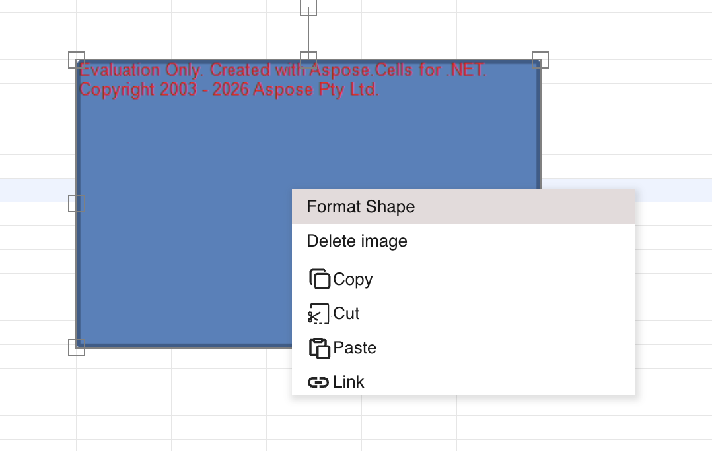
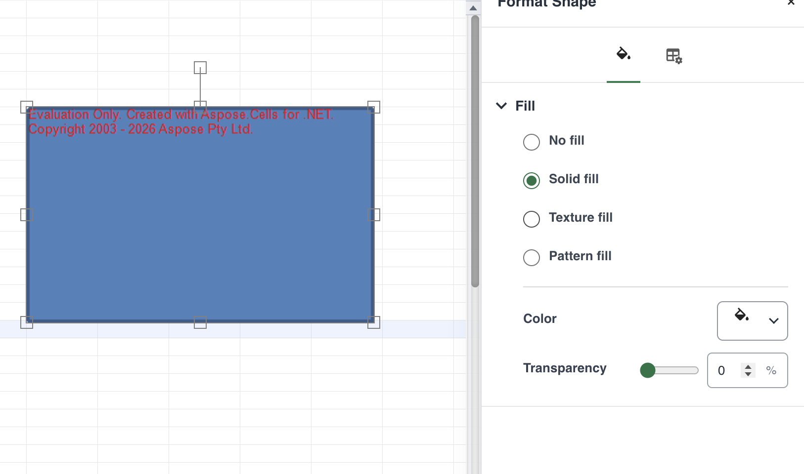
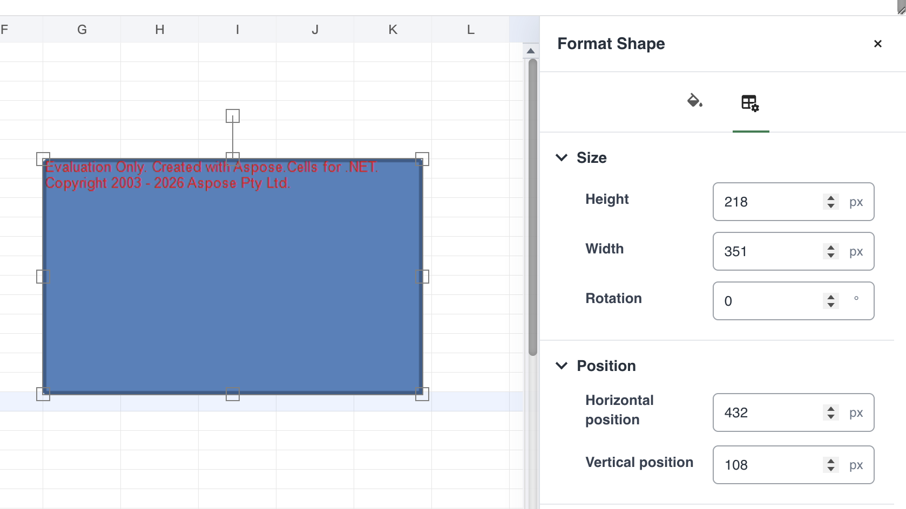

## Introduction

GridJs provides a **Format Shape** command for supported drawing shapes. The format panel can change the shape fill and can also set its height, width, rotation, horizontal position, and vertical position.

The command is not provided for charts, OLE objects, check boxes, radio buttons, combo boxes, spinners, spin buttons, or redaction shapes.

## How to use

1. Select a supported shape in the worksheet.

2. Right-click the selected shape and choose **Format Shape**.

3. In **Fill & Line**, choose the fill type that you want to apply.

   | Fill type | Available settings |
   | --- | --- |
   | **No fill** | Removes the shape fill. |
   | **Solid fill** | Select a color and set transparency from 0 to 100 percent. |
   | **Texture fill** | Select one of the preset textures displayed by the texture gallery. |
   | **Pattern fill** | Select a pattern and set its foreground and background colors. |

   GridJs can omit a fill type when the selected shape reports that capability as unavailable. An unrecognized existing fill is shown as unsupported instead of being presented as one of the editable fill types.

4. Open **Size & Properties** to change the shape geometry.

   - **Height** and **Width** use positive pixel values.
   - **Rotation** uses degrees. GridJs normalizes the entered value to a value from 0 through 359.
   - **Horizontal Position** and **Vertical Position** use pixel values.

5. Enter a new value and press **Enter**, or move focus away from the field, to apply it.

   GridJs rounds the geometry fields to whole numbers. Empty values, non-numeric values, and non-positive width or height values are rejected.

6. Close the format panel when the shape has the required fill and geometry.

   When formatting is locked for the selected shape, the panel displays a locked message and disables its controls.

## JavaScript API

The inspected code does not expose a dedicated public `Spreadsheet` method for opening the **Format Shape** panel or applying these panel changes. The feature is driven by the shape context menu and internal drawing-format handlers.

### Internal format flow

| Function or component | Verified behavior |
| --- | --- |
| `getDrawingFormatMenuItem(obj)` | Adds **Format Shape** for supported non-picture drawing objects. |
| `DrawingFormatPanel.showFor(target, "shape")` | Opens the format panel for the selected shape. |
| `DrawingFormatPanel.commitFill(fill)` | Submits a changed supported fill for a shape. |
| `DrawingFormatPanel.commitNumber(key, input)` | Validates and submits size, rotation, and position changes. |
| `Sheet.applyDrawingFormatChange(...)` | Applies the changed drawing properties and synchronizes the selected target. |

## Common Questions

Q: Why is Format Shape missing from a drawing's context menu?
A: GridJs does not add the command for charts, OLE objects, form controls, redaction shapes, or drawing objects without a supported drawing type.

Q: Why is a fill option missing?
A: The selected shape can provide format capabilities. GridJs omits any fill type whose capability is explicitly disabled.

Q: Why was my width or height rejected?
A: Width and height must be numeric values greater than zero.

Q: Can the format panel change a shape while formatting is locked?
A: No. GridJs displays a locked notice and disables the format controls.

