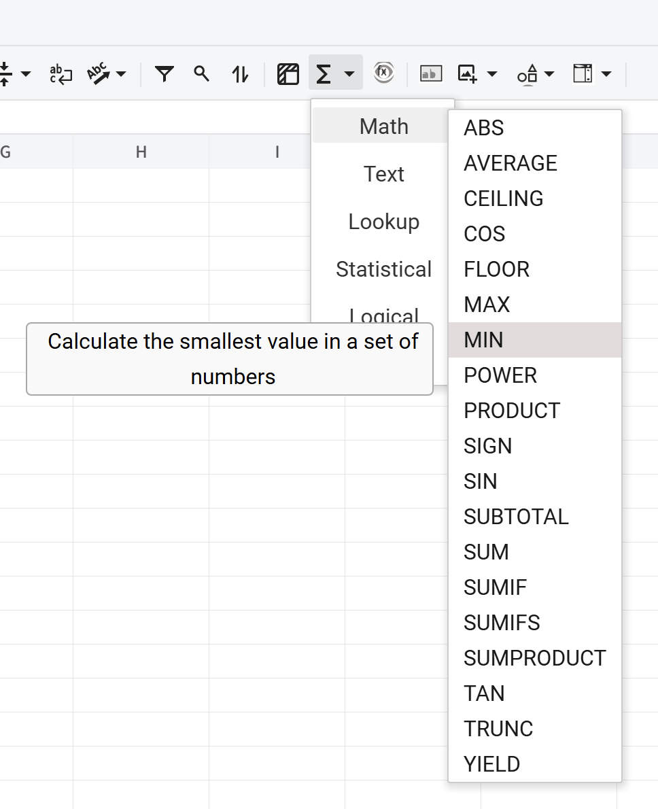

## Introduction

GridJs supports formula input in both the cell editor and the formula bar. When input starts with `=`, formula suggestion and formula tip UI are used during editing. You can also insert a function template from the **Functions** toolbar dropdown, which writes a formula skeleton into the selected cell.

## How to use

1. Select a target cell.
2. Type a formula that starts with `=` in the cell editor or in the formula bar (for example, `=SUM(A1:A3)`).

3. While typing after `=`, formula suggestions are shown; choose a function to insert it quickly.

4. To insert a function template directly, click **Functions** on the toolbar and pick a function. The selected cell receives `=FUNCTION()`.

5. Press **Enter** in the formula bar to commit and move selection down. Use **Shift+Enter** to move up, **Tab** to move right, and **Shift+Tab** to move left.


## JavaScript API
```js
xs = x_spreadsheet('#gridjs-demo-uid', option);

// Set a formula text directly (ri/ci are zero-based indexes).
xs.cellText(0, 0, '=SUM(A1:A3)');
xs.reRender();

// Insert a formula template into the current selected cell.
xs.sheet.data.setSelectedCellAttr('formula', 'SUM');
xs.reRender();
```

### Relevant functions

| Function | Description | Parameters | Returns |
|----------|-------------|------------|---------|
| `xs.cellText(ri, ci, text, sheetIndex)` | Sets cell text on a sheet. A formula can be passed as text beginning with `=`. | `ri` (number), `ci` (number), `text` (string), `sheetIndex` (number, optional) | `xs` |
| `xs.reRender()` | Re-renders the sheet after data changes so formula input results are visible. | None | `xs` |
| `xs.sheet.data.setSelectedCellAttr('formula', value)` | Writes a formula template to the current selection. For a single cell it becomes `=value()`. | `value` (function key, such as `SUM`) | `void` |

`xs.cellText(...)` writes formula text through the same cell-text pipeline used by editing.
`setSelectedCellAttr('formula', ...)` is the function-template path used by the toolbar Functions dropdown.

## Common Questions

Q: Why can I not input formulas in some sheets?
A: Input is blocked in read mode and also blocked when the sheet is locked.

Q: When does formula suggestion appear?
A: Suggestion appears when input starts with `=` and formula text is being edited.

Q: What happens when I pick a function from the Functions dropdown?
A: For a single selected cell, GridJs inserts a formula skeleton like `=SUM()` and places the editor cursor inside `()`.

Q: Why does the formula bar show formula text instead of displayed value?
A: If the selected cell has a formula field (`f`), the formula bar shows `f` first.
