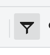

———
title: How to use AutoFilter and Sort
description: Enable AutoFilter on a selected range to apply per-column sort and filtering, or open the Sort dialog to run
multi-level sorting on the selection.
keywords: AutoFilter, Sort, SortFilter, Sort A -> Z, Sort Z -> A, Filter results visible to me only
type: docs
weight: 1
url: /net/aspose-cells-gridjs/how-to-autofilter-and-sort
aliases:
- /net/aspose-cells-gridjs/how-to-use-autofilter
- /net/aspose-cells-gridjs/how-to-use-sort
- /net/aspose-cells-gridjs/how-to-sort-and-filter
- /net/aspose-cells-gridjs/how-to-autofilter-sort
- /net/aspose-cells-gridjs/how-to-apply-autofilter
———

## Introduction

AutoFilter lets you toggle filtering for the current selection range and provides a per-column Sort/Filter panel from the
header row. The Sort/Filter panel includes “Sort A -> Z”, “Sort Z -> A”, and a selectable value list, plus a “Filter
results visible to me only” option in collaborative mode. The Sort button opens a dedicated Sort dialog that supports
multiple sort levels, different sort-on types, and orientation options.

## How to use

1. Select a range that includes the header row, then click AutoFilter on the toolbar or in the Edit menu to toggle filtering on the range.

2. Click the filter dropdown in a header cell to open the Sort/Filter panel.
3. In the panel, choose Sort A -> Z or Sort Z -> A, select the values to keep, and (in collaborative mode) toggle Filter results visible to me only if needed. Click OK to apply.

1. For multi-level sorting, select a range and click Sort on the toolbar or in the Edit menu to open the Sort dialog.

2. In the Sort dialog, confirm the range, choose Sort by, Sort on, and Order, optionally add more levels, set Orientation and My data has headers, then click OK.

## JavaScript API

xs = x_spreadsheet('#gridjs-demo-uid', option);

// Toggle AutoFilter for the current selection.
xs.sheet.data.autofilter();

// Apply a filter and optional sort to a column in the current AutoFilter range.
xs.sheet.data.setAutoFilter(ci, order, operator, values, unfilterValueSet, unfilterRecheck, showFilterResultForMeOnly);

// Run a sort operation on the current selection (or a provided range).
xs.sheet.data.doSortOpr(ci, order, isHeader, sortOn, colorValues, positionValues, orientation, range);

### Relevant functions

| Function | Description | Parameters | Returns |
|----------|-------------|------------|---------|
| data.autofilter() | Toggle AutoFilter on the current selection range. | None. | void |
| data.setAutoFilter(ci, order, operator, values, unfilterValueSet, unfilterRecheck, showFilterResultForMeOnly) | Apply
filter values and optional sort order for one column in the active AutoFilter range. | ci (column index), order ('asc' or
'desc' or null), operator (e.g., 'in' or 'all'), values (array of filter keys), unfilterValueSet (Set), unfilterRecheck
(Set), showFilterResultForMeOnly (boolean). | void |
| data.doSortOpr(ci, order, isHeader, sortOn, colorValues, positionValues, orientation, range) | Execute a sort operation
for the current selection or the provided range, with support for multi-level sorting. | ci (array of column indices),
order (array of 'asc'/'desc'), isHeader (boolean), sortOn (array of 'cellvalue'/'cellcolour'/'fontcolour'), colorValues
(array), positionValues (array), orientation ('top2bottom' or 'left2right'), range (optional CellRange). | void |

data.autofilter() toggles the AutoFilter state for the current selection.
data.setAutoFilter(...) updates filter values and sort order for a specific column in the active AutoFilter and then
refreshes the filtered result.
data.doSortOpr(...) sends a sort operation using the provided sort levels, orientation, and optional range.

## Common Questions

Q: Why can’t I enable AutoFilter on my selection?
A: If the selection overlaps an existing table AutoFilter, the UI shows “there is already table autofilter in the
selected range” and AutoFilter is not activated.

Q: Does AutoFilter sorting include the header row?
A: No. When AutoFilter applies sorting, it sorts starting from the row below the header.

Q: Why does the Sort dialog show an error about merged areas?
A: If the selected range contains merged areas, sorting is blocked and the UI shows “The select range has merge areas,we
do not support sort on merge areas”.

Q: When is “Filter results visible to me only” available, and what does it do?
A: It appears only when collaborative mode is enabled. If you uncheck it, the filter operation is sent to the server so
others can see it; if checked, it stays local.