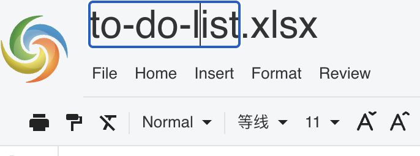

## Introduction

GridJs displays the current file name in the banner through the `Filenamebar` component. The default settings set `showFileName` to `true`, and the sheet constructor passes this setting into `Banner`, which creates the editable file name bar.

The inspected implementation separates the file name into a base name and suffix. Users edit the base name in a `contenteditable` field, while the suffix is displayed separately. When the field loses focus, GridJs removes HTML tags and line breaks from the edited text, then updates `sheet.filename` by appending the existing suffix.

## How to use

1. Make sure the file name bar is visible. The default setting is `showFileName: true`.

```js
const xs = x_spreadsheet('#gridjs-demo-uid', {
  showFileName: true,
});
```

2. Set the initial file name with `setFileName`. The inspected file name bar uses the last dot in the file name to split the base name from the suffix.

```js
xs.setFileName('Sales.xlsx');
```

3. Click the file name text in the banner.

4. Type the new base file name. The suffix is not part of the editable field.

5. Press `Enter` or move focus away from the file name field.

   On blur, GridJs removes HTML tags and line breaks from the edited text, then sets `sheet.filename` to the edited base name plus the existing suffix.



6. Use the built-in download actions after renaming.

   The inspected download handler reads `this.filename`. For non-original download types, it keeps the base name and changes the extension to the selected type in lowercase.

7. Hide the file name bar by setting `showFileName: false`.

```js
const xs = x_spreadsheet('#gridjs-demo-uid', {
  showFileName: false,
});
```

## JavaScript API

The inspected implementation exposes `setFileName(fname)` on the spreadsheet instance in `index.js`. This method updates the outer spreadsheet `filename`, the active sheet `filename`, and the banner file name display.

```js
const xs = x_spreadsheet('#gridjs-demo-uid', {
  showFileName: true,
});

xs.setFileName('Budget.xlsx');
```

The inspected `index.d.ts` file declares the `showFileName` option, but it does not declare `setFileName(fname)`.

### Relevant functions
| Function / Location | Description | Parameters | Returns |
|----------|-------------|------------|---------|
| `defaultSettings` (`core/data_proxy.js`) | Sets `showFileName: true` by default. | None | Settings object |
| `Sheet(targetEl, data, xs)` (`component/sheet.js`) | Reads `showFileName` from settings and creates `new Banner(..., showFileName, this, local)`. | `targetEl`, `data`, `xs` | `Sheet` instance |
| `Banner(data, widthFn, isHide, showPartToolbar, showFileName, sheet, local)` (`component/banner.js`) | Creates `Filenamebar`; hides the file name bar when `showFileName` is false. | `data`, `widthFn`, `isHide`, `showPartToolbar`, `showFileName`, `sheet`, `local` | `Banner` instance |
| `Banner.setFileName(fileName)` (`component/banner.js`) | Passes the file name to `filenamebar.setValue(fileName)`. | `fileName` | `void` |
| `Filenamebar.setValue(fileName)` (`component/filenamebar.js`) | Splits a file name at the last dot, places the base name in the editable field, and places the suffix in a separate element. | `fileName` | `void` |
| `Filenamebar` blur handler (`component/filenamebar.js`) | Removes HTML tags and line breaks from the edited base name, then updates `sheet.filename` with the existing suffix. | Blur event | `void` |
| `Filenamebar` keyup handler (`component/filenamebar.js`) | Blurs the editable field when `Enter` is pressed. | Keyup event | `void` |
| `setFileName(fname)` (`index.js`) | Updates `this.filename`, `this.sheet.filename`, and `this.sheet.menubar.setFileName(fname)`. | `fname` | `void` |
| `fileDownloadByType(type, device)` (`component/sheet.js`) | Reads `this.filename`; for non-original types, replaces the file extension with the selected output type. | `type`, `device` | `void` |
| `getReloadUrl()` (`component/sheet.js`) | Builds a reload URL query string with the current `filename` and `uid`. | None | URL string |

## Common Questions

Q: Is the file name bar visible by default?
A: Yes. The inspected default settings set `showFileName` to `true`.

Q: Does the UI edit the extension?
A: No. The inspected `Filenamebar` displays the suffix separately and only makes the base name editable.

Q: What happens when users press Enter in the file name field?
A: The keyup handler blurs the field. The blur handler then updates `sheet.filename`.

Q: Does `setFileName` require a file name with an extension for the banner display?
A: The inspected `Filenamebar.setValue(fileName)` returns without updating the displayed name when the value does not include a dot.
