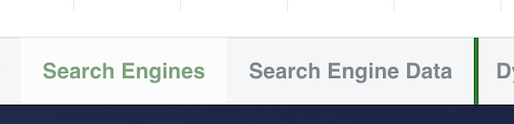
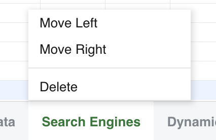

## Introduction

GridJs supports worksheet tab reordering in edit mode through the bottom sheet bar.

The `Bottombar` component (`component/bottombar.js`) handles visible tab movement. The `Spreadsheet.moveSheet(...)` method (`index.js`) updates the internal `datas` array, and `DataProxy.moveSheetOpr(...)` (`core/data_proxy.js`) sends a `move` operation when server synchronization is enabled. Because `getData()` and `getUpdateDatas()` iterate `this.datas`, the reordered array is the source used when returning or updating worksheet data.

## How to use

1. Open a workbook in edit mode.

   The sheet tab drag behavior is attached in `Bottombar.setItemEvent(...)` when `settings.mode === 'edit'`. In read mode, the code binds click switching only.

2. Drag a worksheet tab to a new position.

   When the pointer moves farther than the `dragThreshold`, `Bottombar` starts a drag session, adds the dragging style, calculates the target index with `resolveDropIndex(...)`, and shows before or after indicators with `xspread-drag-target-before` or `xspread-drag-target-after`.



3. Release the tab.

   On pointer up, `Bottombar` calls `moveItem(fromIndex, targetIndex)` to reorder the visible tab items and then calls `moveFunc(fromIndex, targetIndex)`. In `Spreadsheet`, that callback calls `moveSheet(fromIndex, toIndex, false)`.

4. Use the context menu when you want one-step movement.

   Right-click a worksheet tab to show the tab context menu. The menu contains:
   - **Move Left**
   - **Move Right**
   - **Delete**

   The first tab disables **Move Left**, and the last tab disables **Move Right**. The menu actions call `moveSheetByName(sheetname, -1)` or `moveSheetByName(sheetname, 1)`.



5. The order is stored in the workbook data model.

   `moveSheet(fromIndex, toIndex, ...)` removes the sheet from `this.datas` with `splice(...)` and inserts it at the target index. When server synchronization is enabled, it calls `sheetData.moveSheetOpr(sheetData.name, toIndex)`, which sends an operation object with `op: 'move'`.

## JavaScript API

GridJs exposes `moveSheet(fromIndex, toIndex)` in `index.d.ts`.

### Relevant functions

| Function / Location | Description | Parameters | Returns |
|----------|-------------|------------|---------|
| `moveSheet(fromIndex, toIndex)` (`index.d.ts`) | Public API declaration for moving a sheet to a new tab index. | `fromIndex`, `toIndex` | `this` |
| `Spreadsheet.moveSheet(fromIndex, toIndex, syncBottombar = true, syncServer = true)` (`index.js`) | Reorders `this.datas`, optionally updates the bottom bar, and optionally sends a server move operation. | `fromIndex`, `toIndex`, `syncBottombar`, `syncServer` | `this` |
| `Spreadsheet.moveSheetByName(sheetname, offset)` (`index.js`) | Finds a sheet by name and moves it left or right by an offset. | `sheetname`, `offset` | `this` |
| `Bottombar.moveItem(fromIndex, toIndex)` (`component/bottombar.js`) | Reorders visible tab items and tab names in the bottom bar. | `fromIndex`, `toIndex` | `boolean` |
| `DataProxy.moveSheetOpr(sheetName, toIndex)` (`core/data_proxy.js`) | Sends a server update operation with `op: 'move'`. | `sheetName`, `toIndex` | `void` |
| `Spreadsheet.getData()` (`index.js`) | Returns data by mapping the current `this.datas` order. | None | `Record<string, any>[]` |
| `Spreadsheet.getUpdateDatas()` (`index.js`) | Builds update data by iterating the current `this.datas` order and skipping chart sheets. | None | `Array` |

### Example

```javascript
// Move the first worksheet tab to the third tab position.
xs.moveSheet(0, 2);
```

## Common Questions

Q: Can users reorder worksheet tabs by dragging?
A: Yes. In edit mode, the bottom bar starts a pointer drag session and calls `moveItem(...)` plus `moveFunc(...)` when the tab is released over a different target index.

Q: Can users move a tab without dragging?
A: Yes. The worksheet tab context menu provides **Move Left** and **Move Right** actions.

Q: What prevents invalid moves?
A: `moveSheet(...)` returns without changes when indexes are out of range or when `fromIndex === toIndex`. It also returns without moving when the workbook is protected.

Q: How is the new order preserved in GridJs data?
A: `moveSheet(...)` reorders `this.datas`; `getData()` and `getUpdateDatas()` read from that array order, and `moveSheetOpr(...)` sends the server operation when synchronization is enabled.
