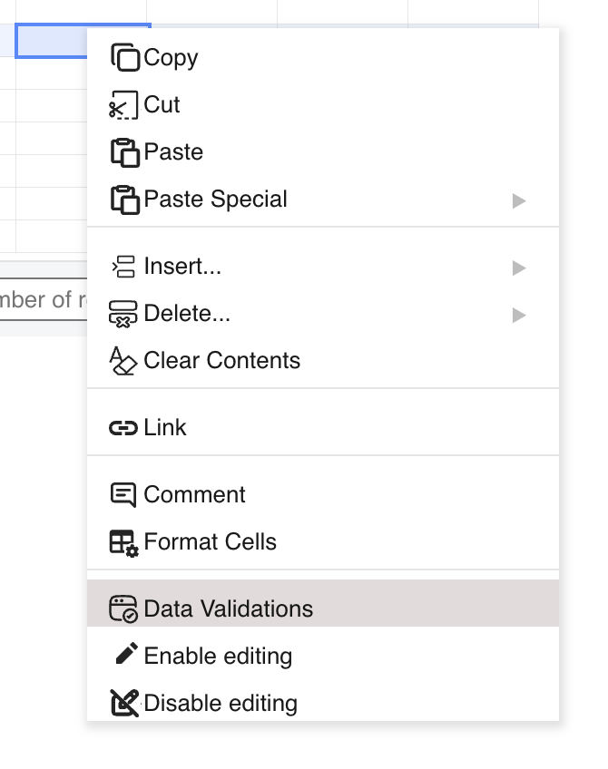
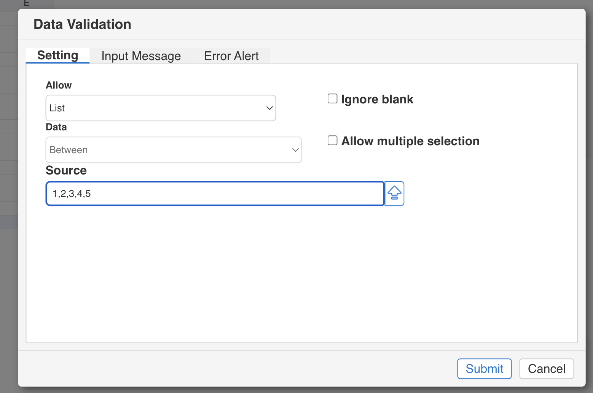
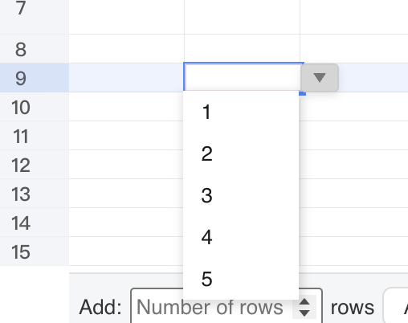

## Introduction

GridJs provides a **Data Validation** modal where you can set validation type, source, input message, and error alert for a selected range.

For dropdown validation, select **Allow = List**. The modal stores the list source in `f1/value1`, and GridJs uses that source to build selectable list items while editing the cell.

## How to use

1. Select the target cell or range.

   GridJs applies the validation to the current selection range.

2. Open **Data Validation** from the menu.

   In `menubar.js`, the Edit menu includes `new DataValidation()`, and `sheet.js` handles `type === 'data-validation'` to open `modalDataValidation`.

3. Set **Allow** to **List** in the **Setting** tab.

   In `modal_data_validation.js`, choosing `List` shows `Source`, disables the Data operator dropdown, and can show **Allow multiple selection**.

4. Enter the **Source** for list values.

   Use comma-separated values (for example `A,B,C`) or a formula/range source starting with `=` (for example `=A1:A10`).

5. Optionally configure **Ignore blank** and **Allow multiple selection**.

   The modal writes these options into validation data (`ignoreblank`, `ismultiple`) on submit.

6. Click **Submit**.

   `modalDataValidation.change` updates validations for the selected range, sets validator type to `list`, and updates collaborative state with `updateValidationOpr(...)` when collaboration is enabled.

7. Select a validated cell and open the dropdown values.

   When the selected validator type is `list`, `selector.showDropdownButton()` displays the dropdown button, and entering edit mode loads list items through `validator.values(data)`.

8. Pick one value or multiple values.

   In multi-select mode, `suggest.js` keeps selected items and writes them back as a comma-separated string.

## JavaScript API

The inspected code applies dropdown validation through modal and data-layer objects.

### Relevant functions
| Function / Location | Description | Parameters | Returns |
|----------|-------------|------------|---------|
| `DataValidation` (`component/toolbar/data_validation.js`) | Defines the `data-validation` command tag. | None | `DataValidation` instance |
| Edit menu setup (`component/menubar.js`) | Adds `DataValidation` under the Edit menu. | `data`, `widthFn`, `isHide`, `showPartToolbar`, `local` | `Menubar` instance |
| Toolbar/menu change handler (`component/sheet.js`) | Handles `type === 'data-validation'` and opens `modalDataValidation.show(...)`. | `type`, `value`, `extra` | `void` |
| `ModalDataValidation.settingPageChangeFn(...)` (`component/modal_data_validation.js`) | Switches UI fields by `allowType`; for `List`, shows `Source` and optional `isMultiple`. | `allowType`, `data` | `void` |
| `ModalDataValidation` submit handler (`component/modal_data_validation.js`) | Builds the validation object and emits `change(validationIndex, validation)`. | None | `void` |
| `modalDataValidation.change` (`component/sheet.js`) | Creates and assigns validation to selected range; maps `allowtype` to `validator.type/value`. | `index`, `validation` | `void` |
| `getListValue` (`src/index.js`) | Resolves list values for `=` sources from sheet range or server `vlist` path. | `v` | `Promise<Array>` |
| `Validator.values` (`core/validator.js`) | Returns dropdown options: split by comma or resolve `=` reference via `data.getListValue(...)`. | `data` | `Promise<Array>` |
| `Selector.showDropdownButton` (`component/selector.js`) | Shows the in-cell dropdown button when selected validator type is `list`. | None | `void` |
| List suggest handling (`component/editor.js`, `component/suggest.js`) | Loads list items, supports multi-select, and writes selected values to editor text. | internal editor/suggest state | `void` |

## Common Questions

Q: What source formats are supported for List validation?
A: `Validator.values` supports comma-separated text and formula/range sources that start with `=`.

Q: How are `=` sources resolved?
A: `getListValue` resolves explicit A1 ranges locally when possible, and uses the server `vlist` path for named-range or formula-based references.

Q: When does the dropdown button appear in a cell?
A: `Selector.showDropdownButton` shows it only when `data.getSelectedValidator()?.type === 'list'`.

Q: How is multiple selection stored?
A: In multi-select mode, selected items are joined with `, ` and written back as one cell text value.
