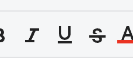
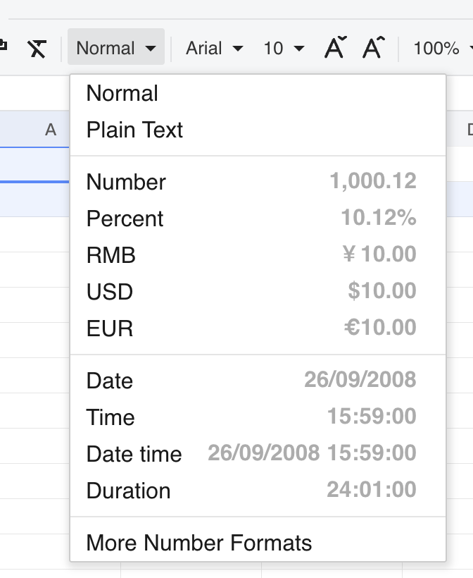
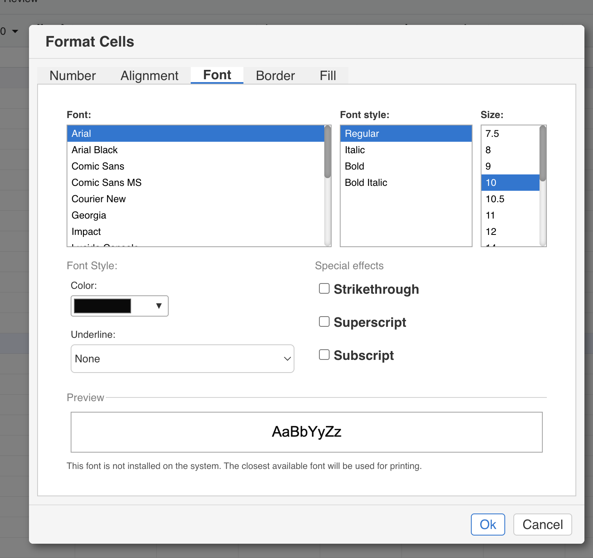

## Introduction

GridJs provides toolbar controls for **Font italic**, **Underline**, and **Strike**. The toolbar creates these controls with the command tags `font-italic`, `underline`, and `strike`.

For selected cells, GridJs stores italic under the cell style font object, stores strike as `style.strike`, and stores underline as `style.underline`. The canvas renderer uses these style values when drawing cell text.

## How to use

1. Select the cell or range that you want to format.

   Toolbar formatting is forwarded to the selected cell range through the sheet toolbar change handler.

2. Click **Font italic** on the toolbar, or press **Ctrl+I**.

   The italic toolbar item uses the `font-italic` command. When no explicit value is provided, GridJs toggles `font.italic` on the selected cells.

3. Click **Underline** on the toolbar, or press **Ctrl+U**.

   The underline toolbar item uses the `underline` command. A toolbar click toggles the selected cells between underline value `Single` and `None`.

4. Click **Strike** on the toolbar.

   The strike toolbar item uses the `strike` command. When no explicit value is provided, GridJs toggles `style.strike` on the selected cells.

5. Use **More Number Formats** when you need underline style choices.

   The More Number Formats dialog reads the current cell style and initializes **Font style**, **Underline**, and **Strikethrough** controls. The underline dropdown contains `None`, `Single`, `Double`, `SingleAccounting`, and `DoubleAccounting`. The dialog applies the selected font settings through the `formatUpdate` style update flow.

6. Review the formatted cells on the sheet.

   Italic text is drawn by adding `italic` to the canvas font string. Strike and underline are drawn as lines over or below the rendered text. Underline is not drawn when the stored underline value is `None`.

## JavaScript API

The inspected code exposes default style settings in the GridJs options type and implements cell updates through internal toolbar, sheet, and data objects. It does not expose a separate public JavaScript method dedicated only to italic, strike, or underline formatting.

### Relevant functions
| Function / Location | Description | Parameters | Returns |
|----------|-------------|------------|---------|
| `Italic` (`component/toolbar/italic.js`) | Creates the toolbar toggle item with tag `font-italic` and shortcut label `Ctrl+I`. | None | `Italic` instance |
| `Underline` (`component/toolbar/underline.js`) | Creates the toolbar toggle item with tag `underline` and shortcut label `Ctrl+U`. | None | `Underline` instance |
| `Strike` (`component/toolbar/strike.js`) | Creates the toolbar toggle item with tag `strike`. | None | `Strike` instance |
| `Toolbar.trigger(type)` (`component/toolbar/index.js`) | Clicks a toolbar item by resolving `${type}El`; keyboard handlers use it for italic and underline. | `type` | `void` |
| Toolbar change handler (`component/sheet.js`) | For ordinary toolbar commands, forwards `type` and `value` to `data.setSelectedCellAttr(type, value)` and resets the sheet. | `type`, `value`, optional `callback` | `void` |
| `setSelectedCellAttr(property, value)` (`core/data_proxy.js`) | Applies style changes to the selected range. For `font-italic`, it toggles `font.italic` when no value is supplied. For `strike`, it toggles `style.strike`. For `underline`, it toggles between `Single` and `None` or accepts an explicit value. | `property`, optional `value` | `void` |
| `setRangeAttr(range, property, value)` (`core/data_proxy.js`) | Applies a style property to a range by calling `setSelectedCellAttr`. The More Number Formats dialog uses it with `formatUpdate`. | `range`, `property`, `value` | `void` |
| `formatUpdate` branch (`core/data_proxy.js`) | Applies a style object that can include `font.italic`, `strike`, and `underline`. | style object in `value` | `void` |
| `drawFontLine(type, tx, ty, align, valign, blheight, blwidth, underlineStyle)` (`canvas/draw.js`) | Draws underline or strike lines. For underline, it supports `Single`, `SingleAccounting`, `Double`, and `DoubleAccounting`. | line type, text position, alignment, font metrics, underline style | `void` |
| `Options.style` (`index.d.ts`) | Defines default style fields including `strike`, `underline`, and `font.italic`. | option object | Type declaration |

## Common Questions

Q: Is there a keyboard shortcut for italic?
A: Yes. The sheet keyboard handler maps **Ctrl+I** to `toolbar.trigger('italic')`, and the italic toolbar item uses the `font-italic` command.

Q: Is there a keyboard shortcut for underline?
A: Yes. The sheet keyboard handler maps **Ctrl+U** to `toolbar.trigger('underline')`, and the underline toolbar item uses the `underline` command.

Q: Is there a keyboard shortcut for strike?
A: The inspected code creates a **Strike** toolbar item with the `strike` command, but no strike keyboard shortcut was found in the inspected keyboard handler.

Q: Which underline styles are available in More Number Formats?
A: The inspected dialog defines `None`, `Single`, `Double`, `SingleAccounting`, and `DoubleAccounting`.
