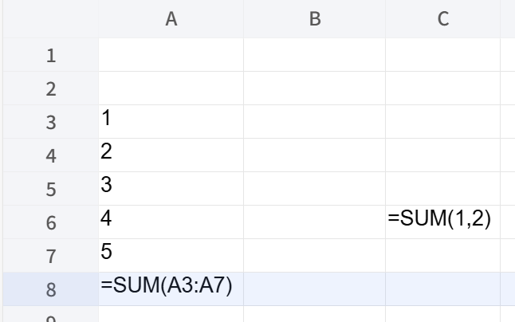

## Introduction

Show Formulas is a toolbar toggle that switches worksheet display between normal cell output and formula text. When it is on, a formula cell displays its formula expression in the cell. When it is off, the cell returns to normal rendered value/text display. If `showFormulas` is not set in settings, the toolbar state is initialized as off.

## How to use

1. Open a worksheet with the toolbar visible.
2. Click **Show Formulas** in the toolbar.

3. Formula cells now display formula text in the grid.

4. Click **Show Formulas** again to switch back to normal display.


## JavaScript API
```js
xs = x_spreadsheet('#gridjs-demo-uid', option);

// Enable formula text display.
xs.sheet.data.settings.showFormulas = true;
xs.reRender();
xs.sheet.toolbar.reset();

// Disable formula text display.
xs.sheet.data.settings.showFormulas = false;
xs.reRender();
xs.sheet.toolbar.reset();
```

### Relevant functions

| Function | Description | Parameters | Returns |
|----------|-------------|------------|---------|
| `x_spreadsheet(selector, option)` | Creates the spreadsheet instance. | `selector` (string), `option` (object) | Spreadsheet instance (`xs`) |
| `xs.reRender()` | Re-renders the sheet after changing display settings. | None | `xs` |
| `xs.sheet.toolbar.reset()` | Refreshes toolbar button states from current sheet settings. | None | `void` |

`xs.reRender()` updates table/canvas rendering so the Show Formulas effect is visible.
`xs.sheet.toolbar.reset()` syncs the toolbar toggle state with `data.settings.showFormulas`.

## Common Questions

Q: Why can I not toggle Show Formulas on a protected sheet?
A: The toolbar change handler blocks this action when the sheet is locked.

Q: Why is the default state off?
A: When `data.settings.showFormulas` is undefined, toolbar reset sets the Show Formulas toggle state to false.

Q: What happens to rich text when Show Formulas is enabled?
A: Rich text rendering is skipped while Show Formulas is on.
