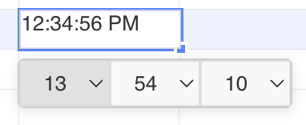

## Introduction

GridJs includes a `Timepicker` component inside the cell editor. The time picker renders hour, minute, and second select controls.

The inspected editor shows the time picker when the active cell is recognized as time content. It can appear because the cell style format is `time`, because the current text is detected by `data.isTime(text)`, because a custom number format is detected as time, or because the selected cell has a time validation rule.

## How to use

1. Select the cell or range that should use a time value.

2. Open the format dropdown and choose `Time`.

   The inspected format dropdown includes the `time` format with the visible title `Time`. When the toolbar change handler receives this format, GridJs applies the selected cell attribute with `data.setSelectedCellAttr('format', 'time')`.

3. Open the cell editor for the time-formatted cell.

   When the editor receives a cell whose style format is `time`, or whose text is detected as a time value, GridJs shows the time picker. If the cell already contains non-empty text, the time picker tries to parse it and sets the hour, minute, and second controls.

4. Change the hour, minute, or second select control.

   The time picker contains 24 hour options and 60 minute and second options. When a select value changes, GridJs calculates the selected time as a fraction of one day and writes that offset string to the editor.

5. Use data validation when selected cells should be constrained to time values.

   Open `Data Validation` from the context menu, choose `Time` in the `Allow` field, choose the comparison in the `Data` field, and enter the required time values. When a `Time` validation is saved, GridJs also sets the selected cell format to `time`.

## JavaScript API

The inspected code does not expose a declared public JavaScript method for opening the time picker directly. Time picker behavior is wired into the internal editor, format handling, and data validation handling.

### Relevant functions
| Function / Location | Description | Parameters | Returns |
|----------|-------------|------------|---------|
| `baseFormats` (`core/format.js`) | Defines the `time` format entry used by the format dropdown. | None | Format entry array |
| `DropdownFormat` (`component/dropdown_format.js`) | Renders the format dropdown and sends `change("format", it.key)` when a format is selected. | `belongItem` | `Dropdown` instance |
| `toolbarChange(type, value)` (`component/sheet.js`) | Applies unhandled toolbar changes with `data.setSelectedCellAttr(type, value)`, including `format` changes from the dropdown. | `type`, `value`, optional `callback` | `void` |
| `ModalDataValidation.getSettingPage()` (`component/modal_data_validation.js`) | Adds `Time` to the validation `Allow` dropdown. | None | Section component |
| `modalDataValidation.change(index, validation)` (`component/sheet.js`) | Saves the validation, maps `Time` validation to `validator.type`, and sets selected cell format to `time`. | `index`, `validation` | `void` |
| `Editor.setCell(cell, validator, data, focus)` (`component/editor.js`) | Shows the time picker when style, text, custom format, or validator type matches time. | `cell`, `validator`, `data`, optional `focus` | `Promise<void>` |
| `Timepicker.setValue(timeString, fromInputEl)` (`component/timepick.js`) | Parses a time string, updates hour, minute, and second select values, and hides seconds when the input has only hour and minute parts. | `timeString`, optional `fromInputEl` | `Timepicker` instance |
| `Timepicker.change(cb)` (`component/timepick.js`) | Builds an `HH:mm:ss` value internally, converts it to a fraction of one day, and passes that offset string to the callback. | `cb` | `void` |

## Common Questions

Q: When does the time picker appear?
A: The inspected editor shows it when the style format is `time`, when `data.isTime(text)` returns true, when a custom format is detected as a time format, or when the validator type is `time`.

Q: Does the time picker write `HH:mm:ss` directly to the editor?
A: No. The inspected `Timepicker.change` builds `HH:mm:ss` internally, converts it to a fraction of one day, and passes that offset string to the editor.
