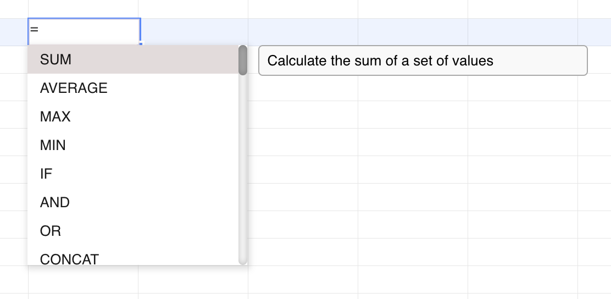

## Introduction

GridJs uses the `Suggest` component to show filtered suggestions while a cell is being edited. The inspected implementation uses it for formula names when the editor text starts with `=`, and for list validation values when a selected cell has a list validator.

GridJs also uses the `ModalInputSuggest` dialog for content suggestions returned by the syntax checking flow. When syntax checking is enabled and the server returns a different value, GridJs opens the **Suggest Input** dialog with the suggested text.

## How to use

1. Start editing a cell and type `=`.

   When the editor input starts with `=`, GridJs searches the formula list with the text after the equals sign and shows formula suggestions.

2. Type part of a formula name.

   The suggestion list filters items whose key starts with the typed text converted to uppercase. Formula suggestions display the formula key.

3. Use the keyboard or mouse to choose a formula.

   The suggestion component handles **Up**, **Down**, **Enter**, and **Tab** while the editor has focus. Choosing a formula inserts the formula key followed by `(` into the editor and shows the formula tip for the current formula text.

4. Enable syntax checking from the toolbar if the syntax status button is visible.

   The toolbar item `syntaxstatus` toggles `data.settings.checkSyntax`. The toolbar hides this item when `data.settings.showCheckSyntaxButton` is not enabled.

5. Configure a syntax checking endpoint before relying on content suggestions.

   The public GridJs instance forwards `setSyntaxCheckUrl(url)` to the sheet. The sheet stores the URL as `syntaxCheckUrl`.

6. Finish editing non-formula text.

   If syntax checking is enabled, a syntax check URL is configured, the finished text is not empty, the text does not start with `=`, and the trimmed text is not all digits, GridJs posts the text to the syntax check URL.

7. Review the **Suggest Input** dialog.

   The syntax check request sends `uid`, `v`, and `locale`. If the JSON response contains `v` and that value differs from the entered text, GridJs opens the **Suggest Input** dialog with the returned value.

8. Click **OK** to accept the suggested content.

   Accepting the dialog calls the sheet update flow with the suggested words. Closing the dialog hides it.

## JavaScript API

The inspected code exposes the syntax check URL setter through the GridJs instance and keeps the suggestion UI components internal to the editor and sheet.

### Relevant functions
| Function / Location | Description | Parameters | Returns |
|----------|-------------|------------|---------|
| `setSyntaxCheckUrl(url)` (`index.js`) | Forwards the syntax check URL to the active sheet. | `url` | `void` |
| `setSyntaxCheckUrl(u)` (`component/sheet.js`) | Stores the URL in `this.syntaxCheckUrl`. | `u` | `void` |
| `dataSetCellText(text, state = 'finished')` (`component/sheet.js`) | Checks whether syntax checking should run, posts `uid`, `v`, and `locale`, and opens `ModalInputSuggest` when the response value differs. | `text`, optional `state` | `void` |
| `ModalInputSuggest.show(v, state, ri, ci)` (`component/modal_input_suggest.js`) | Opens the **Suggest Input** dialog, fills the input with `v`, stores edit state and cell coordinates, and focuses the input. | `v`, `state`, `ri`, `ci` | `void` |
| `ModalInputSuggest.btnClick(action)` (`component/modal_input_suggest.js`) | On `accept`, trims the dialog input and calls `change('accept', state, txt, ri, ci)`. | `action` | `void` |
| `Suggest` constructor (`component/suggest.js`) | Creates the suggestion popup, stores suggestion items, and registers the click callback. | `items`, `itemClick`, optional `width` | `Suggest` instance |
| `Suggest.search(word, type = '')` (`component/suggest.js`) | Filters suggestions by key prefix and renders the popup. Formula mode uses `type === 'f'`. | `word`, optional `type` | `void` |
| `Suggest.bindInputEvents(input, sheet)` (`component/suggest.js`) | Binds suggestion keyboard handling to an input element. | `input`, `sheet` | `void` |
| `inputEventHandler(evt)` (`component/editor.js`) | Shows formula suggestions when editor text starts with `=` and hides them otherwise. | `evt` | `void` |
| `suggestItemClick(it, focus)` (`component/editor.js`) | Inserts the selected list validation value or formula key into the editor. | `it`, `focus` | `void` |

## Common Questions

Q: When do formula suggestions appear?
A: They appear when the editor input starts with `=` and the cell is editable. The search text is the part after `=`.

Q: How are formula suggestions selected?
A: The suggestion popup supports mouse click, **Enter**, **Tab**, **Up**, and **Down** from the bound editor input.

Q: When does the **Suggest Input** dialog appear?
A: It appears only when syntax checking is enabled, `syntaxCheckUrl` is set, editing is finished, the trimmed text is non-empty, the text does not start with `=`, the text is not all digits, and the server response `v` differs from the entered text.

Q: What does accepting a content suggestion do?
A: The dialog passes the accepted text back to the sheet update flow with the stored edit state and cell coordinates.
