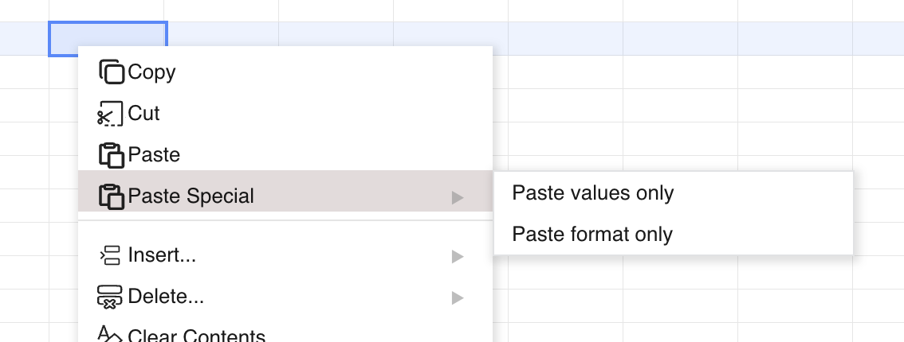

## Introduction

GridJs adds a **Paste Special** submenu to the context menu. That submenu contains **Paste values only** and **Paste format only**, and the sheet component routes them to `paste('text')` and `paste('format')`. Both actions stop immediately when the sheet is in read mode or the current sheet is locked.

## How to use

1. Select the source cell or range in GridJs.

2. Copy or cut the selection inside GridJs.

3. Select the target cell or range.

4. Right-click the selection and open **Paste Special**.

5. Click **Paste values only** when you want the handler to use the `text` paste branch.

6. Click **Paste format only** when you want the handler to use the `format` paste branch.



7. If the current sheet is read-only or locked, GridJs does not run the paste action.

## JavaScript API

```js
const xs = x_spreadsheet('#gridjs-demo-uid', options);

// Paste only the internal GridJs clipboard text branch.
const valuesPasted = await xs.sheet.data.pasteFromInternal('text', msg => {
  console.log(msg);
});

// Paste only the internal GridJs clipboard format branch.
const formatsPasted = await xs.sheet.data.pasteFromInternal('format', msg => {
  console.log(msg);
});

// Paste plain text into the current selection.
xs.sheet.data.pasteFromText('A\tB\r\n1\t2', msg => {
  console.log(msg);
});

// Paste styled HTML cells into the current selection.
xs.sheet.data.pasteFromHTML(htmlString, msg => {
  console.log(msg);
});
```

### Relevant functions
| Function | Description | Parameters | Returns |
|----------|-------------|------------|---------|
| `sheet.data.pasteFromInternal(what, error)` | Pastes from the internal GridJs copy/cut clipboard. | `what`: `'all'`, `'text'`, or `'format'`; `error`: callback for paste errors | `Promise<boolean>` |
| `sheet.data.pasteFromText(txt, error)` | Splits plain text by `\r\n` and `\t`, expands the target range, and writes text cells. | `txt`: plain text; `error`: callback for paste errors | `void` |
| `sheet.data.pasteFromHTML(html, error)` | Parses styled cells from HTML and applies them to the current selection. | `html`: HTML string; `error`: callback for paste errors | `void` |

For internal copy and paste, the row model uses `what === 'text'` to write destination `text` only, and `what === 'format'` to write destination `style` and copied merge metadata.

## Common Questions

Q: What does **Paste values only** do in this code?
A: The context menu action calls `paste('text')`, and the row model's `text` branch writes only the destination cell text.

Q: What does **Paste format only** do in this code?
A: The context menu action calls `paste('format')`, and the row model's `format` branch writes the destination cell style. When the copied cell includes merge metadata, that merge metadata is copied in the same branch.

Q: Does the **Paste Special** menu have a separate external clipboard fallback for formats?
A: No separate external format-only fallback was found in the menu handler. When internal copy/cut is unavailable, the code reads the browser clipboard and handles `text/plain` through `pasteFromText`, or `image/png` through image upload.

Q: What happens when the target intersects merged cells?
A: Paste is allowed only when the target is exactly one complete merged area and the source is a single cell, or when the merged target size is an integer multiple of the source range. For a multi-cell source pasted into one complete merged area, the code unmerges the target area before applying the paste.

Q: Do `Ctrl+Shift+V` and `Ctrl+Alt+V` have dedicated keyboard handling?
A: The submenu items display those labels, but in the inspected `sheet.js` code only `Ctrl+V` has a dedicated keyboard branch. No separate key handling branch was found for the two Paste Special combinations.
