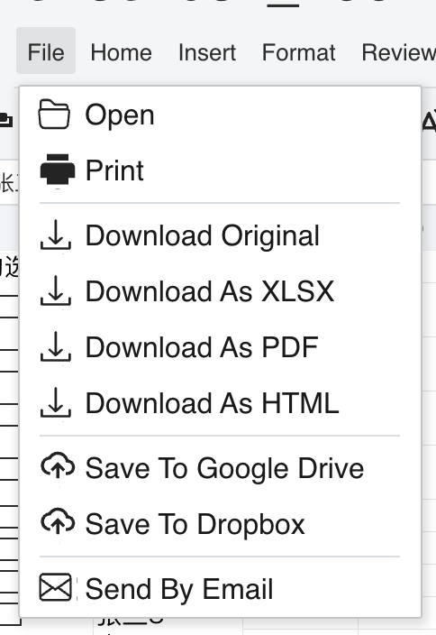
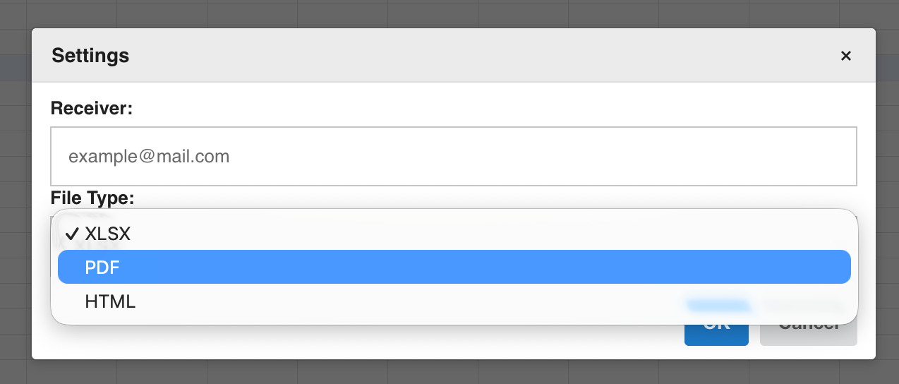

## Introduction

GridJs adds **Send By Email** to the File menu through the `Email` menu item. Selecting this item opens an email modal with a **Receiver** input and a **File Type** selector. The modal passes the receiver value and selected file type to `setEmailSendCallFunction` when the user clicks **OK** and a callback has been configured.

## How to use

1. Open GridJs and use the **File** menu.

2. Select **Send By Email**. GridJs routes the menu item tag `email` through the menu change handler and opens the email modal.



3. Enter a receiver address in the **Receiver** field. The field placeholder is `example@mail.com`.

4. Choose one file type from the **File Type** selector. The code defines three values: `xlsx`, `pdf`, and `html`.

5. Click **OK**. If the receiver input has been marked with a red border by the input handler, the modal shakes the receiver field and does not call the send callback.

6. When the receiver input is not marked red and `emailSendCallFunc` has been configured, GridJs calls the send callback with an object containing `receiver` and `type`, shows a **Sending Email** mask, and then shows a success toast with the returned message. If the callback throws, GridJs shows an error toast and closes the mask.

7. Click **Cancel** to close the modal without calling the send callback.



## JavaScript API

Use `setEmailSendCallFunction(emailSendCallFunc)` on the top-level spreadsheet instance to provide the email send callback.

```js
const xs = x_spreadsheet('#gridjs-demo-uid', options);

xs.setEmailSendCallFunction(async (mailObj) => {
  // mailObj.receiver comes from the Receiver input.
  // mailObj.type is one of: 'xlsx', 'pdf', or 'html'.
  return 'Email sent';
});
```

### Relevant functions
| Function / Location | Description | Parameters | Returns |
|----------|-------------|------------|---------|
| `new Email()` (`component/toolbar/email.js`) | Creates an icon menu item with the tag `email`. | None | `Email` instance |
| `Menubar(data, widthFn, isHide, showPartToolbar, local)` (`component/menubar.js`) | Adds `new Email()` to the File menu after the download entries. | `data`, `widthFn`, `isHide`, `showPartToolbar`, `local` | `Menubar` instance |
| `toolbarChange(type, value)` (`component/sheet.js`) | Opens `modalEmail` when `type === 'email'`. | `type`: menu or toolbar tag; `value`: optional item value | `void` |
| `ModalEmail` (`component/modal_email.js`) | Builds the Receiver input, File Type selector, OK button, and Cancel button. | None | `ModalEmail` instance |
| `setEmailSendCallFunction(emailSendCallFunc)` (`index.js`) | Stores the callback on `this.sheet.emailSendCallFunc`. | `emailSendCallFunc`: function called with `{ receiver, type }` | `void` |
| `modalEmail.change(action, mailObj)` (`component/sheet.js`) | Calls `emailSendCallFunc(mailObj)` when `action === 'ok'`, shows a sending mask, and reports success or error with a toast. | `action`: modal action; `mailObj`: `{ receiver, type }` | `Promise<void>` |

The inspected `index.d.ts` file does not declare `setEmailSendCallFunction`, but the `index.js` implementation exposes the method directly.

## Common Questions

Q: Where does the Send By Email command appear?
A: It is added to the File menu after the download-related menu entries.

Q: Which file types are available in the email modal?
A: The modal defines `xlsx`, `pdf`, and `html` as selectable file type values.

Q: What object is passed to the send callback?
A: GridJs passes an object with `receiver` from the Receiver input and `type` from the File Type selector.

Q: Is Send By Email blocked when the sheet is protected?
A: No. The `email` operation is included in `protectSheetAllowOperations`.
