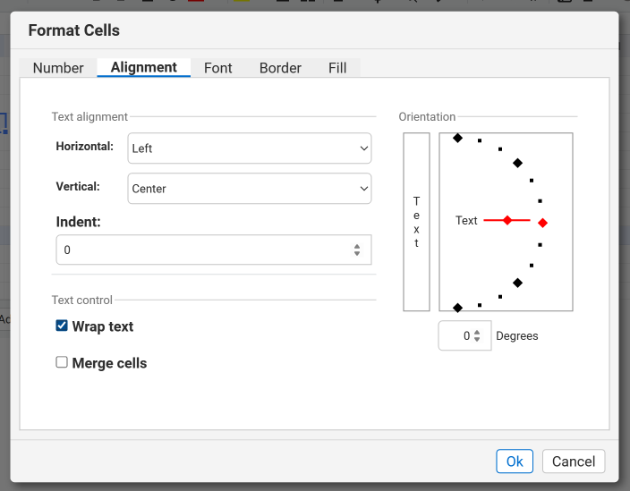

## Overview
Turning on text wrap makes long text automatically break onto new lines inside a cell, keeping all content visible without widening the column. For example, you can wrap a product description so it stays inside a narrow column while still being fully readable.

## How to use

### Step-by-Step Instructions

### Method A: Toolbar buttons (quickest way)

#### Step-by-Step Instructions

#### Step 1: Select the cells
**Action**: Click and drag the mouse over the cells you want to align.

**You'll see**: The selected range is highlighted with a blue border.


#### Step 2: Enable Wrap Text
**Action**: Click the **Wrap Text** button in the toolbar (icon looks like a curved arrow around lines).

**You'll see**: The selected cells now display wrapped text, breaking long lines into multiple lines within each cell.


### Method B: Format Cells dialog (full control)

#### Step 1: Select the cells you want to wrap
**Action**: Click and drag to highlight the cell(s) that contain the long text.

**You'll see**: The selected cells are outlined with a blue border.


#### Step 2: Open the Format Cells dialog
**Action**: Right‑click the highlighted cells and choose **Format Cells…** from the context menu

**You'll see**: A modal window titled “Format Cells” appears with several tabs (Number, Alignment, Font, Border, Fill).


#### Step 3: Go to the Alignment tab
**Action**: Click the **Alignment** tab inside the dialog.

**You'll see**: Options for Horizontal, Vertical, and a “Text control” section appear.


#### Step 4: Enable Wrap Text
**Action**: Check the **Wrap text** checkbox in the “Text control” section.

**You'll see**: A check‑mark appears next to “Wrap text”.



#### Step 5: Confirm the change
**Action**: Click the **OK** button at the bottom of the dialog.

**You'll see**: The dialog closes and the selected cells now display wrapped text (multiple lines within the same cell).


## For Developers: JavaScript API

### Quick Example
```javascript
// xs is the GridJs instance
// Set text wrap for the currently selected range
xs.sheet.data.setRangeAttr(
  xs.sheet.data.selector.range,   // the range you have selected
  'textwrap',                    // property name
  true                           // enable wrap
);
```

### API Reference
| Method | Parameters | Description |
|--------|------------|-------------|
| `setRangeAttr` | `range: Range`, `property: string`, `value: any` | Updates a visual attribute of the given cell range. Use property **'textwrap'** with value **true** to turn wrapping on (or **false** to turn it off). |

## Common Questions

**Q: Does Wrap text work for merged cells?**  
**A**: Yes, but the merged cell must have enough height; otherwise the text will be clipped.

**Q: I want to turn off Wrap text for many cells at once.**  
**A**: Select the whole range, open the Format Cells dialog, uncheck **Wrap text**, and click **OK**. You can also use the API: `setRangeAttr(..., 'textwrap', false)`.

**Q: Is Wrap text saved when I export the sheet?**  
**A**: The wrap setting is stored in the sheet’s style data, so it persists in exported formats that support cell styling (e.g., XLSX, CSV with formatting).