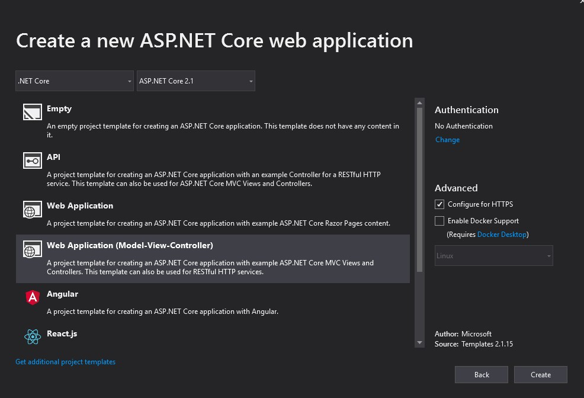
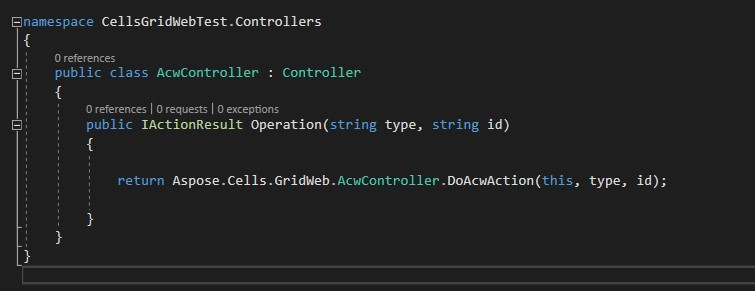
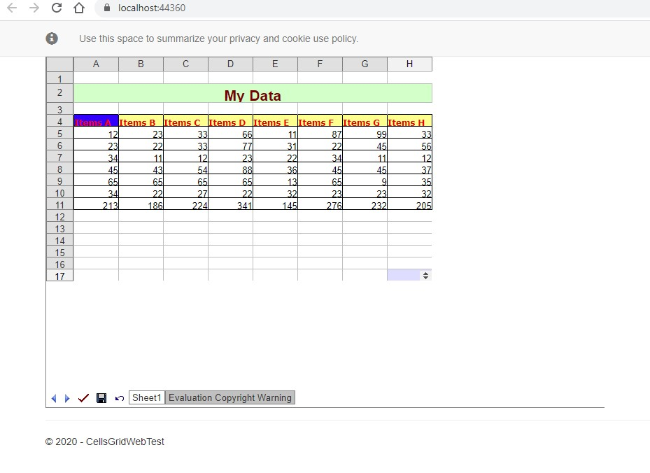

{} 

This topic explains how to use Aspose.Cells.GridWeb with .NET Core applications using Visual Studio 2019. This topic is useful for beginner‑level developers working with Aspose.Cells.GridWeb.

{} 
## **Use Aspose.Cells.GridWeb with .NET Core**
This topic shows how to use Aspose.Cells.GridWeb by making a sample website in Visual Studio 2019. The process has been divided into steps.
### **Step 1: Creating a New Project**
1. Open Visual Studio 2019.  
2. From the **File** menu, select **New**, then **Project**. The **Create a new project** dialog opens.  
3. Select **ASP.NET Core Web Application** from Visual Studio’s installed project templates and click **Next**.


4. Specify the location and name of the project, then click **Create**.


5. Select the **Web Application (Model-View-Controller)** template and make sure that **ASP.NET Core 2.1** is selected. 



6. Click **Create**.
### **Step 2: Checking the initial view**
Running the newly created project shows the default template in the browser as shown in the image below.


### **Step 3: Adding Aspose.Cells.GridWeb**
1. Add the following NuGet packages to the project  

```xml
<PackageReference Include="Microsoft.AspNetCore.App" />
<PackageReference Include="Microsoft.AspNetCore.Razor.Design" Version="2.1.2" PrivateAssets="All" />
<PackageReference Include="Newtonsoft.Json" Version="12.0.3" />
<PackageReference Include="System.Drawing.Common" Version="4.7.0" />
<PackageReference Include="System.Text.Encoding.CodePages" Version="4.7.0" />
```

2. Add the Aspose.Cells.GridWeb package  


3. Add the following to the **_ViewImports.cshtml** file in the *Views* folder.  



The file will look like this after the modifications:


4. Put the following code in the **HomeController**’s `Index` method.  



{} 

Remember to update the `SessionStorePath` and the `ImportExcelFile` path.

{} 


5. Add the following code in the **Index.cshtml** file in the *Views > Home* directory.  



The file will look like this after the change:


6. Add session support and the **GridScheduledService** in the **Startup.cs** file  
   1. Add the following code snippet in the `ConfigureServices` method.  




   2. Add the following code snippet in the `Configure` method.  




7. Put the latest `acw_client` in the directory **wwwroot/js**.  

{}   {}

8. Add an **AcwController** in the *Controllers* folder to handle the `acw` route, which provides the default operations for general edit actions.  




### **Step 4: Test the App**
Running the app will produce output similar to the one shown in the image below.


