{} 

This topic explains how to use Aspose.Cells.GridWeb in ASP.NET applications using Visual Studio.NET 2005. This topic is useful for beginner‑level developers working with Aspose.Cells.GridWeb.

{} 
## **Working with Aspose.Cells.GridWeb Using Visual Studio 2013**
This topic shows how to use Aspose.Cells.GridWeb by making a sample website in Visual Studio 2013. The process has been divided into steps.
### **Step 1: Creating New Web Site**
1. Open Visual Studio 2013.  
2. From the **File** menu, select **New Web Site**, then **Web Site**.  

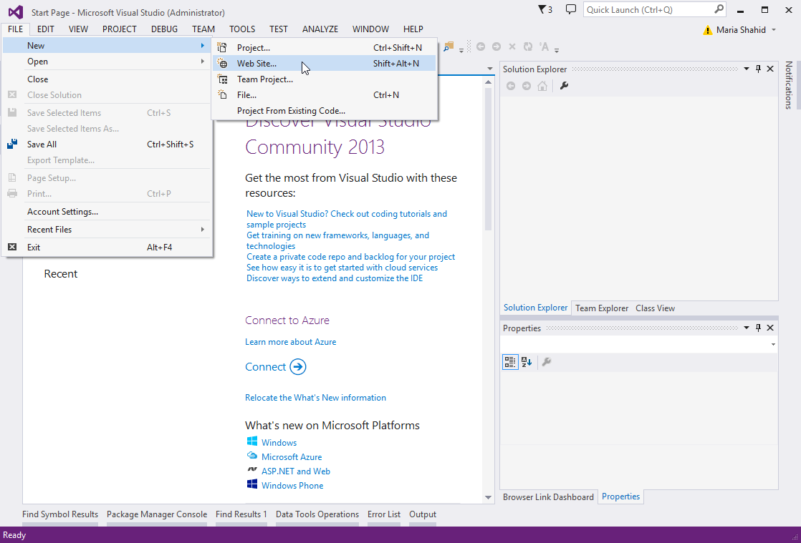

The New Web Site dialog is opened.  

1. Select **ASP.NET Web Forms Site** from Visual Studio installed templates.  
2. Choose HTTP mode for the location of the web site.  

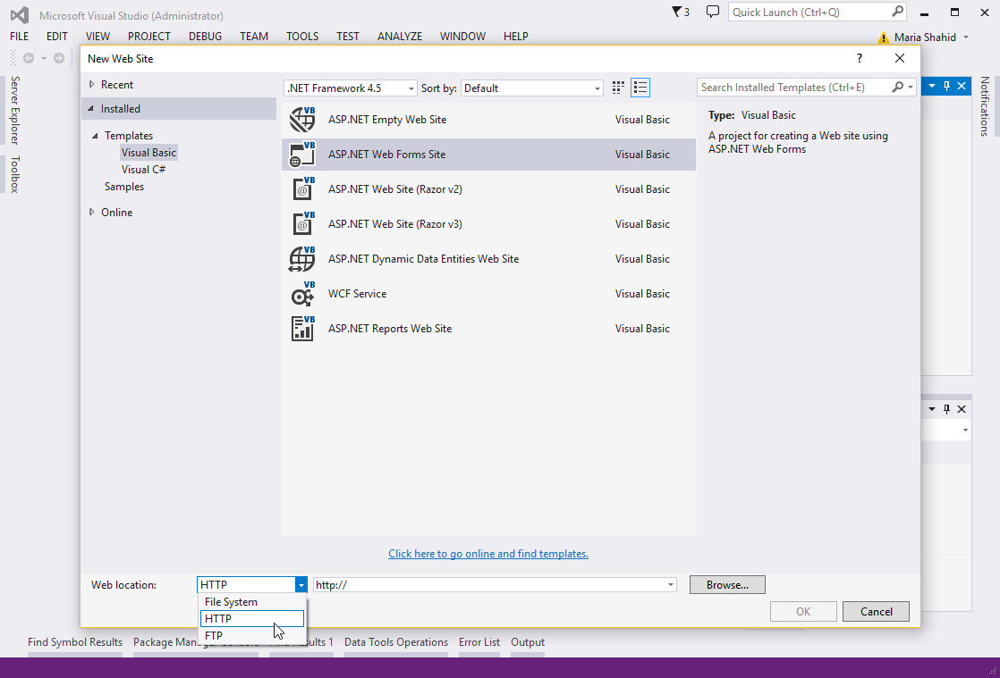

1. Specify a location where the web site files will be created and stored.  
   1. Click **Browse** in the New Web Site dialog.  

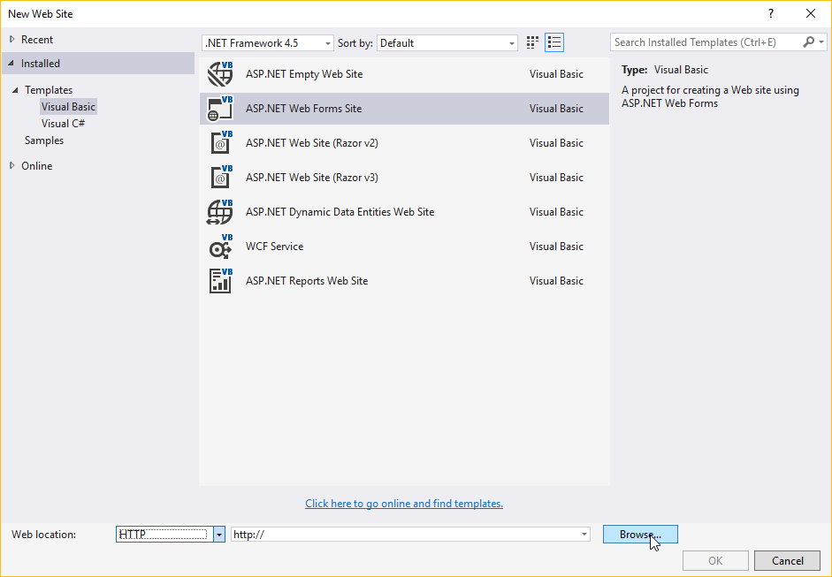

The Choose Location dialog is displayed.  

1. Click the **Local IIS** tab.  
   All folders and web applications stored in your IIS root folder are displayed (for example: C:\Inetpub\wwwroot).  

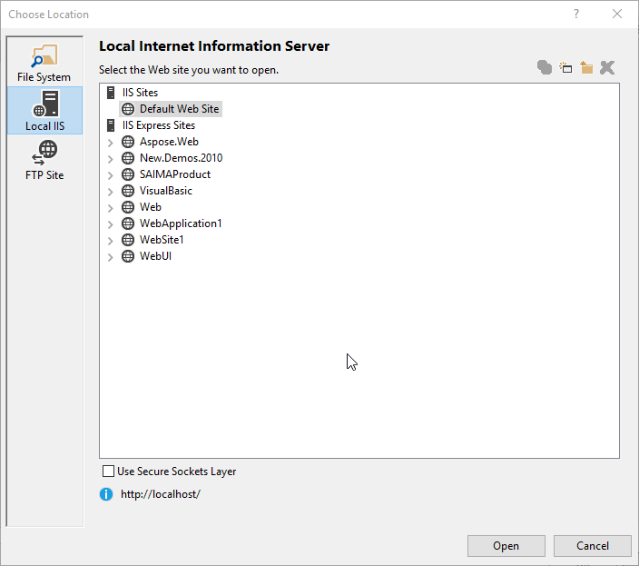

1. Now create a new web application in your local IIS where the website files will be stored.  
   The Choose Location dialog lets you create and delete web applications or virtual directories in your local IIS. To create a web application, click the button shown below.  

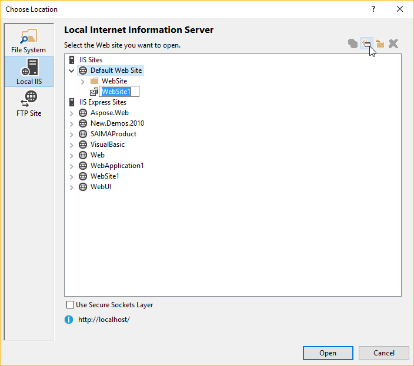

A new web application with the default name WebSite is created.  

1. Rename the web application. We renamed it **GridWebOn2013**.  
2. Click **Open**.  

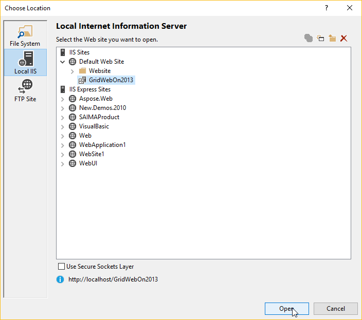

You return to the New Web Site dialog. The path of the web site location is set to <http://localhost/GridWebOn2013>.  

1. Click **OK** to let Visual Studio create a web site.  

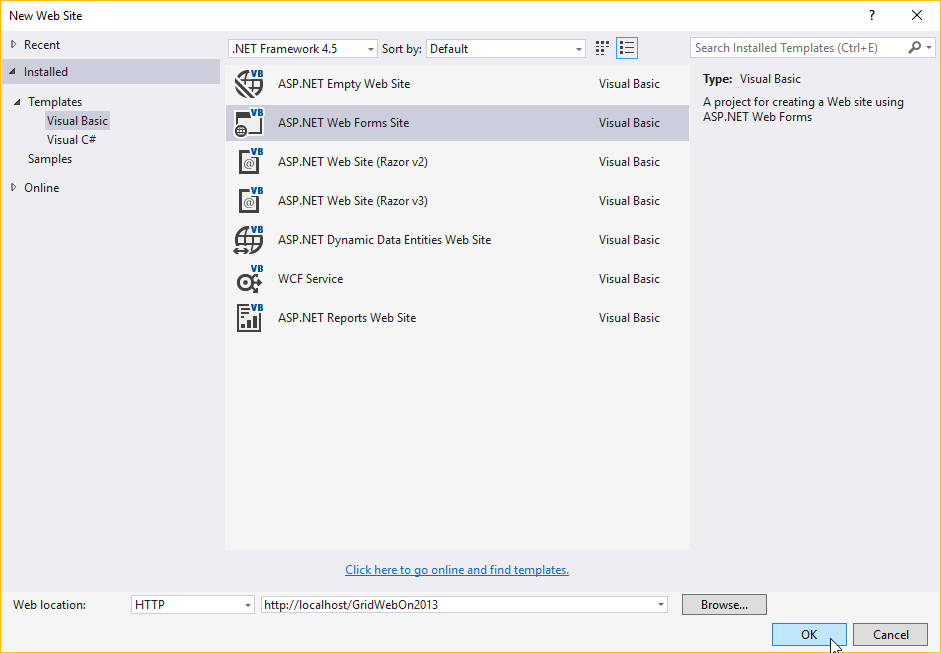
### **Step 2: Checking Source & Design Views of a Web Page**
A default web site has been created by Visual Studio 2013. It contains a **Default.aspx** web page with some dummy text and markup.  

**Source view of Default.aspx page**  

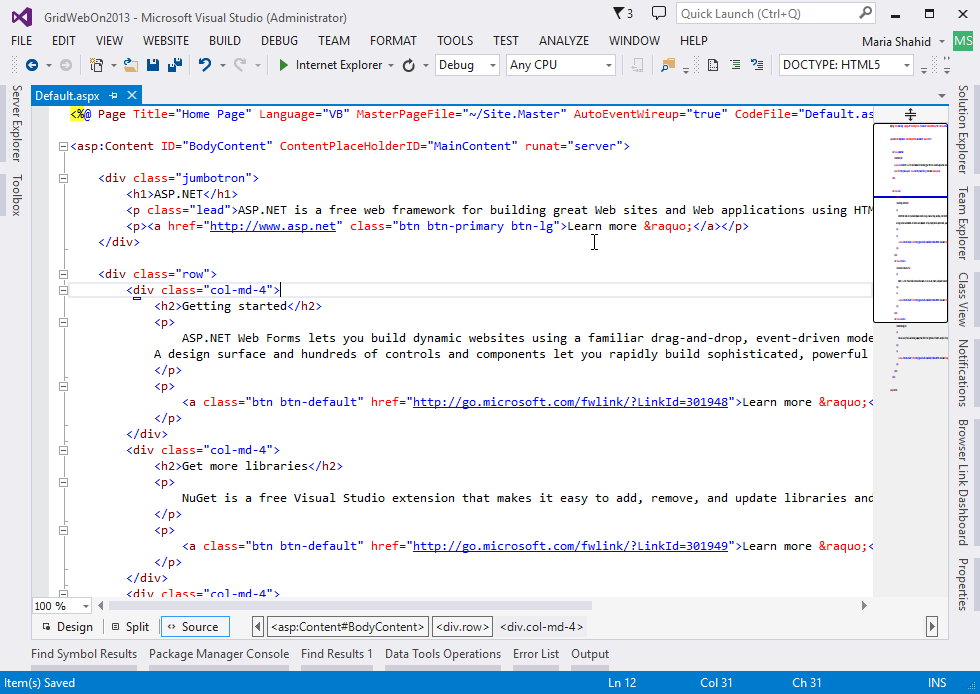

All web pages (including ASP.NET) can be opened in two modes. One is the source view that lets developers access and modify the source code. The second mode is the design view that can be used to design web pages in a WYSIWYG manner. The above screenshot shows the source view of the Default.aspx web page. To view the design view, click **Design**.  

**Design view of Default.aspx page**  

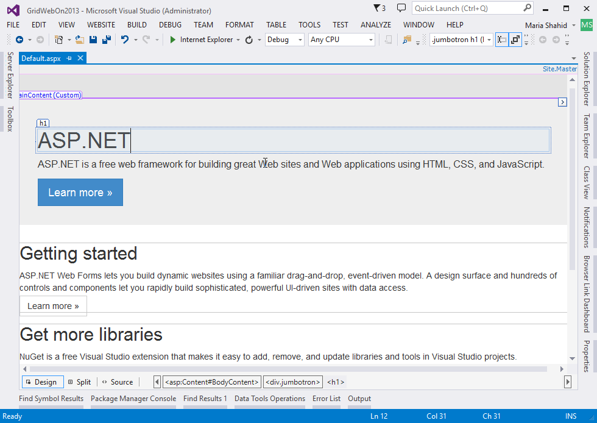

Delete the **Default.aspx** page added by Visual Studio and add a new blank **Default.aspx** page.

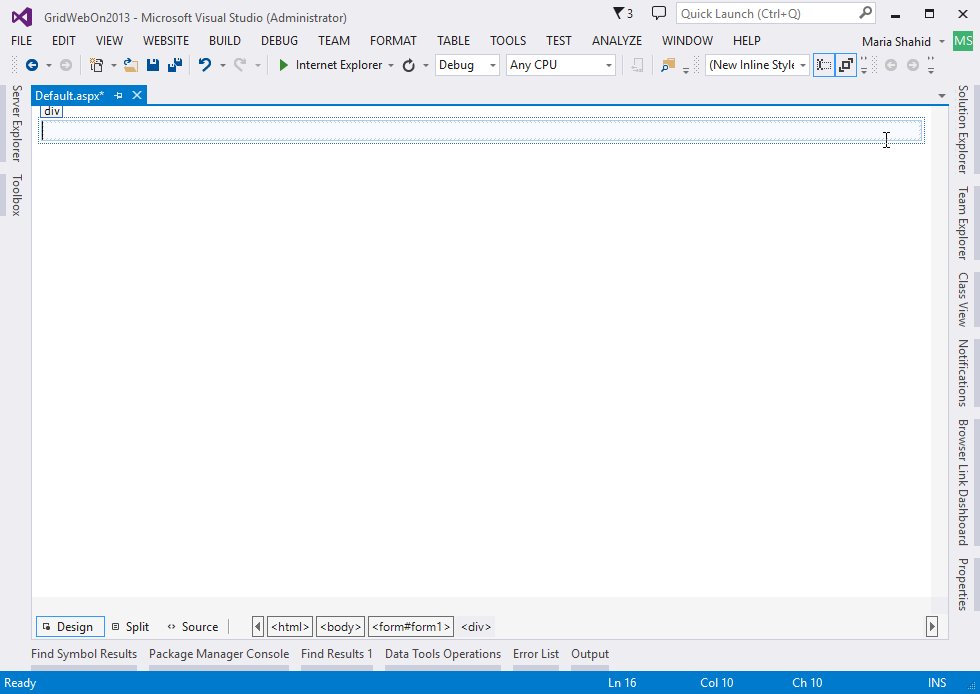
### **Step 3: Adding Aspose.Cells.GridWeb to Web Page**
You can simply add Aspose.Cells.GridWeb (or GridWeb) control to a web page by dragging it from the toolbox.  

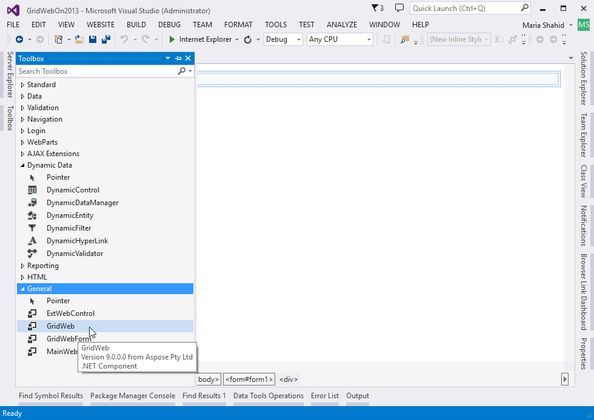

{} 

If you don't know how to add Aspose.Cells.GridWeb to the toolbox, refer to [Integrate Aspose.Cells Grid Controls with Visual Studio.NET](/cells/net/aspose-cells-gridweb/integrate-aspose-cells-grid-controls-with-visual-studio-net/). 

{} 

Once the GridWeb control is dropped onto the web page, it will render like this:  

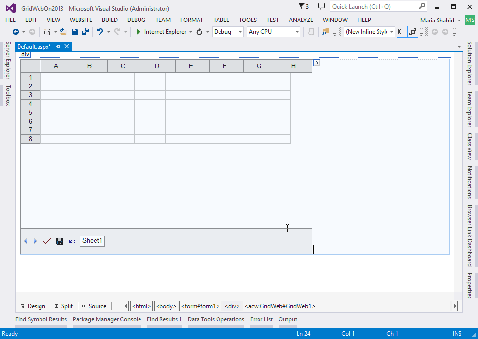

### **Step 4: Change the <!DOCTYPE> tag**
1. Switch to source view and find the following **<!DOCTYPE>** tag in the source code:  

**ASP.NET**



<!DOCTYPE html>



2. Select the complete tag.  

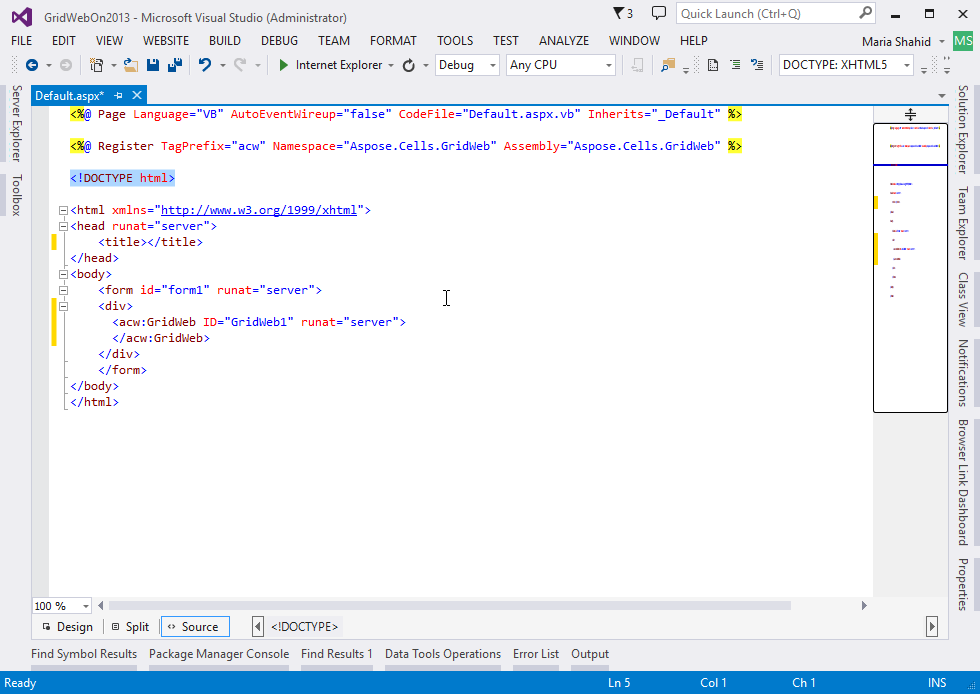

3. Retain, change, or delete the <!DOCTYPE> tag.  
4. Or modify the <!DOCTYPE> tag with the following one:  



<!DOCTYPE HTML PUBLIC "-//W3C//DTD HTML 4.0 Transitional//EN">


### **Step 5: Resizing Aspose.Cells.GridWeb Control**
You can change the width and height of the GridWeb control after dragging it to the website.  

In design view, you can resize the width and height of the GridWeb.  

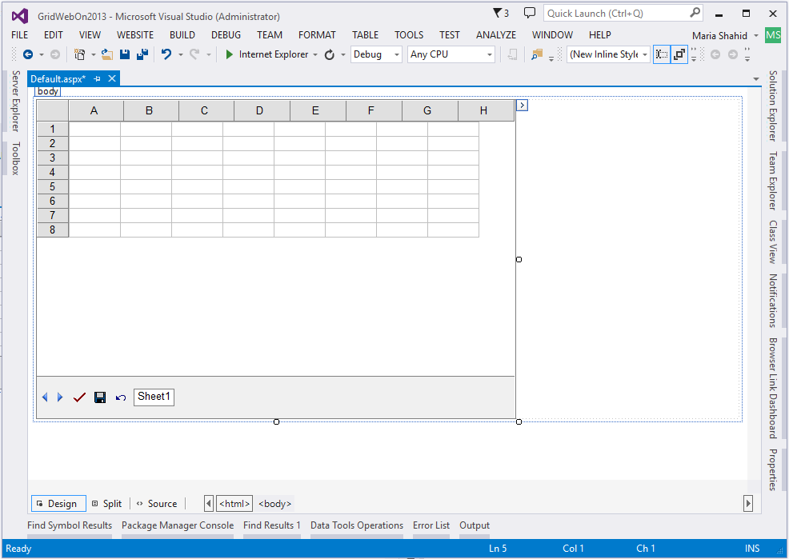

### **Step 6: Configuring the Properties of Aspose.Cells.GridWeb**
Configure the Aspose.Cells.GridWeb properties in WYSIWYG by clicking the **Properties** button on the right side of the Visual Studio 2013 IDE.  
A Properties dialog is displayed.  

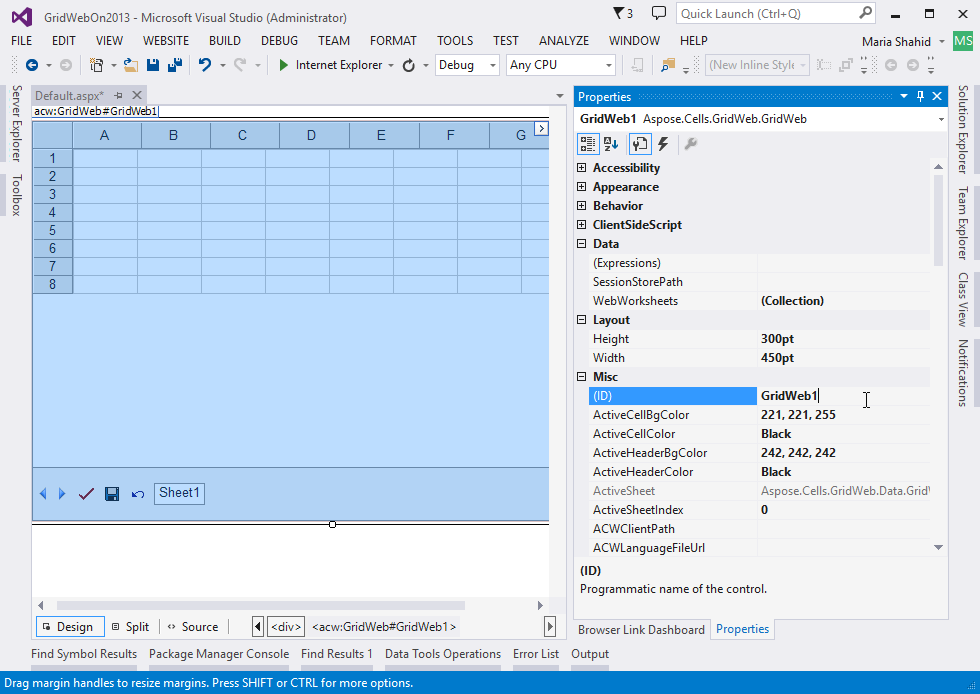

The Properties pane makes it possible to configure the look & feel of the GridWeb and other settings that control GridWeb's behaviour.
### **Step 7: Running Your First Web Site Containing Aspose.Cells.GridWeb**
Build and run the web site.  

1. Run the web site directly from Visual Studio by pressing **Ctrl+F5** or clicking **Start Debugging**.  

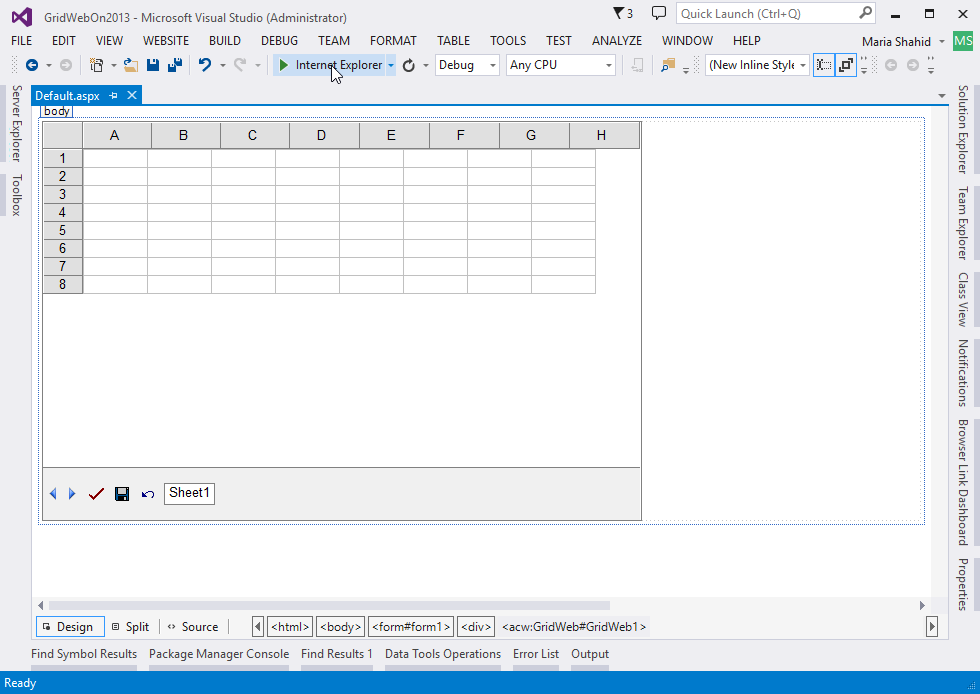

Now you can start using the GridWeb control.  

**GridWeb control in action**  

