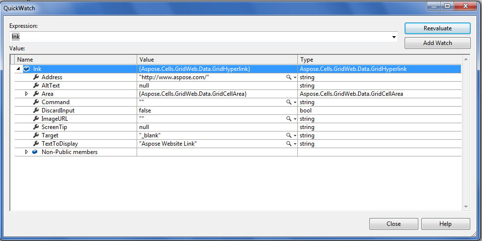

## **Possible Usage Scenarios**
You can check if a cell contains a hyperlink or not using the following two methods. These methods will return **null** if the cell does not contain a hyperlink, and if it does, they will return a **GridHyperlink** object.

- GridHyperlinkCollection.GetHyperlink(GridCell cell)
- GridHyperlinkCollection.GetHyperlink(int row, int column)

## **Open Hyperlink in New or Existing Window**
If your Excel file contains a hyperlink that links to a URL such as <http://www.aspose.com/> and you load it in GridWeb, the hyperlinks will be rendered with the target attribute set to `_blank`. This means that when you click the hyperlink in a GridWeb cell, it will open in a new window instead of the existing window. Please check the **GridHyperlink.Target** property in the following debug window. Alternatively, if you want to open the hyperlink in the existing window, set the **GridHyperlink.Target** to `_self`.

## **Access Hyperlink object of the GridWeb Cell**
The following sample code accesses the hyperlink of cell **A1**. If cell **A1** contains a hyperlink, it will return a **GridHyperlink** object; otherwise, it will return **null**.

### **Sample Code**

