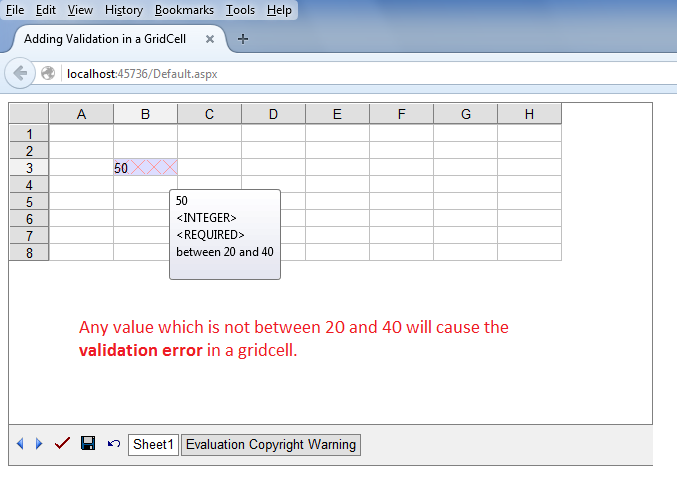

{} 

Aspose.Cells.GridWeb allows you to add **Data Validation** using the GridWorksheet.Validations.Add() method. Using this method, you have to specify the **Cell Range**. But if you want to create a Data Validation in a single GridCell then you can do it directly using GridCell.CreateValidation() method. Similarly, you can remove **Data Validation** from a GridCell using the GridCell.RemoveValidation() method.

{} 
## **Create Data Validation in a GridCell of GridWeb**
The following sample code creates a **Data Validation** in a cell B3. If you enter any value which is not between 20 and 40, the cell B3 will show **Validation Error** in the form of **Red XXXX** as shown in this screenshot.


