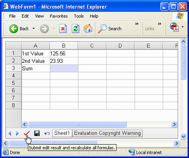
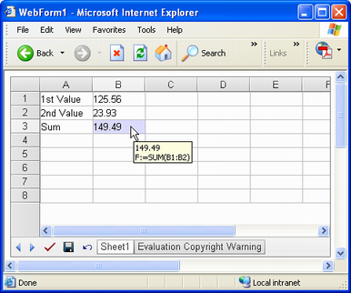

{} 

The most valuable feature offered by Aspose.Cells.GridWeb is support for formulas or functions. Aspose.Cells.GridWeb has its own Formula Engine that calculates the formulas in worksheets. Aspose.Cells.GridWeb supports both in-built and user-defined functions or formulas. This topic discusses adding formulas to cells using Aspose.Cells.GridWeb API in detail.

{} 
## **Adding Formulas to Cells**
### **How to Add & Calculate a Formula?**
It is possible to add, access and modify formulas in cells by using a cell's Formula property. Aspose.Cells.GridWeb supports user-defined formulas ranging from simple to complex. However, a large number of built-in functions or formulas (similar to Microsoft Excel) are also supplied with Aspose.Cells.GridWeb. To see the full list of built-in functions, please refer to this [list of supported functions.](/cells/net/list-of-supported-functions/)

{} 

The formula syntax should be compatible with Microsoft Excel syntax. For example, all formulas must begin with an equal sign (=).

To add a formula dynamically, Aspose.Cells.GridWeb will recognize it as a formula even if you don't use an **=** sign, but if end users working in the GUI, he must use the "=" sign.

{} 



**Formula added to B3 cell but not calculated by GridWeb** 

In the above screenshot, you can see that a formula has been added to B3 but has not been calculated yet. To calculate all formulas, call the GridWeb control's GridWorksheetCollection's CalculateFormula method after adding formulas to worksheets as shown below.



{} 

Users can also calculate formulas by clicking **Submit**.

**Clicking Submit button of GridWeb** 

**IMPORTANT**: If a user clicks the **Save** or **Undo** buttons, or the sheet tabs, all formulas are calculated by GridWeb automatically.

**Formula result after calculation** 

{} 
### **Referencing Cells from Other Worksheets**
Using Aspose.Cells.GridWeb, it is possible to reference values stored in different worksheets in their formulas, creating complex formulas.

The syntax for referencing a cell value from a different worksheet is SheetName!CellName.


