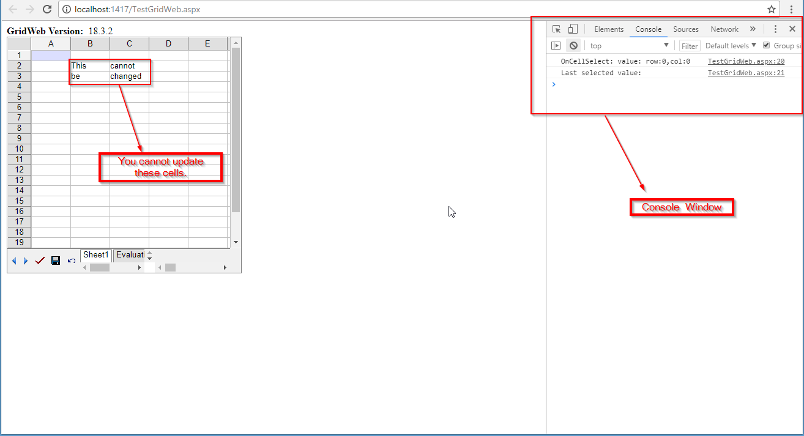
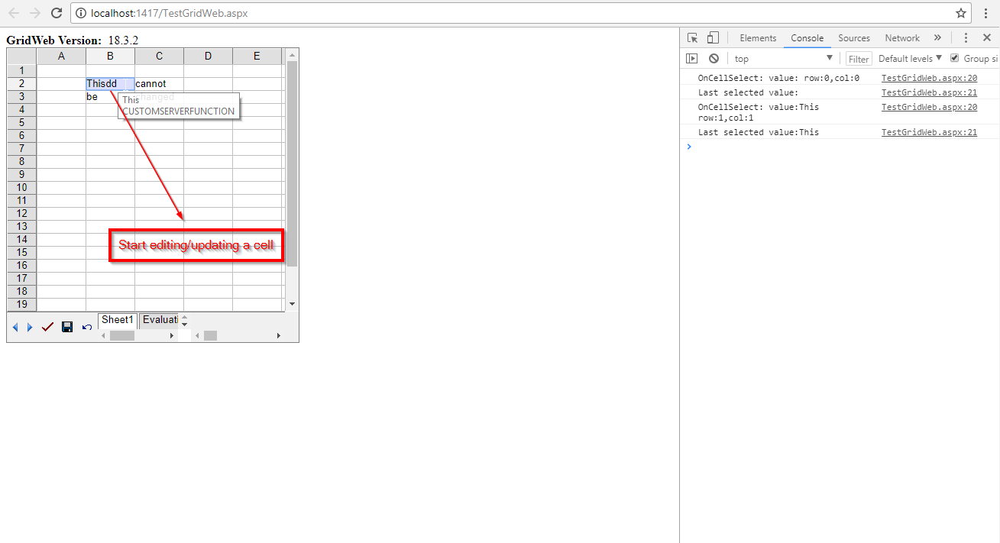
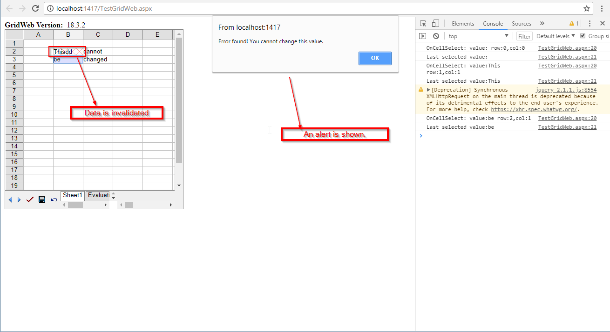
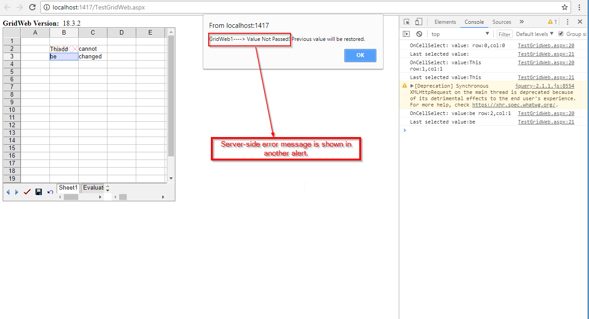
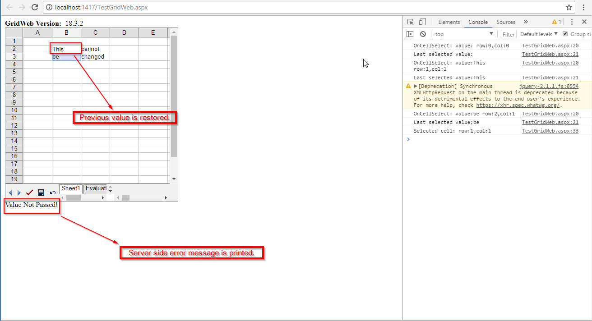

## **Possible Usage Scenarios**
Sometimes, you might need to implement data validation on the server side. Aspose.Cells.GridWeb allows you to add custom server-side data validation. You have to specify a cell range or area. You can also set client-side validation functions for callbacks with custom server-side validation.

## **Add Custom Server-side Function Validation**
You need to set the server validation class which implements the **GridCustomServerValidation** interface via the **GridValidation.ServerValidation** attribute. You also need to set the client-side validation function (it should be written in JavaScript on the client side). This function is required to validate the data on the client end during a callback. You can set the error message via **GridValidation.ErrorMessage** and the title via **GridValidation.ErrorTitle** properties as needed. Please see a series of screenshots that show how it works (step by step) in a given scenario after executing the sample code below.  

In the example, you cannot update data in B2:C3 cells. When you try to edit those cells, you will be prompted with error messages and the previous value will be restored. You can open the browser's console window to print the cell's information/details for certain events.  

## **Sample Code**

