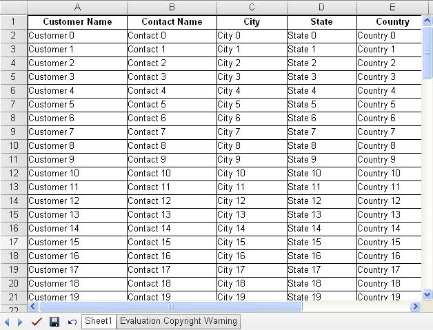
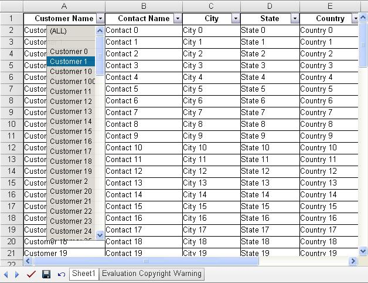
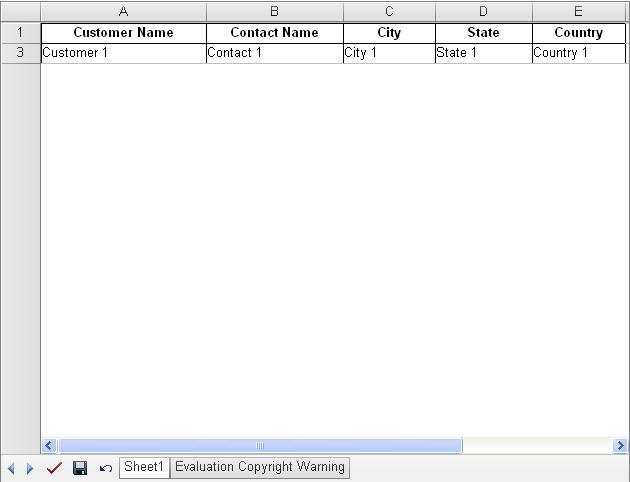

{} 

Aspose.Cells.GridWeb provides AutoFilter and custom data filter features. These features allow you to select only those items in a worksheet that you want to display in a list. Moreover, you can filter items in a list according to set criteria. Filter text, numbers, or dates with the filtering features.

{} 
## **Working with Filters**
Use the `Worksheet.AddAutoFilter` method to enable AutoFilter for a worksheet. This method accepts the row index, start column index, and end column index.

To enable a custom filter, use the `Worksheet.AddCustomFilter` method, which accepts the row index to which the filter has to be applied and the custom filtering criteria.

The example below implements both AutoFilter and custom data filters. In the example, the AutoFilter feature is enabled, and filtered rows are retrieved based on some criteria.

**Input: The data list in the first worksheet** 

**Output: AutoFilter feature enabled** 

### **Auto-filter**

### **Custom Data Filter**
**Custom‑filtered data based on the criteria** 


