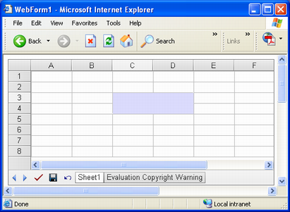

{} 

Aspose.Cells.GridWeb has a handy utility feature that lets you merge cells into one large cell. This topic describes how to merge cells programmatically.

{} 
## **Merging Cells**
Merge multiple cells in a worksheet into a single cell by calling the Cells collection's Merge method. Specify the range of cells to be merged when calling the Merge method.

{} 

If you merge multiple cells and each cell contains data, only the content of the top left cell in the range is retained after the merge. Data in the other cells is not lost. If you unmerge the cells, each cell recovers its data.

{} 

**Four cells merged into one** 


## **Unmerging Cells**
To unmerge cells, use the Cells collection's UnMerge method that takes the same parameters as the Merge method and performs the unmerging of cells.


