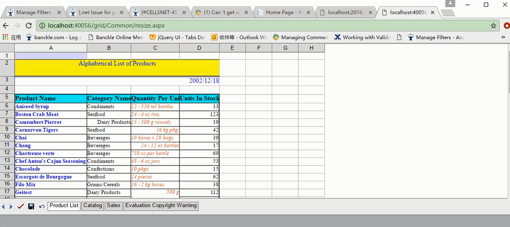
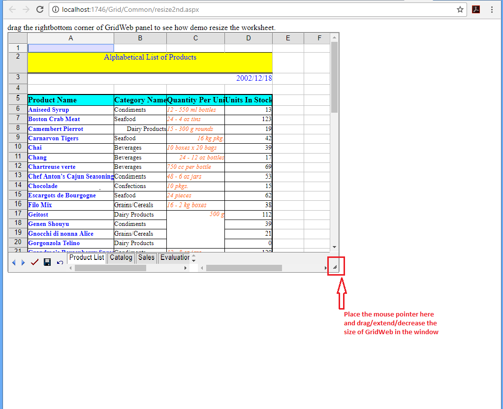

## **Possible Usage Scenarios**
Sometimes you want Aspose.Cells.GridWeb to resize itself in accordance with the browser window. You might need GridWeb to always adjust its size (height, width) and be compatible with the browser window’s size. Aspose.Cells.GridWeb provides a client‑side *resize()* function for this purpose. Moreover, you can even make the GridWeb control resizable in the browser window. For example, you may use the bottom‑right handle (via mouse) to customize its width/height in the window. You also need to include/specify jQuery JavaScript files to make it work in the page source of your project.

## **Using GridWeb’s resize method**
The following code will check if a resizing action has taken place every 100 milliseconds. When there is no more resizing action, it assumes the resize operation is finished. We use a sample template file which is imported into GridWeb. We use client‑side code to resize the GridWeb. The screenshot shows that GridWeb resizes itself accordingly when resizing the browser window.

### **Sample Code**


## **Making GridWeb resizable using resizable jQuery UI feature**
The following code will make GridWeb control resizable in the browser window. For example, you may use the bottom‑right handle to customize the size of GridWeb in the window. We first use the same template file, which is imported into GridWeb. We use jQuery scripts to make the GridWeb resizable. The screenshot shows that GridWeb has been resized using its bottom‑right handle in the browser window.

### **Sample Code**

