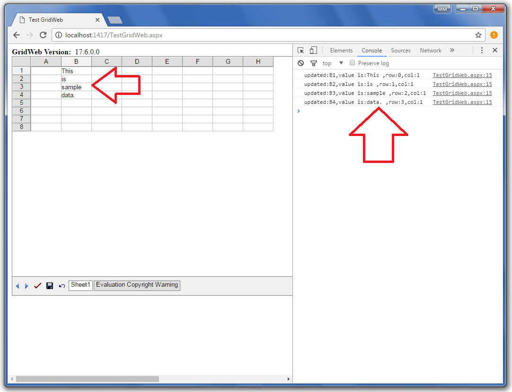
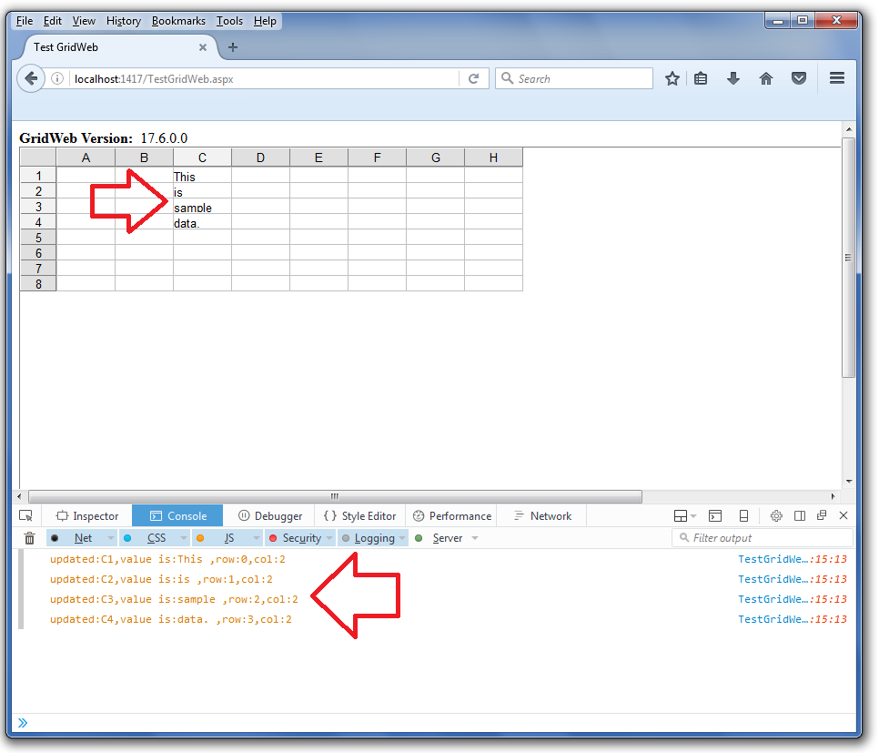

## **Possible Usage Scenarios**
OnAjaxCallFinishedClientFunction is a client-side function that is called when the user copies some data to a GridWeb worksheet. This function is helpful when the bulk of cells are updated and you want to keep track of those updated cells on the client side (i.e., in web browsers like Firefox, Google Chrome, etc.).

## **Using OnAjaxCallFinishedClientFunction of GridWeb**
The following sample code explains how to make use of the OnAjaxCallFinishedClientFunction client function. The screenshots show the console output in Google Chrome and Firefox when the code is executed. Once you execute the code, please copy/paste some data spanning multiple cells inside the GridWeb worksheet and then check the Web Browser Console as shown in the screenshots.

## **Google Chrome Console Output**

## **Firefox Console Output**

## **Sample Code**


 //-------------------------------------------------------

//------TestGridWeb.aspx---------------------------------

//-------------------------------------------------------

//

<%@ Page Language="C#" AutoEventWireup="true" CodeFile="TestGridWeb.aspx.cs" Inherits="TestGridWeb" %>

<%@ Register TagPrefix="acw" Namespace="Aspose.Cells.GridWeb" Assembly="Aspose.Cells.GridWeb" %>

<!DOCTYPE html PUBLIC "-//W3C//DTD XHTML 1.0 Transitional//EN" "http://www.w3.org/TR/xhtml1/DTD/xhtml1-transitional.dtd">

<html xmlns="http://www.w3.org/1999/xhtml">

<head runat="server">

    <title>Test GridWeb</title>

    

</head>

<body>

    <form id="form1" runat="server">

        

            

                <b>GridWeb Version:&nbsp </b>

                <asp:Label ID="lblVersion" runat="server" Text="Label"></asp:Label>

                 

            

            <acw:GridWeb ID="GridWeb1" runat="server" XhtmlMode="True" Height="504px" Width="1119px" EnableAJAX="true" OnAjaxCallFinishedClientFunction="TestAjaxCallFinish" OnCellUpdatedClientFunction="CellUpdate">

            </acw:GridWeb>

        

    </form>

</body>

</html>

//-------------------------------------------------------

//------TestGridWeb.aspx.cs------------------------------

//-------------------------------------------------------

//

using System;

using System.Web.UI;

using Aspose.Cells.GridWeb;

public partial class TestGridWeb : System.Web.UI.Page

{

    protected void Page_Load(object sender, EventArgs e)

    {

        if (Page.IsPostBack == false && this.GridWeb1.IsPostBack == false)

        {

            lblVersion.Text = GridWeb.GetVersion();

        }

    }

}


