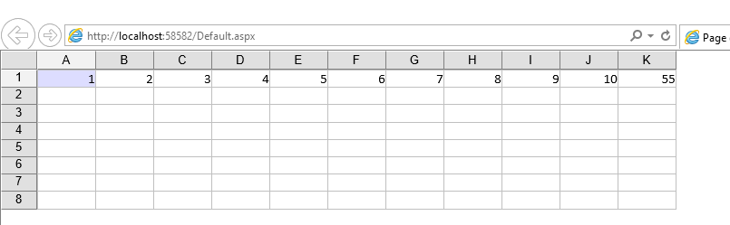
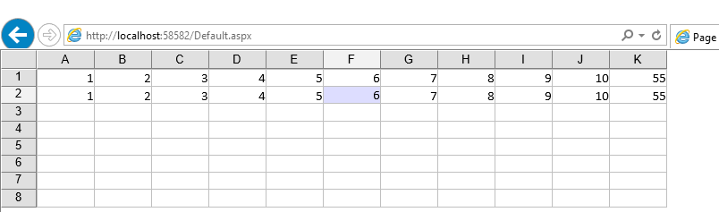
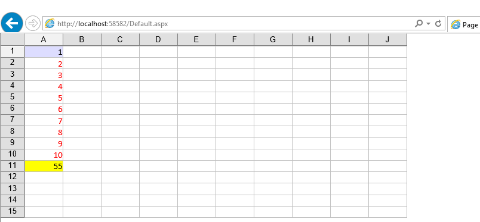
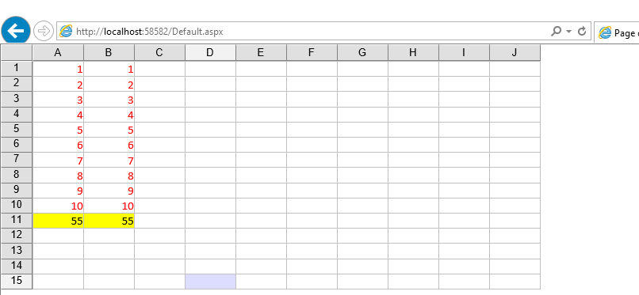
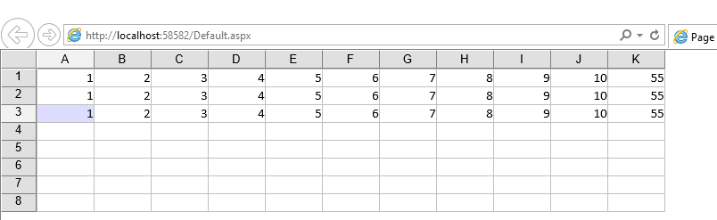
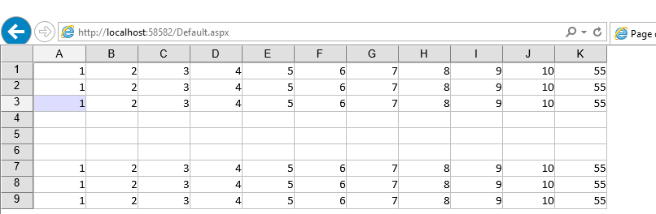
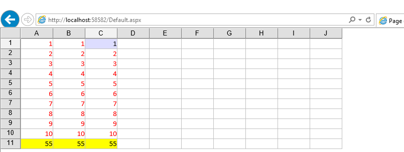
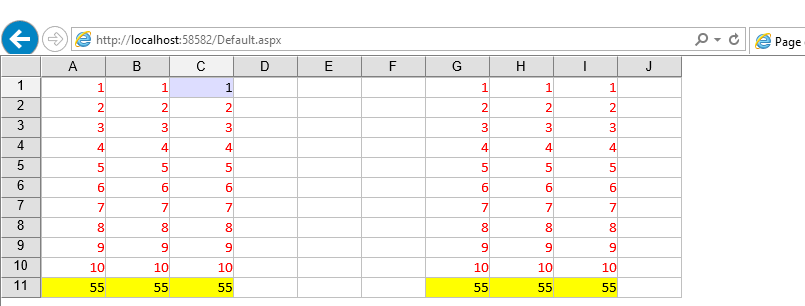

{} 

Aspose.Cells.GridWeb component offers the means to copy row & column while using the GridCells class. This article demonstrates the usage of APIs exposed by the Aspose.Cells.GridWeb to copy rows & columns on GridWeb interface. 

The GridCells.CopyRow, GridCells.CopyColumn, GridCells.CopyRows & GridCells.CopyColumns methods will copy the contents, styling & formulas from the source row & column to destination.

{} 
## **Copying Rows & Columns**
If you are not already acquainted with Aspose.Cells.GridWeb component, we strongly suggest you to check the [Introduction to Aspose.Cells.GridWeb](https://docs.aspose.com/cells/net/aspose-cells-gridweb/browsers-capabilities/) and detailed article on [How to add Aspose.Cells.GridWeb component in a WebForms application](https://docs.aspose.com/cells/net/aspose-cells-gridweb/add-gridweb-to-web-form/).
### **Copying Single Row**
In order to keep the example simple, the article uses an existing spreadsheet with one row and a simple formula that sums all the values in the row. Here is how the spreadsheet is displayed in the Aspose.Cells.GridWeb interface before copying the row.

The code snippet is simple as demonstrated below. It accesses GridCells object of active worksheet order to make a copy of the first row to the subsequent row.



Here is how the Aspose.Cells.GridWeb looks after copy row operation.

### **Copying Single Column**
The following example uses an existing spreadsheet with one column and a simple formula that sums all the values in the column. Here is how the spreadsheet is displayed in the Aspose.Cells.GridWeb interface before copying the column.

Similar to the above example, the following code snippet accesses the GridCells object of active worksheet order to make a copy of the first column to the subsequent column.



Here is how the Aspose.Cells.GridWeb looks after copy column operation.

{} 

You may use the GridCells.CopyRow & GridCells.CopyColumn methods in loop to copy the source row & column to multiple rows & columns respectively.

{} 
### **Copying Multiple Rows**
It is also possible to copy multiple rows to a new destination while using the GridCells.CopyRows method, which takes an additional parameter of type integer to specify the number of source rows to be copied.



Here is how Aspose.Cells.GridWeb look before & after copy rows operation.

### **Copying Multiple Columns**
The GridCells class also provide the CopyColumns method, which takes an additional parameter of type integer to specify the number of source columns to be copied.



Here is how Aspose.Cells.GridWeb look before & after copy rows operation.

