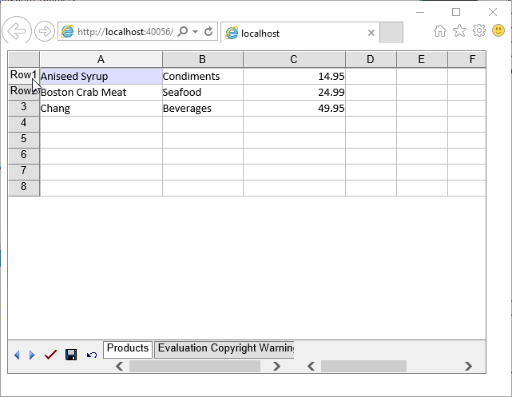
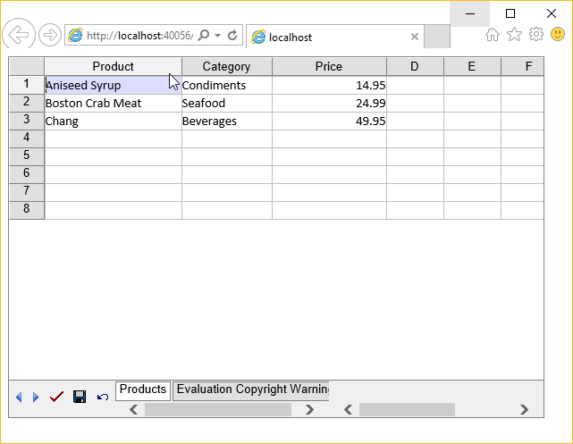

{} 

Like Microsoft Excel, Aspose.Cells.GridWeb also uses standard headers or captions for rows (numbers like 1, 2, 3 and so on) and columns (alphabetic like A, B, C and so on). Aspose.Cells.GridWeb also makes it possible to customize captions. This topic discuss customizing row and column headers at runtime using Aspose.Cells.GridWeb API.

{} 
## **Customizing Row Header**
To customize the header or caption of a row:

1. Add the Aspose.Cells.GridWeb control to a Web Form.
1. Access the worksheet in the GridWorksheetCollection.
1. Set the caption of any specified row.

**The headers of row 1 and 2 has been customized** 


## **Customizing Column Header**
To customize the header or caption of a column:

1. Add the Aspose.Cells.GridWeb control to a Web Form.
1. Access the worksheet in the GridWorksheetCollection.
1. Set the caption of any specified column.

**The headers of column 1, 2 and 3 has been customized** 


