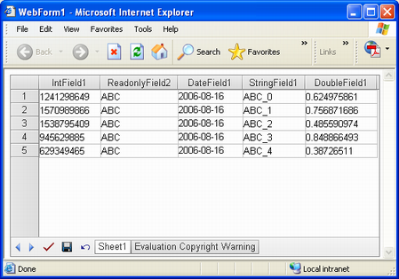
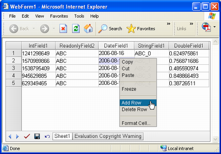
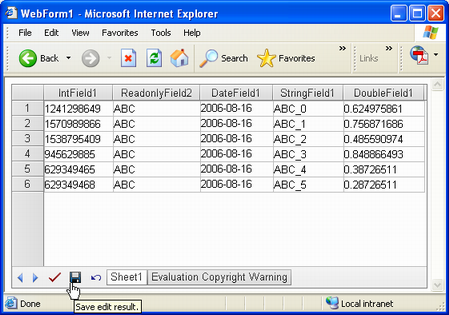

{} 

The Microsoft .NET Framework offers many collection classes but sometimes they don't fulfill the development requirements so developers create **custom collections**, and may require to bind such custom collections with Aspose.Cells.GridWeb.

{} 
## **Binding a Worksheet with a Custom Collection**
To illustrate this feature, this article goes through how to create a sample application, step by step. First, create a custom collection and then use that collection to binding with a worksheet.
### **Step 1: Creating a Custom Record**
Before creating a custom collection, create a class to hold the custom records that will be stored in the collection. The purpose of this article is to give an idea of how to create your own custom collections and bind them with Aspose.Cells.GridWeb, so how you create the custom record is up to you.

The example below uses the MyCustomRecord class which contains five private fields and five public properties that control access to the private fields. Here is the structure of properties:

- The StringField1 property to read and write **stringfield1** (string).
- The ReadonlyField2 property to only read **stringfield2** (string).
- The DateField1 property to read and write **datefield1** (DateTime).
- The IntField1 property to read and write **intfield1** (integer).
- The DoubleField1 property to read and write **doublefield1** (double).

**C#**



 //Creating a class that will act as record for the custom collection

public class MyCustomRecord

{

    //Private data members

    private string stringfield1;

    private string stringfield2 = "ABC";

    private DateTime datefield1;

    private int intfield1;

    private double doublefield1;

    //Creating a string property

    public string StringField1

    {

        get { return stringfield1; }

        set { stringfield1 = value; }

    }

    //Creating a readonly string property

    public string ReadonlyField2

    {

        get { return stringfield2; }

    }

    //Creating a DateTime property

    public DateTime DateField1

    {

        get { return datefield1; }

        set { datefield1 = value; }

    }

    //Creating an int property

    public int IntField1

    {

        get { return intfield1; }

        set { intfield1 = value; }

    }

    //Creating a double property

    public double DoubleField1

    {

        get { return doublefield1; }

        set { doublefield1 = value; }

    }

}


### **Step 2: Creating a Custom Collection**
Now, create a custom collection to add customer records to and access them from. To make it simple, this example uses the MyCollection class which contains a readonly indexer. Using this indexer, we can get any custom record stored in the collection.

**C#**



 //Creating a custom collection

public class MyCollection : CollectionBase

{

    //Leaving the collection constructor empty

    public MyCollection()

    {

    }

    //Creating a readonly property for custom collection. This Item property is used by GridWeb control to

    //determine the collection's type

    public MyCustomRecord this[int index]

    {

        get { return (MyCustomRecord)this.List[index]; }

    }

}


### **Step 3: Binding a Worksheet with a Custom Collection**
The process of creating a custom collection is complete. Now use the custom collection to bind to a worksheet in Aspose.Cells.GridWeb . First create a web form, add the GridWeb control to it and add some code.

To use the custom collection for binding, first create an object of the MyCollection class (created in the above step).
Then create and add MyCustomRecord objects to the MyCollection object.

{} 

Are you're wondering why there wasn't a method in the MyCollection class for adding an MyCustomRecord object to the collection. Take another look at the above code and you'll notice that the MyCollection class is inherited from the CollectionBase class (that has implemented the IList interface which provides an Add method for adding an object to the collection). Use the IList class' Add method by upcasting the MyCollection object to IList.

{} 

Finally, set the MyCollection object as the worksheet's data source and bind the worksheet with the collection. At this point, you can also create validation rules for the bound columns of the worksheet.

**C#**



 //Implementing Page_Load event handler

protected void Page_Load(object sender, EventArgs e)

{

    if (Page.IsPostBack == false && this.GridWeb1.IsPostBack == false)

    {

        //Creating an object of custom collection

        MyCollection list = new MyCollection();

        //Creating an instance of Random class

        System.Random rand = new System.Random();

        //Creating a loop that will run 5 times

        for (int i = 0; i < 5; i++)

        {

            //Creating an object of Custom Record

            MyCustomRecord rec = new MyCustomRecord();

            //Initializing all properties of Custom Record

            rec.DateField1 = DateTime.Now;

            rec.DoubleField1 = rand.NextDouble() * 10;

            rec.IntField1 = rand.Next(20);

            rec.StringField1 = "ABC_" + i;

            //Adding Custom Record to Collection

            ((IList)list).Add(rec);

        }

        //Accessing a desired worksheet

        GridWorksheet sheet = GridWeb1.WorkSheets[0];

        //Setting the Data Source of worksheet

        sheet.DataSource = list;

        //Creating columns automatically

        sheet.CreateAutoGenratedColumns();

        //Setting the validation type of value to DateTime

        sheet.BindColumns[2].Validation.ValidationType = ValidationType.DateTime;

        //Binding worksheet

        sheet.DataBind();

        //Assigning an event handler to InitializeNewBindRow event of the worksheet

        //sheet.InitializeNewBindRow += new InitializeNewBindRowHandler(GridWeb1_InitializeNewBindRow);

    }

}


### **Step 4: Handling the Worksheet's InitializeNewBindRow Event**
In the above code, you might have noticed an extra line of code used to assign the GridWeb1_InitializeNewBindRow event handler to the worksheet's InitializeNewBindRow. This event is triggered whenever a new bound row is added to the worksheet. We created an event handler for this this event because of the MyCustomRecord object's DateField1 property.

Aspose.Cells.GridWeb automatically initializes **int** and **double** values with **zero (0)** whenever a new bound row is added to the GridWeb control. For dates, we would like the GridWeb control to automatically add the current date from the system. To do so, we have created the GridWeb1_InitializeNewBindRow event handler for the InitializeNewBindRow event.

Access a particular instance of the MyCustomRecord class from the GridWeb using the bindObject argument and then assign the current system date to its DateField1 property.

**C#**



 //Creating GridWeb1_InitializeNewBindRow event handler

private void GridWeb1_InitializeNewBindRow(GridWorksheet sender, object bindObject)

{

    //Accessing that custom record object that is newly bound

    MyCustomRecord rec = (MyCustomRecord)bindObject;

    //Initializing the DateTime of a property when a new row gets bound to the database

    rec.DateField1 = DateTime.Now;

}


### **Step 5: Running the Application**
Run the application by either pressing **Ctrl+F5** or clicking the **Start** button in VS.NET. The web form is opened in a new browser window. 

**Worksheet bound with a custom collection** 

Right-click the GridWeb control to add or delete a record. For example, add a new record to the worksheet by selecting **Add Row** option. 

**Selecting Add Row option from the menu** 

When a new row is added to the worksheet, cells contain default data including the current system date. 

**New row added to worksheet with default data** 

After making changes to the data, click **Save** or **Submit** to save your changes. 

**Saving changes by clicking Save button** 

## **Conclusion**
{} 

This article showed how to bind a worksheet to a custom collection created. Using Aspose.Cells.GridWeb, developers can bind worksheets to either a database or custom collections via the Worksheets Designer in a GUI mode or through coding. This provides a wide range of options to developers for creating applications.

{}
