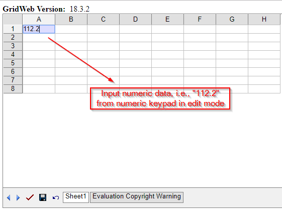
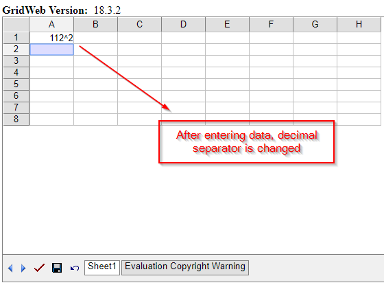

## **Possible Usage Scenarios**
By default, Aspose.Cells.GridWeb displays numeric data according to the locale/regional settings on the machine. You can change the decimal separator from the numeric keypad programmatically using the Aspose.Cells.GridWeb API. So, when a file is imported into the GridWeb matrix, or when you input numeric data (from the numeric keypad) into a new worksheet cell, it should display your desired decimal separator visually.  

## **Change the decimal separator from Numeric keypad**
Using the **GridWorksheetCollection.NumberDecimalSeparator** property, you may change the decimal separator from the numeric keypad programmatically. Please see the screenshots that show how it works.

## **Sample Code**


{} 
Please note that the decimal separator change is only for the user's visual experience in GridWeb. When you edit and save your workbook, it will still store the numeric values (in the spreadsheet) according to your locale/regional decimal separator.  
{}
