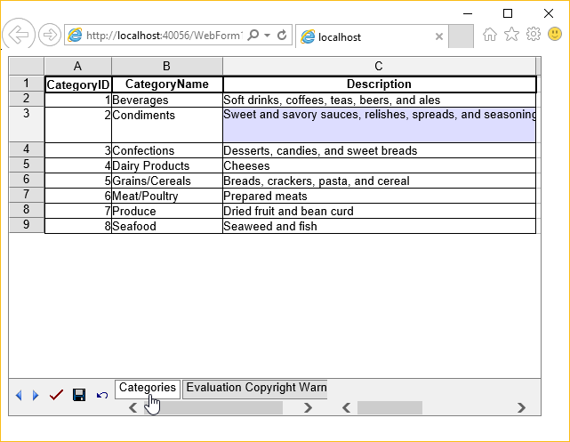

---  
title: Import DataView to GridWeb  
type: docs  
weight: 60  
url: /net/aspose-cells-gridweb/import-dataview-to-gridweb/  
keywords: GridWeb,import  
description: This article introduces how to import data in GridWeb.  
ai_search_scope: cells_net  
ai_search_endpoint: "https://docsearch.api.aspose.cloud/ask"
---  

{}  

With the release of the Microsoft .NET Framework, a new way of storing data was introduced. Now DataSet, DataTable, and DataView objects store data in offline mode. These objects are very handy as data repositories. Using Aspose.Cells.GridWeb, it's possible to import data from either DataTable or DataView objects into worksheets. Aspose.Cells.GridWeb only supports importing data from a DataView object, but a DataTable object can also be used indirectly. Let's discuss this feature in detail.  

{}  

## **Importing Data from DataView**  

Import data from a DataView object using the GridWorksheetCollection's ImportDataView method in the GridWeb control. Pass the DataView object that you want to import data from to the ImportDataView method. It's possible to specify column headers and data styles during import.  

{}  

When data is imported from a DataView object, a new worksheet is created to hold the imported data. The worksheet is named the same as the DataTable.  

{}  

**Output: Data imported from a DataView into a new worksheet**  

  

The widths of the columns are adjusted to show all the data they contain. When data is imported from a DataView, column widths are not adjusted automatically. Users need to adjust them manually. To adjust the column widths programmatically, refer to [Resize Rows and Columns](/cells/net/aspose-cells-gridweb/resize-rows-and-columns/).  

  

{}  

An overloaded version of the ImportDataView method allows developers to specify the name of the sheet that holds the imported data and a specific number of rows and columns to import from the DataView object.  

{}
