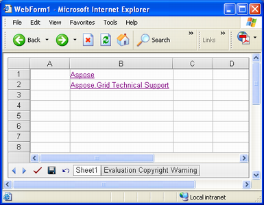
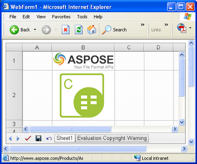
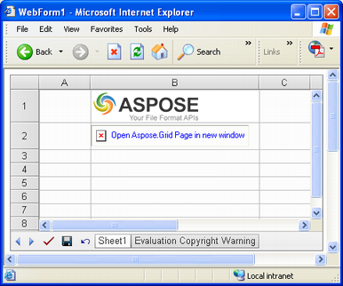
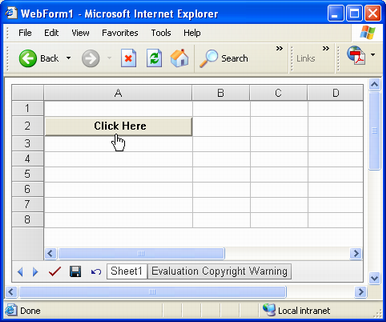
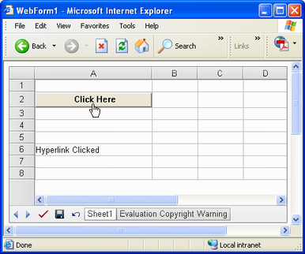

{} 

This topic discusses what types of hyperlinks are supported in Aspose.Cells.GridWeb and how to manage them programmatically. Hyperlinks can be used for either creating links to web URLs or to perform postback to a server.

{} 
## **Working with Hyperlinks**
### **Types of Hyperlinks**
Generally, the following hyperlinks are supported by Aspose.Cells.GridWeb:

- [URL hyperlinks](/cells/net/aspose-cells-gridweb/manage-hyperlinks-in-worksheet/), hyperlinks that can be linked to web URLs.
- [Text hyperlinks](/cells/net/aspose-cells-gridweb/manage-hyperlinks-in-worksheet/), text hyperlinks applied to text.
- [Image hyperlinks](/cells/net/aspose-cells-gridweb/manage-hyperlinks-in-worksheet/), image hyperlinks applied to images.
- [Cell command hyperlinks](/cells/net/aspose-cells-gridweb/manage-hyperlinks-in-worksheet/), hyperlinks that post data to a server. Such hyperlinks act more like a button that triggers a server‑side event when clicked.

The sections below describe the use of all types of hyperlinks in detail. It also discusses how to access or remove links.
### **Adding Hyperlinks**

#### **URL Hyperlinks**
URL hyperlinks look like simple hyperlinks that you normally see on websites. A URL hyperlink works like an anchor in a cell. Whenever it is clicked, it navigates to a web page or opens a new browser window.

There are different types of URL hyperlinks:

- Text hyperlinks.
- Image hyperlinks.

Developers can specify an image for the hyperlink. If an image isn't specified, a text hyperlink is created; otherwise, an image hyperlink is created.

##### **Text Hyperlinks**
To add a text hyperlink to a worksheet:

1. Add the Aspose.Cells.GridWeb control to your Web Form.  
1. Access a worksheet.  
1. Add a hyperlink to a cell in the worksheet.  
1. Set the text that will be shown in the cell.  
1. Set the hyperlink's URL.  
1. Set the hyperlink's target, if desired.  
1. Set a tool tip, if desired.  

{} 

NOTE: The hyperlink target can be set to _self, _top, or _parent to open web URLs in a new, the current, or the top window respectively.

{} 

The example below adds two hyperlinks to a worksheet. One has no target while the other is set to _parent.

**Output: text hyperlinks added to worksheet** 



##### **Image Hyperlinks**
To add an image hyperlink:

1. Add the Aspose.Cells.GridWeb control to your Web Form.  
1. Access a worksheet.  
1. Add a hyperlink to a cell.  
1. Set the URL of the image that will be displayed as hyperlink.  
1. Set the hyperlink URL.  
1. Set a tool tip, if desired.  
1. Set the hyperlink text, if desired.  

**Output: image hyperlinks added to worksheet** 

{} 

Setting the image hyperlink's AltText serves a similar function to setting an <ALT> tag in HTML. The text is displayed only if the hyperlinked image is not displayed (for example, if the image isn't at the specified location). If the image of the second hyperlink is not found, the output of the code snippet below would look as follows.

**The image for the image URL could not be found** 

{} 



#### **Cell Command Hyperlinks**
A cell command hyperlink is a special type of hyperlink which triggers a server‑side event instead of opening a web page. Developers can add code to the server‑side event and perform any task when the hyperlink is clicked. This feature enables developers to create more interactive applications.

To add a cell command hyperlink:

1. Add the Aspose.Cells.GridWeb control to your Web Form.  
1. Access a worksheet.  
1. Add a hyperlink to a cell.  
1. Set the hyperlink's Command to any desired value. The value is used by the hyperlink's event handler to recognise it.  
1. Set a tool tip, if desired.  
1. Set the URL for the Image that will be displayed as a hyperlink.  

**A cell command hyperlink has been added to worksheet** 


##### **Event Handling of Cell Command Hyperlinks**
Developers need to create an event handler for the GridWeb control's CellCommand event to perform specific tasks when a specific cell command hyperlink is clicked. The CellCommand event's event handler provides an object of the CellEventArgs type that offers the Argument property. Use the Argument property to identify a specific hyperlink by comparing its CellCommand value.

The example below creates an event handler for the cell command hyperlink created in the code above. The hyperlink's CellCommand was set to Click. So, in the event handler, first check it and then add code which displays a message in the A6 cell.

The event handler is invoked when the hyperlink is clicked.

**Output: text added to A6 cell when hyperlink is clicked** 


### **Accessing Hyperlinks**
To access an existing hyperlink:

1. Access the cell that contains it.  
1. Get the cell reference.  
1. Pass the reference to the Hyperlinks collection's GetHyperlink method to access the hyperlink.  
1. Modify the hyperlink's properties.  


### **Removing Hyperlinks**
To remove a hyperlink:

1. Access the active worksheet.  
1. Remove a hyperlink using the Hyperlinks collection's Remove method.  


