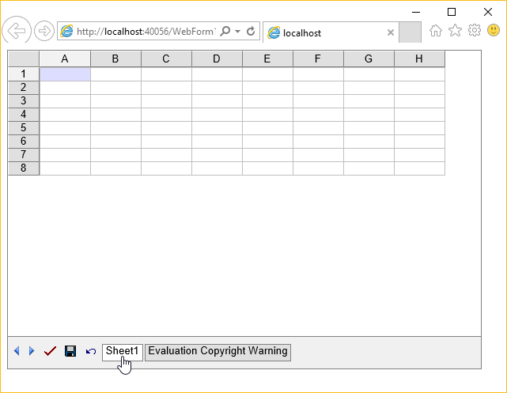
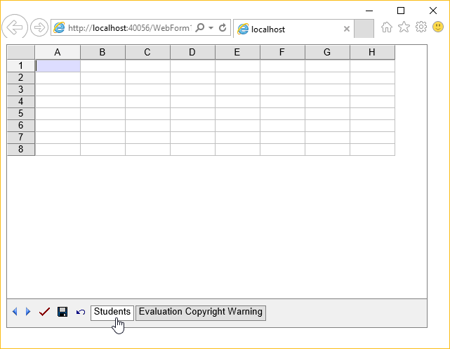

{} 

Renaming a worksheet can be very useful when working with many worksheets in Aspose.Cells.GridWeb and decide to change their names to make them more meaningful. For example, a worksheet containing an invoice can be renamed Invoice instead of Sheet1. This topic describes this simple but useful feature.

{} 
## **Renaming a Worksheet**
All worksheets contain a Name property that allows developers to access or modify worksheets' names. To rename a worksheet:

1. Access a worksheet from the GridWorksheetCollection.
1. Rename the selected worksheet.

{} 

For more details on how to access worksheets in Aspose.Cells.GridWeb, please refer to [Access Worksheets](/cells/net/aspose-cells-gridweb/access-worksheets/).

{} 

Before executing the code, the worksheet has a default name, such as Sheet1.

**Input file: a worksheet with a default name Sheet1** 

After running the code, the worksheet is renamed Students.

**Output: the worksheet is renamed Students** 


