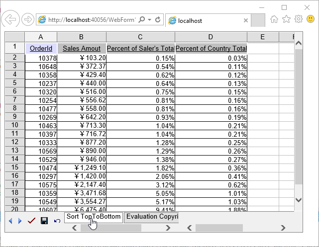
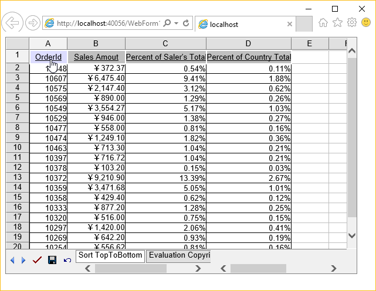
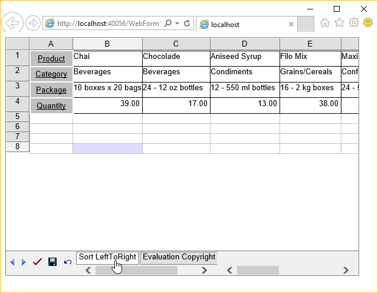
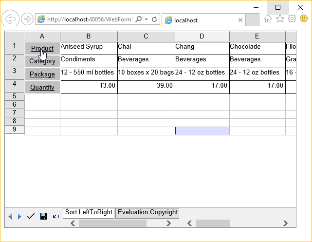

{} 

Sorting is a very valuable feature when it comes to data processing. Unsorted data is a pain for users when searching for specific information. Aspose.Cells.GridWeb supports powerful sorting features. This topic discusses sorting data using the Aspose.Cells.GridWeb API.

{} 
## **Sorting Data**
Aspose.Cells.GridWeb allows developers to sort data horizontally and vertically so that developers can sort data from top to bottom or left to right.
### **From Top to Bottom**
To sort data from top to bottom orientation:

1. Add the Aspose.Cells.GridWeb control to your Web Form.
1. Access the worksheet that you want to sort.
1. Sort the range of data in any order (ascending or descending). Be sure to select top to bottom orientation.

The example below sorts data in four columns of a worksheet in descending order. Only twenty rows of the four columns are sorted in top to bottom orientation.

Before applying the code, the worksheet contains unordered data.

After executing the code, the data is sorted in ascending order.


### **From Left to Right**
To sort data from left to right:

1. Add the Aspose.Cells.GridWeb control to your Web Form.
1. Access the worksheet that you want to sort.
1. Sort the range of data in any order (ascending or descending). Be sure to select left to right.

The example below sorts data in four rows in ascending order. Only four rows of seven columns are sorted left to right.

Before applying the code, the worksheet contains unordered data.

After executing the code, data is sorted in ascending order.



{} 

IMPORTANT: The above examples demonstrate sorting data on the basis of one column (top to bottom) or row (left to right). Aspose.Cells.GridWeb can also sort data according to more than one column or row. To do so, pass an array of column or row indices to the Sort method. Hybrid data type sorting is also supported.

{}
