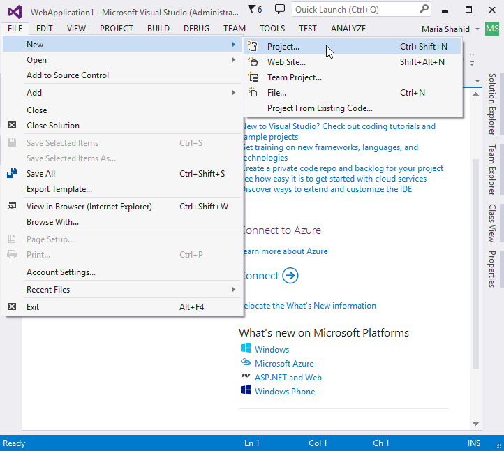
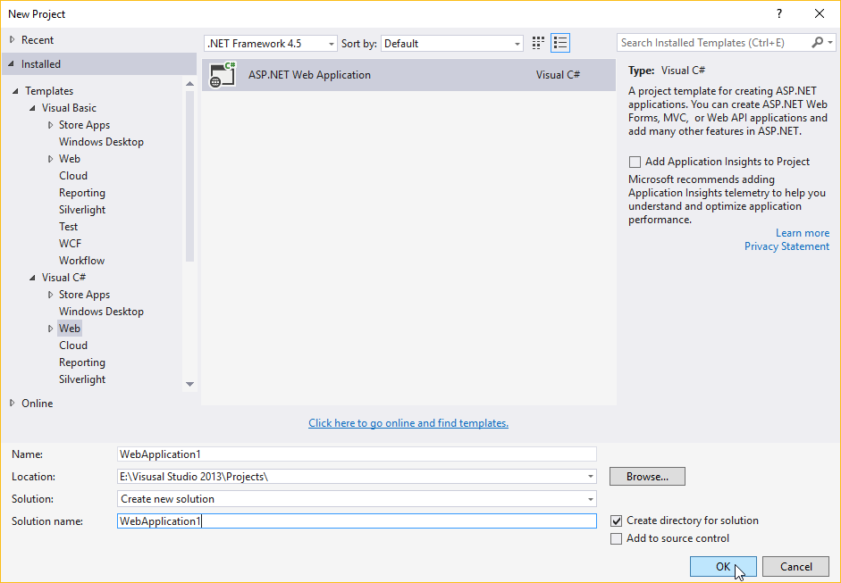
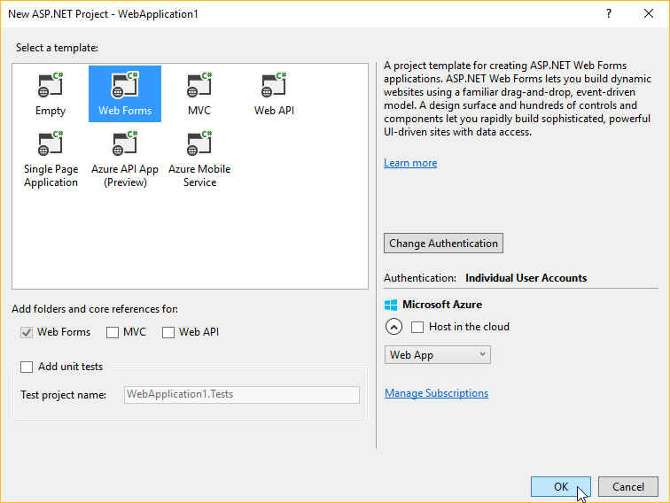
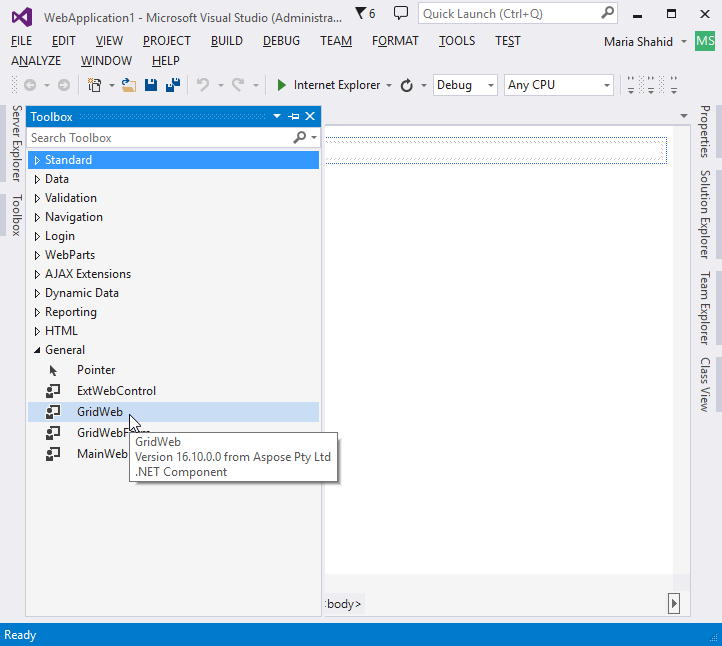
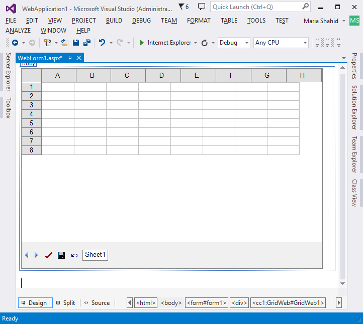
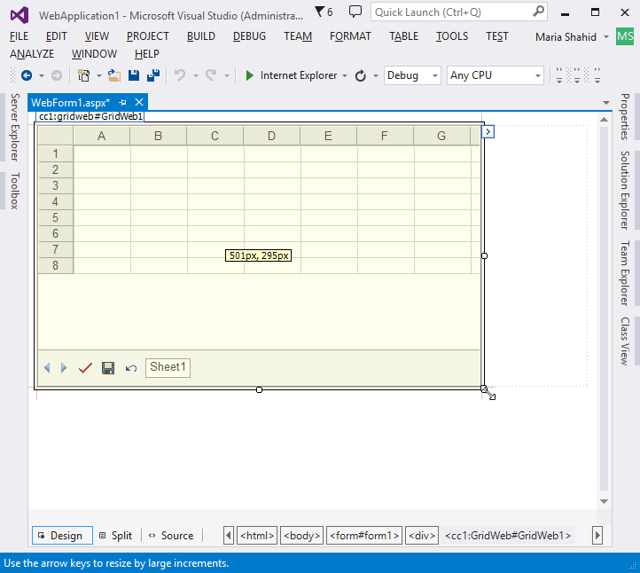
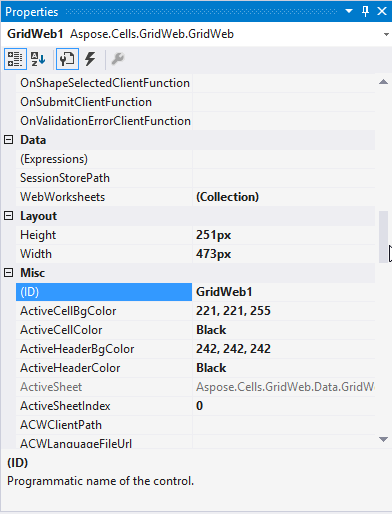
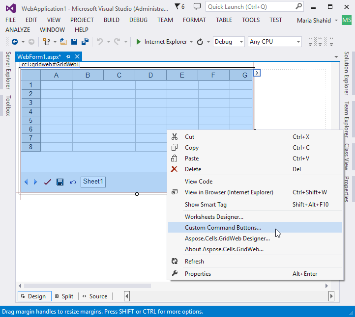
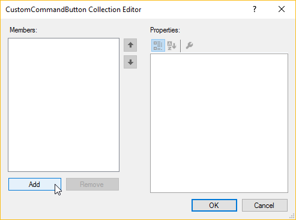
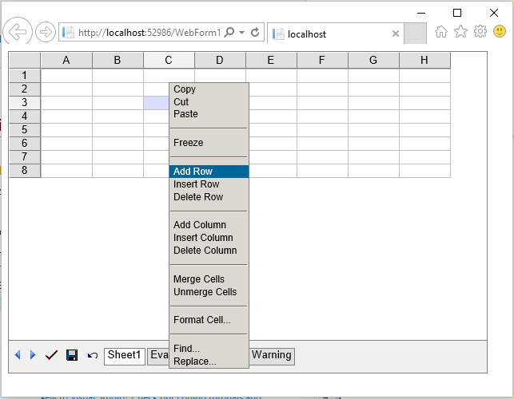

{} 

This topic provides a basic step by step guide for beginners to help them create and use the Aspose.Cells.GridWeb control in web applications.

{} 
## **Creating & Using Aspose.Cells.GridWeb Control**
### **Step 1: Creating a Web Application Project**
First, create a web application project in which to use the Aspose.Cells.GridWeb control:

1. Open Visual Studio.
1. From the **File** menu, select **New** followed by **Project**. 

A New Project Dialog appears.

1. Select **ASP.NET Web Application** for desired language. 

1. Select **Web Forms** template. 

1. Add a new web form to the project.
### **Step 2: Embedding Control to the Web Form**
Drag and drop the Aspose.Cells.GridWeb control from the Visual Studio toolbox to the web form. 

{} 

To learn how to add Aspose.Cells Grid controls to the Visual Studio Toolbox, please read [Integrate Aspose.Cells.Grid Controls with Visual Studio.NET](/cells/net/aspose-cells-gridweb/integrate-aspose-cells-grid-controls-with-visual-studio-net/).

{} 

When the control has been added to the form, it is rendered like this: 

### **Step 3: Resizing Control**
The form is rendered at a default size. Adjust the size by dragging the borders or corners. 

### **Step 4: Setting Control Properties**
Aspose.Cells.GridWeb control can also be configured using various properties. 

It is possible to adjust many properties of the control with the Properties dialog. Basic properties include height, width, color and visual styles. Advanced properties include the edit mode, session mode and double-click mode. Moreover, it is possible to set customized event handlers in the Properties dialog.

There are also some extra configuration tools for Aspose.Cells.GridWeb that can be seen at the bottom of the Properties dialog as hyperlinks, or right_click on the GridWeb control to find them. These configuration tools include:

- Custom Command Buttons
#### **Custom Command Buttons**
To open the custom command buttons editor:
Right-click the GridWeb control and select **Custom Command Buttons**. 

The CustomCommandButton Collection Editor dialog os displayed. 

The dialog lets developers add and remove custom command buttons in the GridWeb control.

### **Important**
Aspose.Cells.GridWeb also provides its resource files with the control. The "acw_client" is a folder (@ your installation directory) that contains files and Aspose.Cells.GridWeb uses this folder to manage its internal configuration and other functionality, it has scripts files, image files and other files to specify GridWeb's behavior and set other operations. The config file is used to manage the embedded client resources (images, scripts, etc.). Moreover, when you need to deploy the web application having GridWeb control, you would also copy the "acw_client" directory into your project folder least your web application (deployed over the server) could not find it. You can always specify the resource folder by adding the following lines of code into the configuration section (e.g in the web.config file in your VS.NET Project):

|


 <appSettings>

  <add key="aspose.cells.gridweb.acw_client_path" value="/grid/acw_client/"/> 

</appSettings>


|
| :- |

{}

The path is always related to the project's directory. You should not use any directory which is outside of the project's directory. So it is necessary to copy the "acw_client" directory (@ your GridWeb installation folder) into the project's directory/sub-directory.

{}
### **Step 5: Running Web Application**
Run the application by pressing Ctrl+F5 or clicking the **Start** button. 

When the application runs in a browser, the WebForm1.aspx page is displayed, now containing an empty Aspose.Cells.GridWeb control. Add values to cells by clicking them. It is also possible to perform other tasks like changing the height of a row or the width of a column, copying (Ctrl+C) or cutting (Ctrl+X) cell data to the clipboard and pasting (Ctrl+V) data to cell. To performing more operations, right-click the control to see full list of options. 

**Context menu of GridWeb control** 

