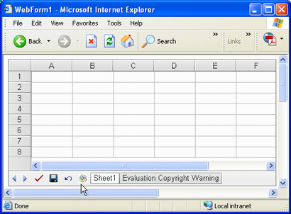
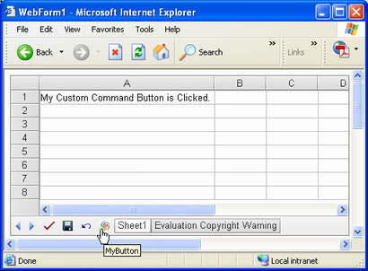

{} 

Aspose.Cells.GridWeb contains special buttons like **Submit**, **Save**, and **Undo**. All these buttons perform specific tasks for Aspose.Cells.GridWeb.  
It is also possible to add custom buttons that perform custom tasks. This topic explains how to use this feature.

{} 

## **Creating Custom Command Buttons**
To create a custom command button in Aspose.Cells.GridWeb:

1. Add Aspose.Cells.GridWeb control to the web form.  
1. Access a worksheet.  
1. Create an instance of the `CustomCommandButton` class.  
1. Set the button's **Command** to some value. This value is used in the button's event handler.  
1. Set the button's text.  
1. Set the button's image URL.  
1. Finally, add the `CustomCommandButton` object to the `CustomCommandButtons` collection of the GridWeb control.

{} 

Custom command buttons can also be added in WYSIWYG mode using Visual Studio's Properties dialog.

{} 

The output of the code snippet is shown below:

**A custom command button added to GridWeb control** 



### **Event Handling of Custom Command Buttons**
The most important aspect of custom command buttons is the action they perform when clicked. To set the action, create an event handler for the GridWeb control's **CustomCommand** event.

The **CustomCommand** event is always triggered when a custom command button is clicked. Therefore, the event handler must identify the specific custom command button to which it applies, using the **Command** set when adding the button to the GridWeb control. Finally, add the custom code that is executed when the button is clicked.

In the code example below, a text message is added to cell **A1** when the button is clicked.

**Text added to A1 cell when custom command button is clicked** 


