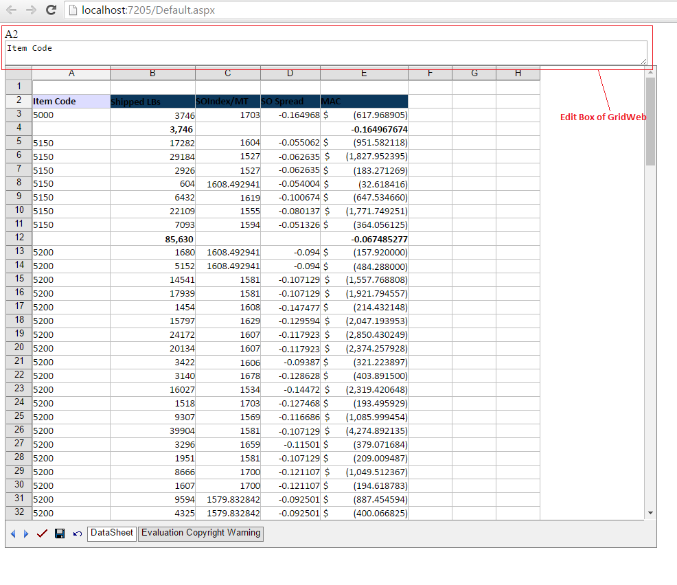

---  
title: Enable GridWeb EditBox  
type: docs  
weight: 110  
url: /net/aspose-cells-gridweb/enable-gridweb-editbox/  
keywords: GridWeb,editbox,formula bar  
description: This article introduces how to work with the formula bar or edit box in GridWeb.  
ai_search_scope: cells_net  
ai_search_endpoint: "https://docsearch.api.aspose.cloud/ask"
---  

{}  

The GridWeb's Edit Box (in Excel called the formula bar) is a toolbar that is rendered at the top of the control that you can use to display or enter a value or copy data/formula for the focused cell. It also shows the name of the cell you are editing. After clicking the frame or when you start entering data or type an equal (=) sign, the Edit Box will be activated.  

{}  

## **Setting the Edit Box of Aspose.Cells.GridWeb**  

The GridWeb control provides the ShowCellEditBox property, which developers can set to **True** to enable the toolbar. The default value of the attribute is **False**. When you set its value to **True**, the Edit Box will appear at the top of the GridWeb control.  

{}  

To enable this feature, you need to import the **jquery.js** file into your project and reference it in your .aspx page(s) to make it work. You may download the jQuery archive from <https://jqueryui.com/download/all/> and place the library file(s) into a folder in the project, then add a reference to the library file via a `  

</head>  

  

{}  

**GridWeb control with Edit Box**  

  

### **Example**  


