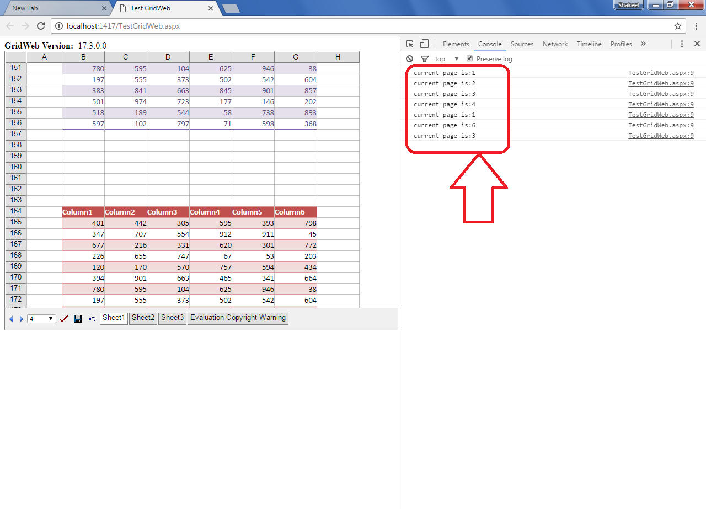

## **Possible Usage Scenarios**
Sometimes you need to execute your client side function when GridWeb page changes. Aspose.Cells.GridWeb provides the OnPageChangeClientFunction property for this purpose. Please set this property with client side function which you want to execute.
## **Execute client side function on GridWeb page change**
The following aspx markup explains how to make use of the OnPageChangeClientFunction property. It sets the property with the client side function named MyOnPageChange. Please note, this property is valid only if you have enabled paging i.e. EnablePaging="true". Now, whenever you will change the GridWeb page, it will call the client side function MyOnPageChange which prints the **current page index** on the **console** as shown in this screenshot.

## **Sample Code**
This is the code of the client side function MyOnPageChange that will be executed because of setting OnPageChangeClientFunction ="MyOnPageChange" property in GridWeb. This is the complete aspx page markup.


