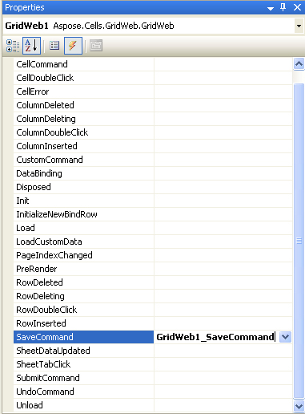
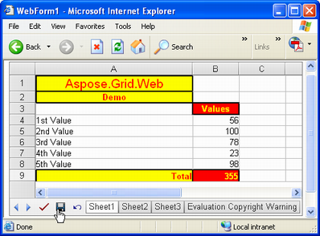

{} 

It is possible to create new, or manipulate existing Microsoft Excel files, on websites in GUI mode using the Aspose.Cells.GridWeb control. The files can then be saved as Excel files. Aspose.Cells.GridWeb effectively serves as an online spreadsheet editor. This topic describes how to save grid content to Excel files.

{} 
## **Export Excel Files**
### **Export as a File**
To save the content of the Aspose.Cells.GridWeb control as an Excel file:

1. Add the Aspose.Cells.GridWeb control to your web form.  
2. Save your work as an Excel file at a specified path.  
3. Run the application.

{} 

If you don't know how to add the Aspose.Cells.GridWeb control to your web form, you should refer to [Add GridWeb to Web Form](/cells/net/aspose-cells-gridweb/add-gridweb-to-web-form/)

{} 

When the Aspose.Cells.GridWeb control is added to a web form, the control is automatically instantiated and added to the form with a default size. You don't have to create an Aspose.Cells.GridWeb control object; all you have to do is drag and drop the control and start using it.

The code example below illustrates how to save grid content to an Excel file.



{} 

If your file system is NTFS, grant read/write access to the ASPNET or Everyone user accounts, or you will get an access‑denied exception at runtime.

{} 

The above code snippet can be used in several ways. A common approach is to add a button that saves the grid content to an Excel file when clicked. Aspose.Cells.GridWeb offers an easier approach for the task. Aspose.Cells.GridWeb has an event called **SaveCommand**. The above code snippet can be added to the SaveCommand event’s handler, which allows users to save their work by clicking the Aspose.Cells.GridWeb’s in‑built **Save** button.

**The GridWeb's SaveCommand event** 

**Saving grid content to Excel by clicking GridWeb's in‑built Save button** 

{} 

If you are working in Visual Studio, you can easily create the SaveCommand event’s handler by double‑clicking the event in the **Properties** pane. To learn more about this, please refer to [Working with GridWeb Events](/cells/net/aspose-cells-gridweb/working-with-gridweb-events/)

{} 
### **Export as a Stream**
It is also possible to save grid content to a stream (for example, MemoryStream).


